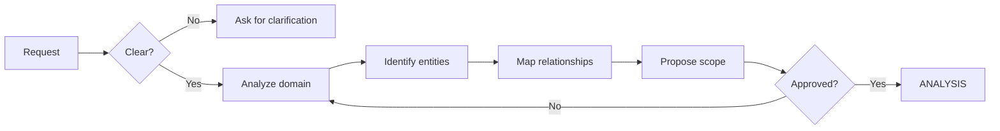

# DISCOVERY & ANALYSIS

> Loading: When starting a new project/feature or during requirements analysis
> Prerequisite: `01_CORE_RULES_EN.md`
> Size: ~350 lines | Context cost: Medium
> Contains: Phase 0 Discovery + Phase 1 Analysis (combined)

---

## PART 1: DISCOVERY (Phase 0)

### Discovery goal
Understand the domain, identify stakeholders, define scope and constraints before formal analysis.

### Discovery checklist

```
- Domain understood (basic glossary)
- Stakeholders identified
- Business goals clear
- Technical constraints known
- Initial risks mapped
- MVP defined
```

### Discovery workflow



### Discovery prompt templates

#### P1: Domain exploration
```
Let's analyze the domain [NAME].
1. What are the main entities?
2. Who are the actors/users?
3. What are the critical flows?
4. Are there regulatory/technical constraints?
```

#### P2: Scope definition
```
For feature [NAME]:
- IN SCOPE: [included functionality]
- OUT OF SCOPE: [explicit exclusions]
- NICE TO HAVE: [optional functionality]
- CONSTRAINTS: [known limitations]
```

#### P3: Initial risk assessment
```
IDENTIFIED RISKS:
| ID | Risk | Probability | Impact | Mitigation |
|----|------|-------------|--------|------------|
| R1 | ...  | H/M/L       | H/M/L  | ...        |
```

### Exit criteria (Discovery)

```
- Shared glossary drafted and approved
- Scope defined and signed off
- Initial risks documented
- Go/No-Go decision made
```

---

## PART 2: ANALYSIS (Phase 1)

### Analysis goal
Turn the business need into formal requirements, user stories, and verifiable acceptance criteria. Technology-agnostic: do not select the stack yet.

### Analysis checklist

```
- Functional requirements documented (FR)
- Non-functional requirements defined (NFR)
  - Performance requirements (mandatory)
  - Security requirements (mandatory)
  - Scalability requirements
  - Availability/Reliability
- User stories with acceptance criteria
- Conceptual data model (technology-agnostic)
- Preliminary threat model
- Stakeholder review completed
```

### Analysis workflow

```mermaid
graph TD
    A[Scope approved] --> B[Elicit requirements]
    B --> C[Classify FR]
    C --> D[Define NFR]
    D --> D1[Security Requirements]
    D --> D2[Performance Requirements]
    D --> D3[Other NFR]
    D1 --> E[Write User Stories]
    D2 --> E
    D3 --> E
    E --> F[Preliminary Threat Model]
    F --> G[Stakeholder review]
    G --> H{Approved?}
    H -->|No| B
    H -->|Yes| I[DESIGN]

    J[New requirements] -.->|@new-requirement| B
```

---

## Mandatory Non-Functional Requirements

### Security requirements (always required)

```markdown
## Security Requirements

Select applicable constraints from `SECURITY_CONSTRAINTS_LIBRARY_EN.md` and define project-specific targets:

### SEC-01: Authentication
- [ ] Required auth type: [session/token/SSO/MFA]
- [ ] Session handling: [timeout, invalidation]
- [ ] Password policy: [if applicable]

### SEC-02: Authorization
- [ ] Authorization model: [RBAC/ABAC/ACL]
- [ ] Roles identified: [role list]
- [ ] Protected resources: [resource list]

### SEC-03: Data Protection
- [ ] Sensitive data identified: [PII, PHI, financial, etc.]
- [ ] Encryption at rest: [required/optional]
- [ ] Encryption in transit: [minimum TLS version]
- [ ] Data retention policy: [duration]

### SEC-04: Audit & Compliance
- [ ] Compliance requirements: [GDPR, HIPAA, PCI-DSS, SOC2, etc.]
- [ ] Audit logging required: [events]
- [ ] Data residency: [geographic constraints]

### SEC-05: Input Validation
- [ ] Input surfaces: [API, form, file upload, etc.]
- [ ] Validation approach: [whitelist/blacklist/schema]

> Note: These IDs define **project-level requirements** (what the project needs).
> The `SECURITY_CONSTRAINTS_LIBRARY_EN.md` defines **implementation checklists** (how to enforce).
> Map each requirement above to the corresponding library entry.
```

### Performance requirements (always required)

```markdown
## Performance Requirements

Select applicable constraints from `PERFORMANCE_CONSTRAINTS_LIBRARY_EN.md` and define project-specific targets:

### PERF-01: Response Time
- [ ] P50 target: [ms]
- [ ] P95 target: [ms]
- [ ] P99 target: [ms]
- [ ] Max timeout: [s]

### PERF-02: Throughput
- [ ] Expected req/s (normal): [n]
- [ ] Expected req/s (peak): [n]
- [ ] Concurrent users: [n]

### PERF-03: Scalability
- [ ] Scaling type: [horizontal/vertical/auto]
- [ ] Growth target: [% per year or users]
- [ ] Expected data volume: [size/growth rate]

### PERF-04: Resource Limits
- [ ] Memory budget per instance: [MB]
- [ ] CPU budget per instance: [cores/%]
- [ ] Storage budget: [GB]
- [ ] Bandwidth: [Mbps]

### PERF-05: Availability
- [ ] SLA target: [99.9%/99.95%/99.99%]
- [ ] RTO (Recovery Time Objective): [hours]
- [ ] RPO (Recovery Point Objective): [hours]
- [ ] Maintenance windows: [when]

> Note: These IDs define **project-level targets** (what to achieve).
> The `PERFORMANCE_CONSTRAINTS_LIBRARY_EN.md` defines **implementation checklists** (how to measure and enforce).
```

---

## Analysis prompt templates

### P1: Functional requirements elicitation
```
For feature [NAME]:

**Functional Requirements (FR):**
| ID | Description | Priority | Source |
|----|-------------|----------|--------|
| FR01 | ... | Must/Should/Could | ... |
```

### P2: User story format
```
**[US-XXX] Title**

As a [ROLE]
I want [ACTION]
So that [BENEFIT]

**Acceptance Criteria:**
- [ ] GIVEN [context] WHEN [action] THEN [result]

**Security considerations:**
- [ ] [relevant security aspect]

**Performance considerations:**
- [ ] [relevant performance aspect]

**Priority:** Must/Should/Could
**Story Points:** [1-13]
```

### P3: Data model draft (technology-agnostic)
```
**Entity: [NAME]**

| Field | Logical Type | Constraints | Sensitivity | Notes |
|-------|--------------|-------------|-------------|-------|
| id | identifier | PK, unique | low | ... |
| email | string | unique, format | PII | encrypt |

**Relationships:**
- [Entity A] 1:N [Entity B]

**Note**: Physical types (UUID, VARCHAR, etc.) are defined in DESIGN
```

### P4: Preliminary threat model
```
**Threat Model: [FEATURE/SYSTEM]**

**Assets (what to protect):**
- [asset 1]: [value/impact if compromised]

**Threat actors:**
- [actor 1]: [motivation, capabilities]

**Attack surfaces:**
- [surface 1]: [attack type]

**Mitigations (to detail in DESIGN):**
- [mitigation 1]: [description]
```

---

## Expected outputs

### From Discovery:
1. Draft glossary -> `docs/01_ANALYSIS/01_GLOSSARIO.md`
2. Scope document -> stakeholder approval
3. Risk register -> first version

### From Analysis:
1. Functional requirements -> `docs/01_ANALYSIS/02_SPEC.md`
2. Non-functional requirements -> `docs/01_ANALYSIS/03_NSF.md`
   - Security requirements (mandatory)
   - Performance requirements (mandatory)
3. User stories -> backlog ready for sprint planning
4. Conceptual data model -> `docs/01_ANALYSIS/04_DATA_MODEL.md`
5. Preliminary threat model -> `docs/02_DATA_GOVERNANCE/THREAT_MODEL.md`

---

## Exit criteria (Analysis)

```
- All requirements have IDs and traceability
- Security requirements complete (SEC-01 to SEC-05)
- Performance requirements complete (PERF-01 to PERF-05)
- User stories with acceptance criteria
- Conceptual data model approved
- Preliminary threat model documented
- Stakeholder sign-off
```

## Reactivating Analysis

This phase re-activates when:
- New business requirements emerge
- Compliance constraints change
- Production feedback requires new features
- A security incident requires review

```
@new-requirement -> restart ANALYSIS cycle
```

## Transition to Design

```
HANDOFF TO DESIGN:
1. Approved functional requirements (FR)
2. Complete NFRs (Security + Performance)
3. User stories ready for prioritization
4. Conceptual data model
5. Preliminary threat model
6. Constraints identified (compliance, infrastructure)
```

---

Next module: `03_DESIGN_EN.md`
