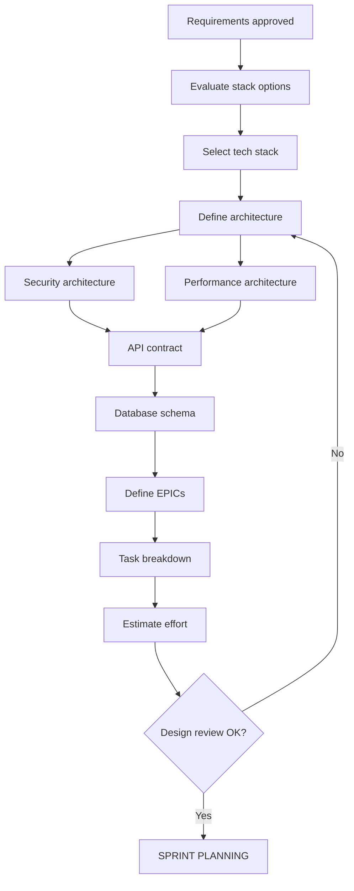

# DESIGN

> Loading: During architecture design and technology choices
> Prerequisite: `01_CORE_RULES_EN.md`, Discovery/Analysis completed
> Size: ~300 lines | Context cost: Medium
> Key outputs: Tech stack, architecture, initial EPICs/tasks

---

## Phase goal
Define the technical architecture, choose the tech stack, patterns and interfaces, and structure work into EPICs and tasks for sprints.

## Design checklist

```
- Tech stack selected and documented
- System architecture defined
- Architectural patterns/principles chosen
- Security architecture defined
- Performance architecture defined
- API contract draft (tech-specific)
- Database schema draft
- EPICs defined with scope
- Initial task breakdown
- ADRs (Architecture Decision Records) written
- Definition of Done defined
```

## Workflow



---

## 1. Tech stack selection

### Stack evaluation template

```markdown
## Stack Evaluation: [PROJECT]

### Requirements to satisfy
- NFR: [key non-functional requirements]
- Constraints: [team skills, existing infra, budget]
- Compliance: [regulatory constraints]

### Options evaluated

| Aspect | Option A | Option B | Option C |
|--------|----------|----------|----------|
| Backend | [lang/framework] | [lang/framework] | [lang/framework] |
| Frontend | [framework] | [framework] | [framework] |
| Database | [type/product] | [type/product] | [type/product] |
| Cache | [product] | [product] | [product] |
| Cloud/Infra | [provider] | [provider] | [provider] |

### Evaluation criteria

| Criterion | Weight | Option A | Option B | Option C |
|----------|--------|----------|----------|----------|
| Team expertise | 20% | [1-5] | [1-5] | [1-5] |
| Performance fit | 20% | [1-5] | [1-5] | [1-5] |
| Security features | 20% | [1-5] | [1-5] | [1-5] |
| Scalability | 15% | [1-5] | [1-5] | [1-5] |
| Community/Support | 10% | [1-5] | [1-5] | [1-5] |
| Cost | 15% | [1-5] | [1-5] | [1-5] |
| TOTAL | 100% | [score] | [score] | [score] |

### Decision
Chosen stack: [Option X]
Rationale: [short rationale]
```

### ADR: Stack decision
```markdown
# ADR-001: Technology Stack Selection

Status: Accepted
Date: [YYYY-MM-DD]

## Context
[Project description and key requirements]

## Decision
- Backend: [language] + [framework]
- Frontend: [framework] + [build tool]
- Database: [type] - [product]
- Cache: [product]
- Infrastructure: [cloud/on-prem] - [orchestration]
- CI/CD: [tool]

## Consequences
Positive:
- [benefit 1]

Negative:
- [risk 1] -> [mitigation]

Team actions:
- [ ] [skill gap to close]
- [ ] [environment setup]
```

---

## 2. Security architecture

```markdown
## Security Architecture

### Authentication
- Mechanism: [JWT/Session/OAuth2/OIDC]
- Provider: [internal/external IdP]
- Token lifetime: [access: X min, refresh: Y hours]

### Authorization
- Model: [RBAC/ABAC/Policy-based]
- Enforcement point: [API Gateway/Application/Both]

### Data Protection
- Encryption at rest: [algorithm, key management]
- Encryption in transit: [TLS version, cert management]
- Secrets management: [tool/approach]

### Network Security
- Segmentation: [VPC, subnets, security groups]
- WAF/DDoS: [yes/no, provider]
- API Gateway: [yes/no, rate limiting]

### Audit & Monitoring
- Logging: [structured, destination]
- SIEM integration: [yes/no]
- Alerting: [thresholds]
```

---

## 3. Performance architecture

```markdown
## Performance Architecture

### Caching strategy
- Layers: [CDN / Application / Database]
- Invalidation: [TTL / Event-driven / Manual]
- Cache-aside vs Write-through: [choice]

### Database optimization
- Indexing strategy: [criteria]
- Read replicas: [yes/no, when]
- Connection pooling: [config]
- Query optimization: [approach]

### Scaling strategy
- Horizontal scaling: [trigger, min/max instances]
- Vertical scaling: [when applicable]
- Auto-scaling: [trigger metrics]

### Async processing
- Queue-based: [which operations]
- Background jobs: [scheduler, worker pool]

### Observability
- Metrics: [what to measure, tool]
- Tracing: [distributed tracing tool]
- Dashboards: [core KPIs]
```

---

## 4. EPIC and task structure

### EPIC template
```markdown
# EPIC: [E-NNN] [Title]

## Description
[2-3 sentences describing business value]

## Scope
In scope:
- [feature 1]

Out of scope:
- [explicit exclusion]

## Included user stories
- [US-001] [title]

## Acceptance criteria (EPIC level)
- [ ] [criterion 1]

## Security considerations
- [ ] [security aspect]

## Performance targets
- [ ] [performance target]

## Dependencies
- [dependency on other EPIC/system]

## Estimate
- Total story points: [N]
- Estimated sprints: [N]
```

### Task breakdown template
```markdown
# Task Breakdown: [EPIC/US Reference]

## Tasks

| ID | Task | Type | Estimate | Dependencies | Owner |
|----|------|------|----------|--------------|-------|
| T-001 | [description] | dev/test/docs | [h/SP] | - | - |
| T-002 | [description] | dev | [h/SP] | T-001 | - |

## Definition of Done (per task)
- [ ] Code implemented and builds
- [ ] Unit tests written (coverage >= [X]%)
- [ ] Code review approved
- [ ] Security checklist verified
- [ ] Performance checklist verified
- [ ] Documentation updated
```

---

## 5. Iterative EPIC/Task cycle

Sprint loop:
1. Review existing EPICs (scope still valid?)
2. Refine tasks (estimates correct?)
3. Sprint planning (capacity, priorities)
4. Implementation
5. Sprint review -> feedback
6. Repeat

---

## Expected outputs

1. Stack ADR -> `docs/03_DESIGN/ADR/ADR-001_Stack.md`
2. Architecture -> `docs/03_DESIGN/ARCHITECTURE.md`
3. Security architecture -> `docs/03_DESIGN/SECURITY_ARCH.md`
4. Performance architecture -> `docs/03_DESIGN/PERFORMANCE_ARCH.md`
5. API contract -> `api-specs/openapi.yaml` (or other format)
6. Database schema -> `docs/03_DESIGN/DATABASE_SCHEMA.md`
7. EPIC list -> `docs/EPICS/`
8. Coding conventions -> `docs/03_DESIGN/CONVENTIONS.md`

---

## Exit criteria

```
- Tech stack documented in ADR
- Architecture approved (review)
- Security architecture complete
- Performance architecture complete
- API contract ready
- EPICs defined with task breakdown
- Definition of Done agreed
- Coding conventions for chosen stack
- Team aligned on architecture
```

## Transition to Sprint Planning / Implementation

```
HANDOFF TO SPRINT PLANNING:
1. Finalized tech stack
2. Documented architecture
3. EPICs ready with task breakdown
4. Initial estimates
5. Definition of Done
6. Dev environment ready
```

---

Next module: `04_IMPLEMENTATION_EN.md`
