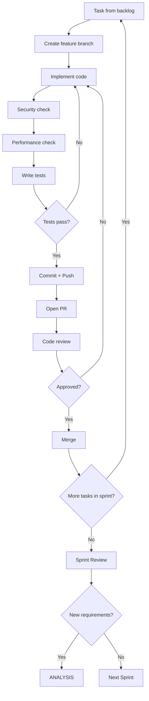

# IMPLEMENTATION

> Loading: During development (most used phase)
> Prerequisite: `01_CORE_RULES_EN.md`, Design completed, stack defined
> Size: ~320 lines | Context cost: Medium
> Iterative: Yes - follows the sprint cycle

---

## Phase goal
Turn the design into working, tested, documented code, following best practices, chosen stack, and Security & Performance by design.

## Sprint cycle

Planning -> Daily work -> Review -> Retrospective -> Next sprint

## Implementation checklist (per task)

```
- Task selected from prioritized backlog
- Feature branch created (naming convention)
- Constraints reread: SEC-XX and PERF-XX from _CONTEXT.md
- For complex logic (>50 lines): pseudocode/comments BEFORE code
- Code implemented per design and stack conventions
- Security checklist verified
- Performance checklist verified
- Unit tests written (coverage target per DoD)
- Integration tests (if applicable)
- Code review completed
- Documentation updated
- PR approved and merged
```

## Pseudocode rule (mandatory for complex logic)

Before writing complex code:
If the task requires:
- Algorithmic logic > 50 lines
- Complex business rules
- Calculations with edge cases
- Integration with external systems

Then:
1. Write pseudocode or detailed comments first
2. Wait for user approval
3. Only then implement the real code

---

## Task workflow

### Task File Navigation

When tasks are organized as files (see `01_CORE_RULES_EN.md` §Task Navigation Protocol):

```
1. User assigns task: "Implement T-001.3"
2. Agent reads: docs/epics/tasks/E-001/T-001.3_*.md
3. Agent extracts: Acceptance Criteria, SEC/PERF, files involved
4. Agent classifies risk (LOW/MED/HIGH) per §11 Risk Classification
5. Agent proposes plan (or executes directly if LOW)
6. Agent implements → build → test → checkpoint
7. Agent updates task status: 🔲 TODO → ✅ DONE
8. Agent updates _CONTEXT.md Active Task
```

**If no task files exist**: Use epic file directly. The agent can propose splitting an epic into task files.

### Task Implementation Flow



---

## Security checklist (each PR)

```markdown
## Security Review: [PR Title]

### Input Validation
- [ ] All inputs validated
- [ ] Whitelist > blacklist
- [ ] SQL injection prevented (params/ORM)
- [ ] XSS prevented (output encoding)
- [ ] Path traversal prevented

### Authentication & Authorization
- [ ] Endpoints protected correctly
- [ ] Permissions verified (not auth-only)
- [ ] Tokens/sessions handled correctly
- [ ] Logout invalidates session

### Data Protection
- [ ] Sensitive data not logged
- [ ] Secrets not hardcoded
- [ ] Encryption applied where required
- [ ] PII handled per policy

### Error Handling
- [ ] Errors do not expose internals
- [ ] No stack traces in responses
- [ ] User-facing messages are generic
```

---

## Performance checklist (each PR)

```markdown
## Performance Review: [PR Title]

### Database
- [ ] No N+1 queries
- [ ] Indexes used correctly
- [ ] Queries optimized (EXPLAIN analyzed)
- [ ] Connection pooling configured
- [ ] Minimal transactions

### Caching
- [ ] Cache used where appropriate
- [ ] Cache invalidation correct
- [ ] TTL configured

### Memory & CPU
- [ ] No memory leaks (dispose/using)
- [ ] Large objects streamed
- [ ] Async for I/O operations
- [ ] No blocking on main threads

### Network
- [ ] Payload minimized
- [ ] Compression enabled
- [ ] Batch requests where possible
- [ ] Timeouts configured
```

---

## Code conventions (stack-specific template)

> Specific conventions are defined in `docs/03_DESIGN/CONVENTIONS.md` based on the chosen stack.

### Universal principles
```
SOLID:
- Single Responsibility: one class = one responsibility
- Open/Closed: extend without modifying
- Liskov Substitution: subtypes are substitutable
- Interface Segregation: small, focused interfaces
- Dependency Inversion: depend on abstractions

CLEAN CODE:
- Self-explanatory naming
- Short functions (ideally <= 20 lines)
- One abstraction level per function
- Comments only for "why", not "what"
- No magic numbers/strings
```

### Generic project structure
```
project-root/
  src/
    api/              # Entry points (controllers, handlers)
    domain/           # Business logic, entities
    infrastructure/   # External services, persistence
    shared/           # Utilities, cross-cutting concerns
  tests/
    unit/
    integration/
  docs/
  scripts/
  config/
```

---

## Prompt templates

### P0: Pre-implementation check (always)
```
Before implementation:

1. Reread constraints from _CONTEXT.md:
   - SEC-XX: [active security constraints]
   - PERF-XX: [active performance constraints]

2. Verify:
   - Does the code respect all constraints?
   - Are there edge cases to consider?
   - Is pseudocode required first?

3. Confirm: "Constraints verified, proceeding with implementation."
```

### P1: Implement a feature
```
Implement [FEATURE] for [COMPONENT]:

Task: [TASK-ID]
Branch: feature/[name]

Active constraints (from _CONTEXT.md):
- SEC: [list]
- PERF: [list]

Requirements:
- [FR/US reference]

Stack: [from docs/03_DESIGN/CONVENTIONS.md]

Acceptance Criteria:
- [ ] [criterion]

Security focus:
- [ ] [aspect to verify]

Performance focus:
- [ ] [aspect to verify]
```

### P2: Code review
```
Review PR: [title]

Checklist:
- Logic correct vs requirements
- Security checklist passed
- Performance checklist passed
- Test coverage adequate
- Naming and conventions
- Error handling
- Documentation

Findings:
- [category]: [issue/suggestion]
```

### P3: Bug fix
```
Bug: [ID] [title]

Symptom: [incorrect behavior]
Root cause: [identified cause]

Fix:
- File: [path]
- Change: [description]

Regression test:
- [ ] Test case covering the bug

Security impact: [none / to verify: ...]
Performance impact: [none / to verify: ...]
```

---

## Sprint ceremonies

### Sprint planning
```
## Sprint [N] Planning

Date: [YYYY-MM-DD]
Capacity: [story points / hours]
Sprint Goal: [one-sentence goal]

Selected items:
| ID | Title | Estimate | Owner |
|----|-------|----------|-------|
| T-XX | ... | [SP] | [name] |

Risks identified:
- [risk]: [mitigation]

Definition of Done reminder:
- [ ] [DoD item]
```

### Sprint review
```
## Sprint [N] Review

Date: [YYYY-MM-DD]

Completed:
- [x] [TASK-XX]: [short description]

Not completed:
- [ ] [TASK-YY]: [reason, action]

Demo notes:
- [feedback received]

Metrics:
- Velocity: [SP completed]
- Bugs introduced: [N]
- Tech debt: [trend]

Action items:
- [ ] [review action]
```

### Retrospective
```
## Sprint [N] Retrospective

What went well:
- [positive]

What didn't go well:
- [problem]

Action items:
- [ ] [improvement for next sprint]

EPIC/Task updates needed:
- [backlog update]
```

---

## Exit criteria (per sprint/release)

```
- All sprint tasks completed (or reprioritized)
- Tests pass (unit + integration)
- Security checklist green for each PR
- Performance checklist green for each PR
- Code reviews approved
- Documentation updated
- Demo completed
- Retrospective done
```

## Transition to Verification (for Release)

```
HANDOFF TO VERIFICATION:
1. Deployable build
2. Draft release notes
3. Test cases for QA
4. Security scan scheduled
5. Performance test plan
```

---

Next module: `05_VERIFICATION_RELEASE_EN.md`
