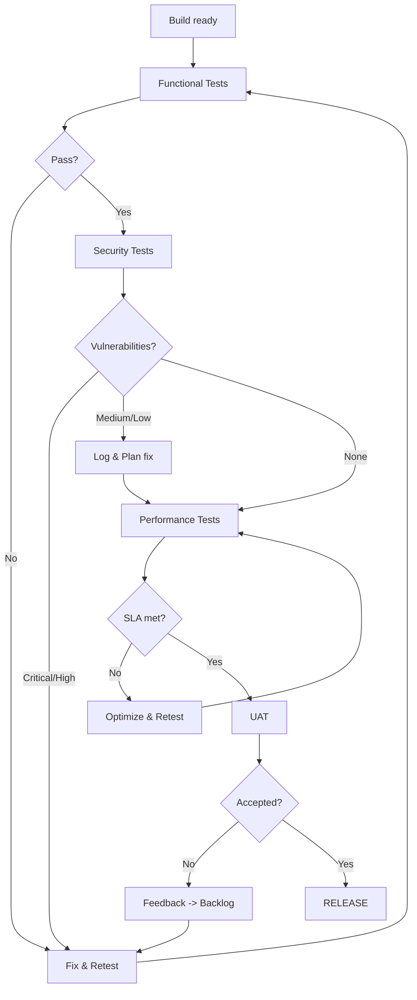
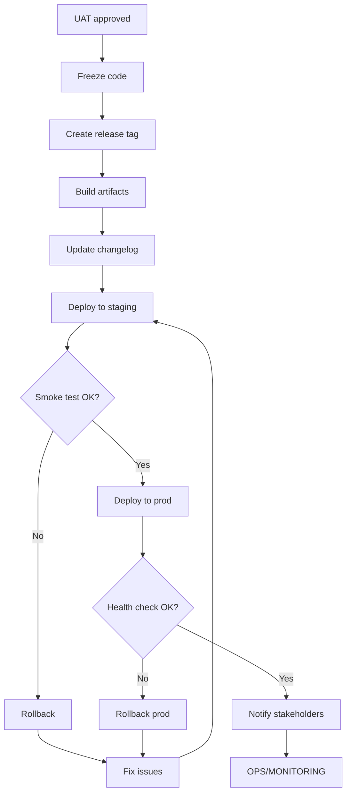

# VERIFICATION & RELEASE

> Loading: During testing, QA, deployment, and release
> Prerequisite: `01_CORE_RULES_EN.md`, Implementation completed
> Size: ~500 lines | Context cost: Medium-High
> Contains: Phase 4 Verification + Phase 5 Release (combined)
> Focus: Security Testing + Performance Testing + Deployment

---

## PART 1: VERIFICATION (Phase 4)

### Verification goal
Validate that the software works correctly, is secure, performs well, and is ready for release by validating the non-functional requirements defined in Analysis.

### Verification checklist

```
- Functional testing
  - Unit tests pass (coverage meets target)
  - Integration tests pass
  - E2E tests pass
  - UAT completed

- Security testing (mandatory)
  - SAST completed
  - DAST completed
  - Dependency scan (CVE check)
  - Secrets scan
  - Penetration test (if required)

- Performance testing (mandatory)
  - Load test completed
  - Stress test completed
  - SLA requirements verified
  - Performance baseline established

- Critical/major bugs resolved
- Documentation updated
```

### Verification workflow



---

## Security testing

### SAST (Static Application Security Testing)
```markdown
## SAST Report

Tool: [SonarQube/Semgrep/CodeQL/Checkmarx/...]
Date: [YYYY-MM-DD]
Commit: [hash]

Findings:
| Severity | Count | Categories |
|----------|-------|------------|
| Critical | 0 | - |
| High | 0 | - |
| Medium | N | [list] |
| Low | N | [list] |

Critical/High Issues:
| ID | File | Line | Issue | Remediation |
|----|------|------|-------|-------------|
| - | - | - | - | - |

Action: [proceed/block release]
```

### DAST (Dynamic Application Security Testing)
```markdown
## DAST Report

Tool: [OWASP ZAP/Burp Suite/Nuclei/...]
Target: [test environment URL]
Date: [YYYY-MM-DD]

Scan Coverage:
- [ ] Authentication flows
- [ ] API endpoints
- [ ] File upload
- [ ] Input forms

Findings:
| ID | Vulnerability | Severity | URL | Status |
|----|---------------|----------|-----|--------|
| V01 | [type] | [H/M/L] | [url] | [open/fixed] |

OWASP Top 10 Coverage:
- [ ] A01: Broken Access Control
- [ ] A02: Cryptographic Failures
- [ ] A03: Injection
- [ ] A04: Insecure Design
- [ ] A05: Security Misconfiguration
- [ ] A06: Vulnerable Components
- [ ] A07: Auth Failures
- [ ] A08: Data Integrity Failures
- [ ] A09: Logging Failures
- [ ] A10: SSRF
```

### Dependency scan
```markdown
## Dependency Vulnerability Report

Tool: [Snyk/Dependabot/OWASP Dependency-Check/...]
Date: [YYYY-MM-DD]

Vulnerabilities Found:
| Package | Version | CVE | Severity | Fix Version |
|---------|---------|-----|----------|-------------|
| [pkg] | [ver] | [CVE-XXXX-XXXX] | [H/M/L] | [ver] |

Action Items:
- [ ] Upgrade [package] to [version]
```

---

## Performance testing

### Load test
```markdown
## Load Test Report

Tool: [k6/Gatling/JMeter/Locust/Artillery/...]
Date: [YYYY-MM-DD]
Environment: [staging/perf]

Test Configuration:
- Duration: [minutes]
- Virtual Users: [N]
- Ramp-up: [pattern]

Results vs SLA:
| Metric | Target | Actual | Status |
|--------|--------|--------|--------|
| Response Time P50 | [ms] | [ms] | [OK/FAIL] |
| Response Time P95 | [ms] | [ms] | [OK/FAIL] |
| Response Time P99 | [ms] | [ms] | [OK/FAIL] |
| Throughput | [req/s] | [req/s] | [OK/FAIL] |
| Error Rate | <[%] | [%] | [OK/FAIL] |

Bottlenecks Identified:
- [endpoint/component]: [issue]
```

### Stress test
```markdown
## Stress Test Report

Objective: Identify breaking point

Results:
- Max sustained load: [N] users / [N] req/s
- Breaking point: [N] users / [N] req/s
- Recovery time: [seconds]
- Graceful degradation: [yes/no]

Failure Mode:
- [behavior under excessive stress]
```

### Resource utilization
```markdown
## Resource Usage Report

Under normal load:
| Resource | Target | Actual | Status |
|----------|--------|--------|--------|
| CPU | <[%] | [%] | [OK/FAIL] |
| Memory | <[MB] | [MB] | [OK/FAIL] |
| DB Connections | <[N] | [N] | [OK/FAIL] |
| Network I/O | <[Mbps] | [Mbps] | [OK/FAIL] |
```

---

## Functional testing

### 2. Core Principle: Test Pyramid

The AI adopts and respects the test pyramid as a non-negotiable rule:

- Unit Tests -> solid and numerous base
- Integration Tests -> targeted and realistic
- System / End-to-End Tests -> few, strategic

Every technical proposal must respect this hierarchy.

### 3. Unit test rules

**3.1 Goal**
- Verify the internal logic of a single unit of code in complete isolation.

**3.2 Rules**
- Test one unit at a time
- No real dependencies:
  - database
  - filesystem
  - network
  - external services
- Use mocks, stubs, or fakes where needed
- Each test must be:
  - fast
  - deterministic
  - independent

**3.3 AI responsibilities**
- Propose unit tests for:
  - functions
  - methods
  - classes with logic
- Flag when code is not testable and suggest refactoring

### 4. Integration test rules

**4.1 Goal**
- Verify that real components work together correctly.

**4.2 Rules**
- Use real dependencies or controlled environments:
  - real databases (temporary/containerized)
  - real APIs
- Do not mock what you want to verify
- Test:
  - mapping
  - configuration
  - transactions
  - API contracts

**4.3 When the AI should propose them**
- Database access
- Service-to-service calls
- Repositories, ORM, serialization
- Critical configurations

### 5. System / End-to-End test rules

**5.1 Goal**
- Verify the full system behavior from the user's perspective.

**5.2 Rules**
- Cover only critical flows
- Do not duplicate what unit or integration tests already cover
- Accept that they are:
  - slow
  - fragile
  - expensive

**5.3 Conscious use**
- The AI does not propose E2E tests as the primary solution to quality problems.

### 6. AI decision rules

When the AI proposes code or tests, it should implicitly answer:
- Is this an internal logic problem? -> Unit test
- Is this a component collaboration problem? -> Integration test
- Is this a full user flow problem? -> System test

If the test type is unclear, the AI must justify the choice.

### 7. Anti-patterns to avoid (mandatory)

The AI must explicitly flag when it detects:
- E2E tests used instead of unit tests
- Fragile tests based on random timing
- Tests depending on shared state
- Tests that validate implementation instead of behavior

### 8. Approach to code

Code must be written to be testable.

If code is hard to test:
- the AI proposes refactoring
- it does not bypass the problem with complex tests

### 9. Final AI responsibility

The AI acts as:
- senior engineer
- quality reviewer
- technical mentor

The goal is not to "make tests pass", but to reduce the risk of bugs, regressions, and production surprises.

### Test plan template
```markdown
## Test Plan: [Feature/Release]

Scope: [what to test]
Out of scope: [what not to test]
Environment: [dev/staging/prod-like]

Test Cases:
| ID | Category | Scenario | Priority | Status |
|----|----------|----------|----------|--------|
| TC01 | Happy path | [description] | High | ? |
| TC02 | Edge case | [description] | Medium | ? |
| TC03 | Error handling | [description] | High | ? |
| TC04 | Security | [description] | High | ? |
| TC05 | Performance | [description] | High | ? |
```

### Bug report template
```markdown
## Bug Report: [BUG-NNN]

Title: [descriptive title]
Severity: Critical / Major / Minor / Trivial
Priority: P1 / P2 / P3 / P4
Environment: [env + version]

Steps to Reproduce:
1. [step]
2. [step]

Expected Result: [expected outcome]
Actual Result: [actual outcome]

Evidence: [screenshot/video/logs]
Security Impact: [none/potential/confirmed]
Performance Impact: [none/potential/confirmed]
```

### Verification summary template
```markdown
## Verification Summary: [Release X.Y.Z]

Date: [YYYY-MM-DD]
Build: [commit hash]

### Functional Tests
| Category | Total | Pass | Fail | Skip | Coverage |
|----------|-------|------|------|------|----------|
| Unit | [N] | [N] | [N] | [N] | [%] |
| Integration | [N] | [N] | [N] | [N] | - |
| E2E | [N] | [N] | [N] | [N] | - |

### Security Tests
| Test Type | Status | Critical | High | Medium | Low |
|-----------|--------|----------|------|--------|-----|
| SAST | [OK/FAIL] | 0 | 0 | [N] | [N] |
| DAST | [OK/FAIL] | 0 | 0 | [N] | [N] |
| Dep Scan | [OK/FAIL] | 0 | 0 | [N] | [N] |

### Performance Tests
| Test Type | Status | Notes |
|-----------|--------|-------|
| Load Test | [OK/FAIL] | [SLA met/issues] |
| Stress Test | [OK/FAIL] | [breaking point] |

### Recommendation
Release decision: GO / NO-GO / GO with conditions
```

### Exit criteria (Verification)

```
- Functional tests: 100% pass (or known issues documented)
- Security: 0 Critical, 0 High issues
- Performance: All SLA targets met
- UAT: Stakeholder sign-off
- Documentation: Release notes ready
- Known issues: Documented with workarounds
```

---

## PART 2: RELEASE (Phase 5)

### Release goal
Release the software to production in a safe, controlled, reversible way.

### Release checklist

```
- Verification completed and approved
- Release notes published
- Changelog updated
- Git tag created
- Artifacts published
- Database migrations applied
- Deployment completed
- Smoke tests passed
- Monitoring active
- Stakeholders notified
```

### Release workflow



### Versioning (SemVer)

```
MAJOR.MINOR.PATCH[-prerelease][+build]

MAJOR: Breaking changes
MINOR: New features, backward compatible
PATCH: Bug fixes, backward compatible

Examples:
- 1.0.0 -> First stable release
- 1.1.0 -> New feature
- 1.1.1 -> Bug fix
- 2.0.0-beta.1 -> Breaking change in preview
```

---

## Release prompt templates

### P1: Release notes
```
# Release [VERSION]

Release Date: YYYY-MM-DD

## New Features
- [FEATURE]: [short description]

## Bug Fixes
- [BUG-ID]: [fix description]

## Improvements
- [improvement description]

## Breaking Changes
- [description + migration path]

## Notes
- [important notes for users/ops]
```

### P2: Deployment checklist
```
Deployment Checklist: v[VERSION]

Pre-deployment:
- [ ] Database backup completed
- [ ] Maintenance window communicated
- [ ] On-call team available
- [ ] Rollback plan documented

Deployment:
- [ ] Stop services (if needed)
- [ ] Apply migrations
- [ ] Deploy backend
- [ ] Deploy frontend
- [ ] Start services

Post-deployment:
- [ ] Smoke tests passed
- [ ] Health endpoints OK
- [ ] Logs clean
- [ ] Metrics baseline OK
- [ ] Stakeholders notified
```

### P3: Rollback plan
```
Rollback Plan: v[VERSION]

Trigger conditions:
- Health check fails for > 5 min
- Error rate > 5%
- Critical bug in production

Steps:
1. [ ] Notify team on Slack/Teams
2. [ ] Revert deployment to v[PREV_VERSION]
3. [ ] Rollback migrations (if applicable)
4. [ ] Verify health
5. [ ] Post-mortem scheduled

Contacts:
- On-call: [name] [phone]
- DBA: [name] [phone]
```

### CI/CD pipeline template

```yaml
# Simplified pipeline
stages:
  - build
  - test
  - security-scan
  - deploy-staging
  - integration-test
  - deploy-prod

deploy-prod:
  when: manual  # Require approval
  environment: production
  script:
    - ./deploy.sh
  only:
    - tags
```

### Release commands

```bash
# Create release tag
git tag -a v1.2.0 -m "Release v1.2.0"
git push origin v1.2.0

# Build Docker images
docker build -t wsiplatform/api:1.2.0 .
docker push wsiplatform/api:1.2.0

# Deploy (example k8s)
kubectl set image deployment/wsi-api wsi-api=wsiplatform/api:1.2.0
kubectl rollout status deployment/wsi-api
```

---

## Exit criteria (Release)

```
- Deployment completed without errors
- Smoke tests passed
- Monitoring shows no anomalies
- Stakeholders notified
- Release notes published
- Celebrate
```

## Transition to Ops

```
HANDOFF TO OPS:
1. Runbook updated
2. Alerts configured
3. Monitoring dashboards ready
4. Escalation path defined
5. SLA monitoring active
```

---

Next module: `06_OPS_EN.md`
