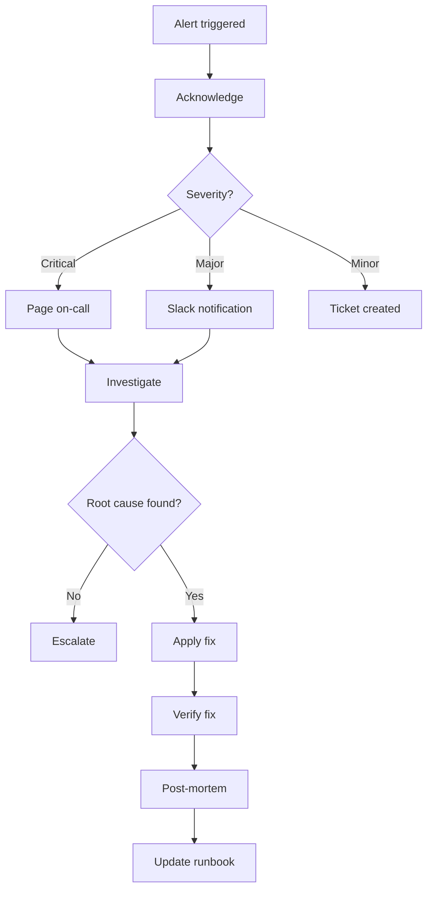

# OPS & MONITORING

> Loading: During operations, monitoring, incident response
> Prerequisite: `01_CORE_RULES_EN.md`, software in production
> Size: ~230 lines | Context cost: Low

---

## Phase goal
Keep the system stable, monitor performance, respond to incidents, and plan improvements.

## Ops checklist

```
- Monitoring active and working
- Alerts configured correctly
- Runbook updated
- Backups verified
- Log rotation configured
- Incident response plan ready
- Capacity planning updated
```

## Incident response workflow



---

## Key metrics (SLA)

| Metric | Target | Alert Threshold |
|--------|--------|-----------------|
| Availability | 99.9% | <99.5% |
| Response Time P95 | <200ms | >500ms |
| Error Rate | <0.1% | >1% |
| CPU Usage | <70% | >85% |
| Memory Usage | <80% | >90% |
| Disk Usage | <70% | >85% |

---

## Prompt templates

### P1: Incident report
```
Incident Report: INC-[NNNN]

Severity: P1/P2/P3/P4
Status: Open / Investigating / Resolved / Closed
Duration: [start] - [end] ([duration])

Impact:
- Users affected: [number/percentage]
- Services affected: [list]
- Revenue impact: [if applicable]

Timeline:
| Time | Event |
|------|-------|
| HH:MM | Alert triggered |
| HH:MM | Investigation started |
| HH:MM | Root cause identified |
| HH:MM | Fix applied |
| HH:MM | Resolved |

Root Cause: [description]

Resolution: [what was done]

Action Items:
- [ ] [preventive action]
```

### P2: Post-mortem
```
Post-Mortem: INC-[NNNN]

Date: YYYY-MM-DD
Authors: [names]
Status: Draft / Final

## Summary
[1-2 sentences describing the incident]

## Impact
[impact metrics: duration, users, revenue]

## Root Cause
[detailed root cause analysis]

## Timeline
[detailed timeline]

## Lessons Learned
What went well:
- ...

What went wrong:
- ...

Where we got lucky:
- ...

## Action Items
| ID | Action | Owner | Due Date | Status |
|----|--------|-------|----------|--------|
| 1 | ... | ... | ... | ... |
```

### P3: Runbook entry
```
Runbook: [Procedure Name]

Last Updated: YYYY-MM-DD
Owner: [team/person]

## Purpose
[when to use this procedure]

## Prerequisites
- [ ] Access to [system]
- [ ] Permissions [role]

## Steps
1. [ ] [detailed step]
   ```bash
   example command
   ```
2. [ ] [next step]

## Verification
[how to verify it worked]

## Rollback
[how to undo if something goes wrong]

## Contacts
- Primary: [name] [contact]
- Escalation: [name] [contact]
```

---

## Health check endpoints

```bash
# Backend health
GET /health          # Basic health
GET /health/ready    # Ready for traffic
GET /health/live     # Liveness probe

# Responses
200 OK: { "status": "Healthy", "checks": [...] }
503 Service Unavailable: { "status": "Unhealthy", ... }
```

---

## Common ops commands

```bash
# Logs
kubectl logs -f deployment/<app-name> --tail=100
docker logs -f <app-name>

# Metrics
kubectl top pods
docker stats

# Restart
kubectl rollout restart deployment/<app-name>
docker-compose restart api

# Scale
kubectl scale deployment/<app-name> --replicas=3
```

---

## Alert configuration

```yaml
# Prometheus/Alertmanager example
groups:
  - name: application-alerts
    rules:
      - alert: HighErrorRate
        expr: rate(http_requests_total{status=~"5.."}[5m]) > 0.01
        for: 5m
        labels:
          severity: critical
        annotations:
          summary: "High error rate detected"

      - alert: SlowResponses
        expr: histogram_quantile(0.95, http_request_duration_seconds_bucket) > 0.5
        for: 10m
        labels:
          severity: warning
```

---

## Continuous monitoring criteria

```
DAILY:
- Review dashboard metrics
- Check error logs
- Verify backup success

WEEKLY:
- Capacity review
- Security patch check
- Cost analysis

MONTHLY:
- SLA report
- Incident trend analysis
- Runbook review
```

---

Continuous loop: Ops feedback feeds new features -> back to Discovery/Analysis
