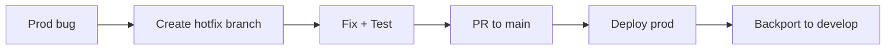

# SPECIAL LANES - Parallel and Special Workflows

> Loading: When working on parallel tracks (frontend + backend) or special cases
> Prerequisite: `01_CORE_RULES_EN.md`
> Size: ~230 lines | Context cost: Low

---

## Goal
Manage parallel development workflows (e.g., frontend and backend simultaneously) and special cases like hotfixes, spikes, and large refactors.

---

## Fullstack Parallel Lane

### When to use
- Feature requires frontend + backend changes
- Team works across both layers
- Need for simultaneous development

### Parallel workflow (summary)
Backend track:
1. Define API contract
2. Implement endpoints
3. Unit tests
4. Integration tests

Frontend track:
1. UI design
2. Components with mocked API
3. Services (mock API)
4. Integration tests

Sync points:
1. Contract agreement
2. Integration ready
3. E2E ready
4. Deploy

### Sync points

```
SYNC POINT 1: Contract Agreement
- OpenAPI spec finalized
- Shared DTOs/interfaces
- Mock server ready for frontend

SYNC POINT 2: Integration Ready
- Backend endpoints working
- Frontend ready to integrate
- Remove mocks, use real API

SYNC POINT 3: E2E Ready
- Both layers integrated
- Feature fully testable
```

### Branching for parallel work

```bash
# Main feature branch
git checkout -b feature/user-dashboard

# Backend sub-branch
git checkout -b feature/user-dashboard-backend

# Frontend sub-branch
git checkout -b feature/user-dashboard-frontend

# Merge flow (conceptual)
# feature/user-dashboard-backend -> feature/user-dashboard -> develop
# feature/user-dashboard-frontend -> feature/user-dashboard -> develop
```

---

## Hotfix Lane

### When to use
- Critical production bug
- Immediate fix required

### Workflow



### Commands

```bash
# Create hotfix from main/production
git checkout main
git pull
git checkout -b hotfix/critical-bug-123

# After the fix
git push -u origin hotfix/critical-bug-123
# Open PR to main

# After merge to main, backport to develop
git checkout develop
git cherry-pick <commit-hash>
```

---

## Spike Lane

### When to use
- Technical investigation
- Proof of concept
- Evaluation of new technologies

### Spike template

```markdown
# Spike: [TITLE]

Time-box: [max hours/days]
Goal: [question to answer]

Experiments:
1. [thing to try]
2. [thing to try]

Success criteria:
- [ ] [criterion 1]
- [ ] [criterion 2]

Expected output:
- [ ] Findings document
- [ ] Go/No-Go recommendation
- [ ] POC code (if applicable, throwaway)
```

### Spike rules

```
- Strict time-box
- POC code never goes to production
- Output is knowledge, not code
- Document findings even if negative
```

---

## Refactoring Lane

### When to use
- Significant cross-cutting refactor
- Major dependency upgrade
- Technology migration

### Strangler Fig strategy

```
PHASE 1: Coexistence
- New code runs alongside old
- Feature flags for switching
- Zero user impact

PHASE 2: Gradual migration
- Move features one by one
- Maintain backward compatibility
- Test both paths

PHASE 3: Remove old
- Disable legacy code
- Monitor for issues
- Complete cleanup
```

---

## Context switch protocol

When switching lanes:

```markdown
## CONTEXT SWITCH

From: [previous lane/task]
To: [new lane/task]

State saved:
- Branch: [name]
- Last commit: [hash]
- Open items: [list]

New context:
- Branch: [name]
- Focus: [what to do]
- Files: [relevant files]
```

---

## Lane selection guide

| Situation | Suggested lane |
|----------|----------------|
| Fullstack feature | Parallel Lane |
| Prod bug | Hotfix Lane |
| New technology | Spike Lane |
| Significant tech debt | Refactoring Lane |
| Backend-only feature | Standard (IMPLEMENTATION) |
| Frontend-only feature | Standard (IMPLEMENTATION) |

---

Use special lanes to handle non-linear situations without losing track.
