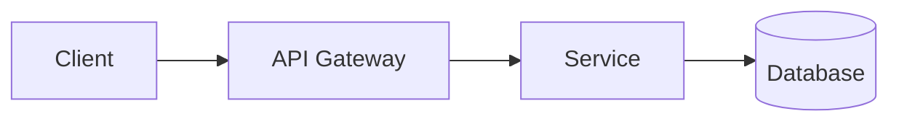

# DOCUMENTATION - Generation & Automation

> Loading: When you need to turn a codebase into maintainable documentation
> Prerequisite: `01_CORE_RULES_EN.md`, optional `09_CODEBASE_ANALYSIS_EN.md` (for MAP/HOTSPOTS)
> Size: ~350 lines | Context cost: Medium

---

## 1. GOAL

Create minimal but useful documentation that stays true over time:
- Operational README (run, test, config)
- Architecture overview (C4-lite)
- API contracts (OpenAPI / endpoints table)
- Data model (tables/entities) and migrations
- Security & performance constraints
- Bugfix/incident runbook

**Format strategy**:
- **Primary**: Markdown + Mermaid (GitHub-native, low friction)
- **Formal publishing**: LaTeX + PlantUML (for audits, compliance, printed docs)

---

## 2. OUTPUT STRUCTURE

```
docs/
  00_OVERVIEW.md
  01_ARCHITECTURE.md
  02_API.md
  03_DATA_MODEL.md
  04_SECURITY_PERF.md
  05_RUNBOOK.md
  99_GLOSSARY.md
```

For LaTeX/PlantUML publishing, add:
```
docs/
  latex/
    structure.base.tex          # Shared preamble (packages, commands)
    00_OVERVIEW.tex ... 05_RUNBOOK.tex
  plantuml_sources/
    architecture_overview.puml
    er_diagram.puml
    sequence_workflow.puml
  diagrams/                     # Generated PNGs (git-ignored)
```

---

## 3. ANTI-NOISE RULES

- 1 page per concept (max 2)
- "How to use" > abstract description
- Each section must include: purpose, code location, how to verify
- If not verifiable: label ASSUMPTION and add TODO
- No duplicated content between Markdown and LaTeX — generate one from the other

---

## 4. TEMPLATES (Markdown)

### `00_OVERVIEW.md`
```md
# Overview
- What: [1-2 sentences]
- Why: [business goal]
- Who uses it: [roles]
- Main flows: [3-5 bullets]
- How to run: (link to README/RUN)
```

### `01_ARCHITECTURE.md` (C4-lite)
```md
# Architecture
## Context
- Users/Actors: [...]
- External systems: [...]

## Containers / Modules
| Module | Responsibility | Entry points | Data |
|---|---|---|---|

## Key decisions
- ADR-001: ...
- ADR-002: ...
```

### `02_API.md`
```md
# API
## Auth
- Mechanism: [JWT/OIDC/...]
- Scopes/Roles: [...]

## Endpoints
| Method | Path | Purpose | Auth | Notes |
|---|---|---|---|---|
```

### `03_DATA_MODEL.md`
```md
# Data Model
## Entities/Tables
| Name | Purpose | Key fields | Relations | Notes |
|---|---|---|---|---|

## Migrations
- How to apply
- Rollback strategy
```

### `04_SECURITY_PERF.md`
```md
# Security & Performance
## Security constraints (SEC-xx)
- SEC-01: ...
## Performance targets (PERF-xx)
- PERF-01: ...
## Verification
- SAST: ... | DAST: ... | Load test: ...
```

### `05_RUNBOOK.md`
```md
# Runbook
## Common operations
- Start/Stop | Logs | Health checks
## Bugfix playbook (→ see 11_BUGFIX_PLAYBOOK_EN.md)
## Incident response
- Severity levels | Escalation
```

---

## 5. DIAGRAM GUIDELINES

### Option A: Mermaid (embedded in Markdown)



- Renders natively on GitHub, GitLab, Azure DevOps
- No external tooling required
- Supports: flowchart, sequence, ER, class, state, C4

### Option B: PlantUML (for LaTeX / formal docs)

Generate `.puml` files in `plantuml_sources/`:

```plantuml
@startuml architecture_overview
package "Presentation" { [Client] }
package "Service Layer" { [API] [Service] }
package "Data Access" { [Repository] database "DB" }
[Client] --> [API]
[API] --> [Service]
[Service] --> [Repository]
[Repository] --> [DB]
@enduml
```

Compile: `java -jar plantuml.jar -tpng -o ../diagrams plantuml_sources/*.puml`

### LaTeX inclusion helper
```latex
\newcommand{\includeplantuml}[3][0.95]{
  \begin{figure}[h]
    \centering
    \includegraphics[width=#1\textwidth]{diagrams/#2.png}
    \caption{#3}
    \label{fig:#2}
  \end{figure}
}
```

---

## 6. GENERATION PROCESS

### Phase 1: Code Analysis
- Identify modules, entry points, data stores
- Extract public APIs, entity schemas, config surfaces
- Use MAP/HOTSPOTS from `09_CODEBASE_ANALYSIS_EN.md` if available

### Phase 2: Diagram Generation
- Create diagrams matching the chosen format (Mermaid or PlantUML)
- Required diagrams: architecture overview, ER/data model, key sequence flows
- Optional: state machines, deployment topology

### Phase 3: Document Generation
- Generate Markdown files following the templates in §4
- If LaTeX required: generate `.tex` files from the same content
- Apply anti-noise rules (§3)

### Phase 4: Validation
- All API methods documented
- All DB tables/entities documented
- Diagrams present and readable
- Internal links working
- No compilation errors (LaTeX)
- Mark gaps as ASSUMPTION + TODO

---

## 7. LATEX CONVENTIONS

When generating LaTeX documentation:

- Use ASCII characters for directory trees (`+--`, `|` instead of box-drawing)
- Shared preamble in `structure.base.tex` — never duplicate packages
- Two `pdflatex` passes for references
- UTF-8 encoding mandatory
- Quote paths with spaces

### API table template
```latex
\begin{longtable}{L{3cm}L{3cm}L{7cm}}
\toprule
\textbf{Parameter} & \textbf{Type} & \textbf{Description} \\
\midrule
\endhead
param1 & string & Parameter description \\
\bottomrule
\end{longtable}
```

---

## 8. BUILD SCRIPTS

### Makefile (Linux/macOS)
```makefile
PLANTUML = java -jar plantuml.jar
PDFLATEX = pdflatex

all: diagrams pdfs validate

diagrams:
	@mkdir -p diagrams
	$(PLANTUML) -tpng -o ../diagrams plantuml_sources/*.puml

pdfs:
	@for f in *.tex; do $(PDFLATEX) -interaction=nonstopmode $$f; $(PDFLATEX) $$f; done

validate:
	@echo "=== Validation Report ==="
	@ls diagrams/*.png 2>/dev/null && echo "Diagrams OK" || echo "No diagrams"
	@ls *.pdf 2>/dev/null && echo "PDFs OK" || echo "No PDFs"
```

### PowerShell (Windows)
```powershell
# Build-Docs.ps1
param([switch]$All, [switch]$Diagrams, [switch]$Validate)

if ($Diagrams -or $All) {
    New-Item -ItemType Directory -Path diagrams -Force | Out-Null
    Get-ChildItem plantuml_sources/*.puml | ForEach-Object {
        java -jar plantuml.jar -tpng -o "../diagrams" $_.FullName
    }
}
if (-not $Diagrams -or $All) {
    Get-ChildItem *.tex | ForEach-Object {
        pdflatex -interaction=nonstopmode $_.Name
        pdflatex -interaction=nonstopmode $_.Name
    }
}
if ($Validate -or $All) {
    Write-Host "=== Validation Report ==="
    Get-ChildItem diagrams/*.png -ErrorAction SilentlyContinue |
        ForEach-Object { Write-Host "  [OK] $($_.Name)" }
}
```

---

## 9. AI COMMANDS

### Full generation
```
Generate complete documentation for module {MODULE}:
1. Analyze source code
2. Generate diagrams (Mermaid for .md, PlantUML for .tex)
3. Generate .md files (+ .tex if formal publishing)
4. Validate and produce report

Output in docs/
```

### Section update
```
Update section {SECTION} for {MODULE}:
1. Re-analyze relevant code
2. Update diagrams if needed
3. Regenerate docs, validate
```

---

AI CONFIDENCE: INFERRED
Basis: Concrete content depends on the repository being documented.
