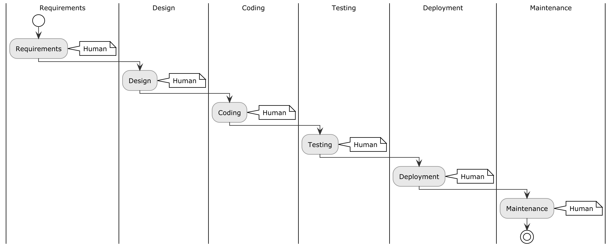
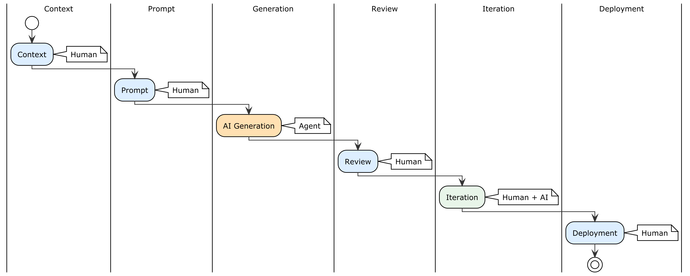

# Introduction — From SDLC to ADLC: The Transformation of Software Engineering

## Why This Book

In 2024, something happened that changed the rules of the game. Artificial intelligence models stopped being autocomplete tools and became **autonomous collaborators**, capable of reasoning, planning, writing code, running tests, and self-correcting. This event — which analysts have called the "Agentic Inflection" — made it possible for the first time in the history of computing to build complete software without manually writing source code.

This is not science fiction. This is not a promise. This is the present.

But this revolution has a problem: nobody has explained **how to actually do it** in practice. Academic sources describe the theory brilliantly. Corporate blogs sell futuristic visions. YouTube tutorials show impressive demos that last 5 minutes. What's missing is a complete, structured path that starts from zero and arrives at a real application in production, explaining every step with the clarity of an operations manual.

This book fills that gap.

You will build 9 real projects — from a Hello World to a full-stack application with a database, authentication, React frontend, Flutter mobile app, and production deployment. All without manually writing a single line of code. The code exists, works, and you can read it, but it's the artificial intelligence that generates it. Your role is different, and it's more important than you think.

---

## The Traditional Paradigm: The SDLC

To understand the revolution underway, you need to understand what it's evolving from.

For decades, software development has followed the **Software Development Life Cycle (SDLC)** — a process model that, in its various incarnations (Waterfall, Agile, DevOps), is founded on a fundamental assumption: **software is deterministic**. The developer writes precise instructions in a formal language. Given the same input, the machine always returns the same output. The source code is the sole repository of business logic.

In this paradigm, the human being is a **syntax worker**. They translate requirements into formal instructions, line by line. Software quality depends on the programmer's ability to write correct, efficient, and maintainable code. Tests verify known paths with binary results: pass or fail. Success is measured in working lines of code, test coverage, and optimized computational cycles.

The model worked for fifty years. But it comes at a very high cost: the barrier to entry. To build software, you first need to learn to program — years of studying syntax, frameworks, patterns, and the quirks of each language. And even after years of experience, the bottleneck remains the speed at which the programmer's fingers transform concepts into code.

---

## The New Paradigm: The ADLC

The **Agent Development Life Cycle (ADLC)** is not an updated version of the SDLC. It's a paradigm shift. The difference is not quantitative (writing code faster), but qualitative (the role of the human being changes in nature).

In the ADLC, artificial intelligence is not an assistant that completes your sentences. It's an **autonomous agent** that uses an LLM as a reasoning engine to execute complex workflows: it writes code, tests it, detects errors, proposes fixes, interacts with external tools, and, when it encounters insurmountable obstacles, transfers control to the human.

The human no longer writes code. They become a **context architect** — an orchestra conductor whose responsibility is to provide the agent with:

- **The project** (context): what to build, with which technologies, in what structure
- **The rules** (constraints): what never to do, which standards to follow, where to stop
- **The tools** (capabilities): which external systems the agent can use

### The 5 Dimensions of Change

The following table illustrates the fundamental differences between the two approaches across five critical dimensions:

| Dimension | Traditional SDLC | ADLC |
|:--|:--|:--|
| **System role** | Executes exclusively predefined tasks along rigid logical paths | Acts as an autonomous collaborator capable of interpreting, prioritizing, and replanning tasks |
| **Behavior** | Deterministic and predictable. Logic resides in rigid code and configurations | Adaptive and probabilistic. Logic emerges from the interaction between context, prompts, models, and tools |
| **Operational focus** | Computational efficiency, algorithmic optimization, and functional correctness | Agency, abstract reasoning, error resilience, and adaptability to unforeseen scenarios |
| **Iteration driver** | Formal changes in business requirements communicated by stakeholders | Changes in performance, environmental mutations, or real-time human feedback |
| **Testing paradigm** | Predefined tests validate known paths (pass/fail). Quality = code maintainability | Continuous evaluation of reasoning, hallucinations, and security. Quality = behavioral reliability |

---

## The 7 Phases of the ADLC

The ADLC structures the development process into 7 phases that map — and transform — the classic SDLC phases:

| # | ADLC Phase | SDLC Equivalent | What Changes |
|:--|:--|:--|:--|
| **0** | **Preparation and Hypothesis** | Planning | You don't write formal requirements. You formulate testable hypotheses: "Can I automate this process with an agent?" |
| **1** | **Scope Framing** | Analysis | You don't analyze the domain to translate it into code. You map the agent's autonomy boundaries: what it can do on its own, where it must stop, where autonomy is forbidden |
| **2** | **Definition and Architecture** | Design | You don't draw UML diagrams. You write the `_CONTEXT.md` — the natural-language contract that governs the agent's behavior |
| **3** | **Simulation (Proof of Value)** | Prototyping | You don't build a prototype. You test with a minimal case whether the agent understands the context and produces coherent output |
| **4** | **Implementation** | Coding | You don't write code. You orchestrate the agent: you formulate requests, review the output, iterate. The agent generates code, tests, documentation |
| **5** | **Release** | Testing + Deploy | You don't just run tests. You evaluate behavioral safety (hallucinations, risk, compliance) and deploy |
| **6** | **Continuous Learning** | Maintenance | You don't patch bugs. You update the context with lessons learned, improving the quality of future sessions |

---

## The Three Fundamental Competencies

If the SDLC required mastery of programming languages, the ADLC requires three different competencies:

### 1. Context Engineering

Language models are **stateless** architectures — they suffer from total amnesia between sessions. If they don't receive structured context, they tend to *drift* toward generic behaviors or *confabulate* nonexistent information.

Context Engineering is the art of designing the information provided to the agent so it can operate with precision. It's not "writing better prompts." It's building an **information system** — context files, constraints, templates, rules — that allows the agent to work autonomously for extended periods without losing its way.

**The vast majority of operational failures in AI agents are no longer attributable to cognitive deficiencies in the models, but to context failures.** The quality of the software you produce in 0-code depends entirely on the quality of your context documents.

### 2. Risk Design

An agent operating autonomously can make wrong decisions. The difference between a safe system and a dangerous one lies in risk classification:

- **LOW RISK**: Diagnostic and research actions → the agent proceeds autonomously
- **MEDIUM RISK**: Actions that create new artifacts → the agent asks for confirmation before proceeding
- **HIGH RISK**: Destructive or irreversible actions → **Mandatory STOP** — the agent categorically stops

Designing risk means deciding in advance where the agent can move freely, where it must ask permission, and where it must stop without exception.

### 3. Confidence Tagging

LLMs don't express uncertainty spontaneously. They can state a verified fact and a dangerous hallucination with the exact same confidence. That's why the ADLC imposes a transparency protocol:

| Tag | Meaning | Action |
|:--|:--|:--|
| **FACT** | Information verifiable from code, documentation, or tool output | No review necessary |
| **INFERRED** | Logical deduction from established facts | Human review recommended |
| **ASSUMPTION** | Unverified hypothesis, high risk of hallucination | **STOP** — the human must validate |

This protocol transforms the agent's output from a "black box" into a transparent system where every statement has a declared degree of reliability.

---

## 0-Code ≠ No-Code

An essential clarification. **0-code** development has nothing to do with traditional no-code platforms (Bubble, Wix, Zapier):

| | Traditional No-Code | 0-Code with AI |
|:--|:--|:--|
| **Code** | Doesn't exist, only visual blocks | The AI generates it (React, Node, Flutter, Python...) |
| **Customization** | Limited to the platform's templates | Unlimited — any stack, any architecture |
| **Ownership** | Locked into the platform | Yours, in your own Git repository |
| **Scalability** | Depends on the platform | Depends on your architecture |
| **How you work** | You drag blocks | You describe what you want in natural language |

In 0-code development, the source code exists, works, and is standard. You can read it, modify it, version it on Git, and deploy it anywhere. The only difference is who writes it: not you with your hands on the keyboard, but the AI agent based on your context documents.

---

## What You Need to Get Started

This book is designed for two profiles:

- **Those with programming basics** (even minimal or rusty) who want to learn to build complete applications by orchestrating AI — becoming a "Context Architect"
- **Junior/mid developers** who want to multiply their productivity tenfold by adopting the 0-code paradigm in their own projects

The AI writes the code, but **you need to be able to read it** to verify that it works and is secure. In the advanced chapters, you'll encounter JWT tokens, Express middleware, Prisma migrations, and state management with Riverpod. You don't need to know how to write these things from scratch — you need to know how to recognize whether the AI has implemented them correctly. The Crash Course below and the contextual explanations in individual chapters will help, but those starting from absolute zero will need to invest more time understanding the generated code.

You need:

- **A computer** (Windows, macOS, or Linux)
- **VS Code** (free) with the GitHub Copilot extension
- **Curiosity** and willingness to experiment
- **Minimal familiarity** with the concept of files, folders, and terminal

If you have programming experience, this book won't bore you. It will show you a completely different way of working — and you might discover that your new role as a context architect is more stimulating than that of a code writer.

---

## Crash Course — The Fundamental Concepts in 5 Minutes

In the following chapters, you'll build applications with databases, APIs, authentication, and mobile apps. The AI will write the code, but to verify that it works correctly, you need to understand some basic concepts. Here's a minimal operational vocabulary.

> 💡 **What is an API?** — An **API** (Application Programming Interface) is a set of "entry points" that a program makes available to receive requests and return responses. When your browser loads a web page, it's calling an API. When a mobile app shows a list of products, it's calling an API. Think of a restaurant: you (the customer) don't go to the kitchen — you talk to the waiter (the API), who takes your order to the kitchen (the server) and brings back your dish (the response).

> 💡 **What is a relational database?** — A **database** is an organized data store. A *relational* database (like PostgreSQL) organizes data into **tables** — similar to Excel spreadsheets. Each table has columns (fields) and rows (records). Tables can be linked to each other: for example, the "users" table is linked to the "notes" table through a `user_id` field. When you ask "show me the notes for user 3," the database searches for all rows in the notes table where `user_id = 3`.

> 💡 **What is client-server architecture?** — In almost all modern applications, there are two parts: the **client** (what the user sees — the web browser, the mobile app) and the **server** (the program running on a remote computer that manages data, logic, and security). The client sends requests, the server responds. The **frontend** (React, Flutter) is the client; the **backend** (Express.js, Node.js) is the server. They communicate through **HTTP** requests — the same protocol your browser uses when you visit a website.

> 💡 **What is authentication?** — **Authentication** is the process by which an application verifies *who you are*. When you log in with Google, Google confirms your identity to your app. The app issues you a digital "ticket" (a **JWT token**) that you attach to every subsequent request, so the server knows it's you without asking for your password every time.

You don't need to memorize all of this now. These concepts will reappear with contextual explanations in the chapters where they're needed. If a term seems unclear during reading, consult the **Glossary** (Appendix A).

---

## How to Read This Book

The book is organized in a linear progression. Each chapter builds on the previous one:

**Part I (Chapters 1–3)** installs the paradigm: what 0-code is, how to configure the environment, how the ADLC works in practice.

**Part II (Chapters 4–6)** gets your hands dirty with the first projects: Hello World, a complete CLI application, your first REST API.

**Part III (Chapters 7–10)** builds a full-stack web application: PostgreSQL database, OAuth 2.0 authentication, React frontend, complete integration.

**Part IV (Chapters 11–13)** takes the project to mobile with Flutter: setup, backend integration, store publication.

**Part V (Chapters 14–15)** tackles quality and production: automated testing, security, deployment to real cloud platforms.

**Part VI (Chapter 16)** looks to the future: multi-agent patterns, microservices, legacy code, and the honest limits of the paradigm.

In **Appendix E** you'll find the analysis of a real, professional ADLC framework — a complete set of "contracts" for AI agents used in production — that shows how the book's theoretical principles translate into mature operational practice.

In **Appendix F** the ultimate test awaits you: an autonomous project (BookShelf) where you'll apply the entire ADLC framework without training wheels. It's the final challenge that consolidates everything you've learned.

Every chapter follows the same structure: **"What you'll learn" → Explanation → Guided practice → Summary"**. You can follow the book from start to finish like a course, or jump to the chapters that interest you if you already have the basics.

---

## Box Legend

Throughout the book, you'll find colored boxes that flag information of different types. Here's how to read them:

| Icon | Box | Meaning |
|:---:|:---|:---|
| 💡 | **Note** (blue) | Theoretical deep dive, key concept, or contextual information. |
| 🟢 | **Tip** (green) | Best practice, shortcut, or operational advice. |
| ⚠️ | **Warning** (orange) | Common mistake or unexpected behavior to avoid. |
| ☠️ | **Danger** (red) | Critical risk: security, data loss, irreversible lock-in. |
| ⚙️ | **Version Note** (purple) | Compatibility between tool, library, or framework versions. |
| 💰 | **How much does it cost?** (gold) | Economic implications: free tiers, limits, real costs. |
| ✅ | **Checkpoint** (green) | Verification point: stop and check that everything works. |
| 🔧 | **Hands-on** (gray) | Step-by-step guided exercise — hands on keyboard. |
