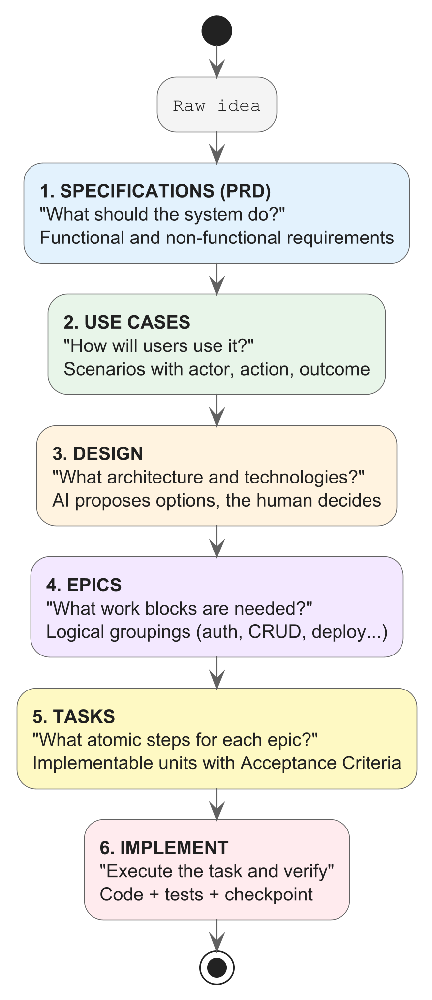

# Chapter 3 — The ADLC Method: How to Work in 0-Code

## What You Will Learn

By the end of this chapter, you will know:
- The 7 phases of the Agent Development Life Cycle applied to application development
- How to write an effective `_CONTEXT.md` file
- What Context Engineering is and why it is the key skill of the 0-code paradigm
- How to structure a project to maximize the quality of AI output

---

## 3.1 — The Life Cycle: The 7 Phases of the ADLC

The ADLC (Agent Development Life Cycle) is the structured working method for developing with AI. It is not academic theory — it is the sequence of steps you will follow in every project in this book.

| Phase | Name | What You Do | Deliverable |
|:--|:--|:--|:--|
| **0** | Preparation | Define the problem, assess whether 0-code is suitable | Solution hypothesis |
| **1** | Framing | Establish boundaries, technologies, constraints | Requirements in natural language |
| **2** | Definition | Write the `_CONTEXT.md` and any `SKILL.md` files | Context documents |
| **3** | Simulation | Test with a small case before starting | Proof of Value |
| **4** | Implementation | The AI generates code under your supervision | Working code |
| **5** | Release | Test, fix, deploy | Application in production |
| **6** | Learning | Update the context with lessons learned | Improved context |

> 💡 **Toward the professional framework.** In this chapter we will look at a basic context with a single `_CONTEXT.md`. If you are wondering how this method scales to real teams and complex architectures, in **Appendix E** we will analyze a 17-file professional ADLC framework used in production — with modules for each phase, NemoClaw, and infrastructure governance. The principles you learn here are the same; only the scale and sophistication change.

### How It Applies in Daily Practice

For a simple project (Hello World, CLI tool), phases 0–3 compress into 5 minutes of reflection. For a complex project (full-stack web app), each phase carries its own specific weight.

**Example: building a REST API for a blog**

- **Phase 0**: "I need a backend for my blog, with posts, comments, and authentication"
- **Phase 1**: "I will use Node.js with Express, PostgreSQL with Prisma, JWT authentication"
- **Phase 2**: I write the `_CONTEXT.md` with architecture, folder structure, constraints
- **Phase 3**: I ask the AI to generate only the `/health` endpoint to verify everything works
- **Phase 4**: I proceed with all endpoints, data model, middleware
- **Phase 5**: Test, fix, deploy on Railway
- **Phase 6**: I notice the AI generated passwords in plain text → I update the context adding: "Use bcrypt for password hashing"

> Phase 6 is crucial: the `_CONTEXT.md` is a **living document** that improves with every project.

### When the AI Goes Off the Rails: Handling Failures

Sooner or later it will happen: the AI will enter an **error loop** — it fixes one bug, introduces another, tries to fix the second one and breaks the code that was working. This is a well-known behavior called a "hallucination loop," and it is important to know how to handle it.

> ⚠️ **The 5 recovery techniques when the AI gets stuck:**
> 1. **Stop and reset the conversation.** Close the chat and open a new one. Often the AI accumulates incorrect context within the session.
> 2. **Go back to the last working version.** Use `git stash` or `git checkout .` to discard the changes. Always keep backups before complex sessions.
> 3. **Break the task into smaller parts.** Instead of "Implement complete authentication," first ask "Generate only the JWT verification middleware."
> 4. **Be more specific in the context.** If the AI generates wrong code, add an explicit constraint to the `_CONTEXT.md`: "DO NOT use CommonJS. Use ONLY import/export ESModules."
> 5. **Switch model or tool.** If Copilot cannot do it, try Claude Code (or vice versa).

> 💡 **Golden rule**: if the AI has failed twice on the same problem with the same approach, **do not insist**. Change strategy: break the task down, add context, or reset the conversation.

### Phase 6 in Practice: How a Constraint Saves the Project

Continuous learning (Phase 6) is not a theoretical exercise. It is the mechanism that transforms errors into permanent defenses.

> 🚨 **Disaster 1: Passwords saved in plain text.** The AI generates a user registration endpoint and saves the password in the database as plain text. The output passed the functional tests, but a security audit would reveal all passwords in the clear.
>
> **The constraint that fixes it**: `SEC-01: Passwords MUST be hashed with bcrypt (cost 12). Never store passwords in plain text.`

> 🚨 **Disaster 2: The AI switches stacks mid-project.** You are working with ESModules (`import/export`) and the AI, in a new session, generates CommonJS code (`require/module.exports`). The project stops compiling.
>
> **The constraint that fixes it**: `Language: JavaScript ES2022+ with ESModules. DO NOT use require() or module.exports. Only import/export.`

> 🚨 **Disaster 3: Phantom dependencies.** The AI installs an unplanned library (e.g., `lodash`) when native functions would have sufficed. The project accumulates unnecessary dependencies.
>
> **The constraint that fixes it**: `Dependencies: ONLY those listed in the _CONTEXT.md. Do not add new dependencies without explicit approval.`

> 💡 **After every error**, ask yourself: "What line could I have added to the `_CONTEXT.md` to prevent this problem?" Then add it. That is the essence of Phase 6.

---

## 3.2 — Context Engineering: The Art of Communicating with AI

Context Engineering is the foundational discipline of 0-code development. It is the difference between an AI that generates mediocre code and an AI that generates professional-quality software.

### The Amnesia Problem

AI models (LLMs) have a fundamental property you must understand: they are **stateless** — they have no memory between sessions. Every time you open a new chat window or restart Copilot, the AI starts from scratch. It does not remember:
- The architectural decisions made yesterday
- Your project's naming conventions
- The bugs you already fixed together
- The chosen technology stack

If you do not provide this information, the AI will **make up** its own (a phenomenon called "hallucination"). It might decide to use MongoDB when your database is PostgreSQL, or generate CommonJS code when your project uses ESModules.

### The Solution: The `_CONTEXT.md` File

The `_CONTEXT.md` file (or `AGENTS.md`) is the **contract** between you and the AI. It is read automatically by the agent at the beginning of every session. It contains everything the AI needs to know to work correctly in your project.

> Think of `_CONTEXT.md` as the brief you would give a new developer on their first day: "Here is how the project is structured, these are the technologies we use, these are the conventions to follow, and these are the things you must NEVER do."

---

## 3.3 — Anatomy of a `_CONTEXT.md`

A good context file has 5 sections:

### 1. Identity and Purpose

```markdown
# Project: BlogAPI

You are working on a REST API backend for a personal blog.
Technologies: Node.js 20, Express.js, PostgreSQL 16, Prisma ORM.
Environment: local development on Windows/macOS.
```

This tells the AI **what** the project is and **what** it works with.

### 2. Architecture and Structure

```markdown
## Project Structure

src/
  routes/          → Endpoint definitions (routing only)
  controllers/     → Controller logic (validation, response)
  services/        → Business logic (DB interaction)
  middleware/      → Auth, error handling, logging
  utils/           → Helper functions
prisma/
  schema.prisma    → Database schema
tests/
  unit/
  integration/
```

This tells the AI **where** to put things. Without this section, the AI might create a different structure every time.

### 3. Conventions and Standards

```markdown
## Conventions

- Naming: camelCase for variables and functions, PascalCase for classes and types
- API responses: always in the format { success: boolean, data: T, error?: string }
- Validation: use Zod for input validation on all endpoints
- Errors: handled centrally via errorHandler middleware
- Async: use async/await, never callbacks
- Imports: use ESModules (import/export), never require()
```

This tells the AI **how** to write the code. This section prevents inconsistencies.

### 4. Constraints and Prohibitions

```markdown
## Constraints (MANDATORY)

- NEVER use raw SQL queries. ALWAYS use Prisma ORM.
- NEVER store passwords in plain text. Use bcrypt with salt rounds >= 12.
- NEVER expose stack traces in production errors.
- NEVER use `any` in TypeScript. Always define types.
- NEVER install dependencies without a documented reason.
```

This tells the AI what it **must never do**. This is the most important section for security and quality.

### 5. Commands and Workflow

```markdown
## Commands

- Start the server: `npm run dev`
- Run the tests: `npm test`
- Migrate the database: `npx prisma migrate dev`
- Generate the Prisma client: `npx prisma generate`
- Linting: `npm run lint`

## Development Workflow

When implementing a new feature:
1. Create/modify the Prisma schema if needed
2. Generate the migration
3. Implement service → controller → route (in that order)
4. Add tests for the new endpoint
5. Verify that all tests pass
6. Update the Swagger documentation
```

This tells the AI **how to work** in the project. The AI will follow this sequence instead of inventing its own.

---

## 3.4 — Your First Complete `_CONTEXT.md`

Here is a complete example that we will use as a foundation for the coming chapters:

### 🔧 **Hands-on** — Create your first context file

Create a `_CONTEXT.md` file in the root of a new project:

```markdown
# Project: TaskMaster CLI

## Purpose
A command-line application for managing personal tasks.
The user can add, list, complete, and delete tasks.
Data is saved in a local JSON file.

## Technologies
- Language: Python 3.11+
- Libraries: standard modules only (argparse, json, os, datetime)
- No external dependencies allowed

## Structure

taskmaster/
├── _CONTEXT.md
├── main.py              ← CLI entry point
├── task_manager.py      ← Task management logic
├── storage.py           ← JSON file persistence
├── tests/
│   ├── test_task_manager.py
│   └── test_storage.py
└── data/
    └── tasks.json       ← Local database (created automatically)


## Conventions
- Naming: snake_case for everything (files, functions, variables)
- Docstrings: every public function must have a docstring
- Type hints: use type hints on all function signatures
- CLI output: clear and formatted messages for the user

## Constraints
- DO NOT use external libraries (pip install). Standard library only.
- DO NOT use global variables. Always pass data as parameters.
- DO NOT ignore errors. Handle FileNotFoundError, JSONDecodeError, etc.
- The tasks.json file must be created automatically if it does not exist.

## CLI Commands
- `python main.py add "Buy milk"` → Adds a task
- `python main.py list` → Shows all tasks
- `python main.py list --status done` → Filters by status
- `python main.py done 3` → Marks task #3 as completed
- `python main.py delete 3` → Deletes task #3

## Testing
- Framework: pytest
- Run the tests: `python -m pytest tests/ -v`
- Every module must have test coverage >= 80%
```

> 🎯 **CHECKPOINT**: This file is everything the AI needs to generate a complete, tested, and working CLI application. In Chapter 5 we will put it into practice.

---

## 3.5 — The 7 Golden Rules of Context Engineering

From field practice, consistent rules emerge for writing effective contexts:

### Rule 1: Be imperative, not descriptive
```text
❌ "It would be preferable to use async/await"
✅ "ALWAYS use async/await. Never callbacks or .then()."
```

### Rule 2: Prohibitions are more important than permissions
The AI can do a thousand things. Your job is to tell it the 10 it must NOT do. Every prohibition in the context prevents an entire class of errors.

### Rule 3: Show the structure, do not describe it
```text
❌ "Organize the files logically with separate folders for controllers,
    models, and services"
✅ "src/
     controllers/
     models/
     services/"
```

### Rule 4: Specify exact commands
The AI should not have to guess how to start the project. If the command is `npm run dev`, write it.

### Rule 5: One `_CONTEXT.md` per project
Do not reuse the same context for different projects. Each project has its own.

### Rule 6: Update after every error
When the AI makes a mistake that you then fix, add a constraint to the `_CONTEXT.md` to prevent it in the future. The context is a living document.

### Rule 7: Less is more, as long as it is precise
A 50-line hyper-specific context beats a 500-line generic context. The AI loses effectiveness when the context is too long and unfocused.

---

## 3.6 — MCP and Agent Skills: A Preview

Two concepts you will encounter in the following chapters deserve a brief preview:

### Model Context Protocol (MCP)
When the AI needs to interact with external services (databases, APIs, Slack, GitHub), it uses **MCP** — a standard protocol that connects the AI to tools. We will introduce it in Chapter 7 when we connect our backend to PostgreSQL.

### Agent Skills (SKILL.md)
When a project becomes complex and requires specialized expertise, you can create `SKILL.md` files in the `.copilot/skills/` folder that grant the AI on-demand expertise. SKILL files exist for every phase of the ADLC: requirements analysis, architectural design, implementation (React, Flutter, API design, database, security), and operations. We will introduce them in Chapter 9 for the React frontend, and you will find the complete mapping in Appendix E.

For now, the `_CONTEXT.md` is all you need.

---

## 3.7 — Managing Long Projects: `PROGRESS.md`

For projects that span multiple sessions (like the full-stack web app in Chapters 7–10), you will need a **persistent memory** system. The AI forgets everything between sessions, but it can read a file.

The `PROGRESS.md` file serves as the **project diary**. At the end of each work session, ask the AI:

```text
Update PROGRESS.md with:
1. What was implemented in this session
2. What architectural decisions were made
3. What problems were encountered and how they were solved
4. What remains to be done
```

In the next session, the AI will read this file and resume with all the accumulated knowledge.

> 💡 **Practical note**: If you use Claude Code, you can call this file `claude-progress.txt` — it is read automatically at the beginning of every session. With other tools (Copilot, Cursor, Windsurf), instruct the agent to read it: *"Read PROGRESS.md to understand the project state, then..."*

> We will explore this technique in depth in Chapter 10 when we build the full-stack integration.

---

## 3.8 — The Professional Workflow: From Idea to Implementation

So far you have learned to write the `_CONTEXT.md` manually and ask the AI to implement. But in real projects — those with dozens of features, security constraints, and rotating teams — an intermediate step is needed: **using the AI itself to decompose the idea into implementable work units**.

The complete professional ADLC workflow has six decomposition phases before writing a single line of code:



### Phase 1: From idea to specifications

Start with a high-level prompt. The AI generates a structured requirements document:

```text
Prompt:
"I need to build a BookShelf application to manage a personal library.
 Node.js + Express backend, React frontend, Flutter mobile, Google OAuth auth.
 Generate a specifications document with functional and non-functional requirements,
 technical constraints, and acceptance criteria."
```

The AI produces a PRD (Product Requirements Document) with clear sections: objective, target users, numbered functional requirements (FR-01, FR-02…), non-functional requirements (NFR-01…), technical constraints, and priorities.

> 💡 **Tip**: Save the PRD in `docs/PRD.md` in the project. It is the reference document for everything else.

### Phase 2: From requirements to use cases

Take the requirements and ask the AI to derive use cases:

```text
Prompt:
"Based on the PRD in docs/PRD.md, generate the main use cases.
 For each use case indicate: actor, precondition, main flow,
 alternative flows, postcondition."
```

The AI produces use cases like:

```markdown
## UC-01: Add book to catalog
- **Actor**: Authenticated user
- **Precondition**: The user has logged in
- **Main flow**:
  1. The user clicks "Add book"
  2. Fills in title, author, year, genre
  3. The system validates the data
  4. The system saves the book to the database
  5. The system displays the book in the updated list
- **Alternative flow**: If the title is empty → validation error
- **Postcondition**: The book is visible in the user's library
```

> Save in `docs/USE_CASES.md`. This document bridges the gap between "what the system does" and "how a real person uses it."

### Phase 3: Design and technology choices

This is the phase where **the AI proposes, but the human decides**. Before breaking the work into epics and tasks, architectural decisions that will condition everything else are needed.

```text
Prompt:
"Based on the PRD and use cases, propose the system architecture.
 For each technical decision (database, ORM, authentication, project structure,
 architectural patterns) present 2-3 options with pros, cons, and recommendation.
 I choose, you document in docs/DESIGN.md."
```

The AI generates a design document with structured decisions:

```markdown
## ADR-01: ORM Choice

### Context
The backend requires an ORM for PostgreSQL compatible with Node.js.

### Options
| Option | Pros | Cons |
|--------|------|------|
| **Prisma** | Type-safe, auto migrations, excellent DX | Less flexible for complex queries |
| **Drizzle** | Lightweight, SQL-like, performant | Smaller community, fewer tutorials |
| **TypeORM** | Mature, Active Record pattern | Verbose API, slowing maintenance |

### Recommendation
Prisma — best for a didactic project focused on productivity.

### Decision
→ **[THE HUMAN CHOOSES HERE]**
```

The AI continues with subsequent decisions: folder structure, authentication strategy, frontend state management, API pattern (REST vs. GraphQL), deployment strategy.

> ⚠️ **Fundamental rule**: The AI must not choose technologies on its own. It presents options with concrete data (performance, maturity, learning curve, cost), but the final choice always belongs to the human. This applies to:
> - Technology stack (language, framework, database)
> - Architectural patterns (monolith vs. microservices, REST vs. GraphQL)
> - Cloud services (hosting, auth provider, CDN)
> - Libraries with architectural impact (ORM, state management, UI framework)

The result is a `docs/DESIGN.md` with all the ADRs (Architecture Decision Records) — motivated, traceable decisions that the AI will respect in all subsequent phases.

> Save in `docs/DESIGN.md`. This document feeds the `_CONTEXT.md` with the definitive technology choices.

### Phase 4: From use cases to epics

Epics group use cases into manageable blocks of work:

```text
Prompt:
"Based on the use cases in docs/USE_CASES.md, organize the work into epics.
 Each epic must have: code (E-001, E-002…), title, objective,
 covered use cases, dependencies between epics, and implementation order."
```

The AI produces an index like:

```markdown
## Epic Index

| Code | Title                   | Priority | Dependencies |
|------|-------------------------|----------|--------------|
| E-001  | Setup and Infrastructure | 1       | —            |
| E-002  | OAuth Authentication     | 2       | E-001        |
| E-003  | Book CRUD                | 3       | E-002        |
| E-004  | Search and Filters       | 4       | E-003        |
| E-005  | Statistics               | 5       | E-003        |
| E-006  | Web Frontend             | 6       | E-003        |
| E-007  | Mobile App               | 7       | E-003        |
| E-008  | Testing and Security     | 8       | E-006        |
| E-009  | Production Deploy        | 9       | E-008        |
```

> Save in `docs/epics/INDEX.md` with one file per epic: `docs/epics/E-001_Setup.md`, etc.

### Phase 5: From epics to tasks

Each epic is broken down into atomic tasks — the unit of work the AI implements in a single session:

```text
Prompt:
"Break down epic E-003 (Book CRUD) into atomic tasks.
 Each task must have: code (T-003.1, T-003.2…), title,
 verifiable acceptance criteria, involved files,
 applicable SEC/PERF constraints, estimate in story points (1-5)."
```

The AI generates tasks in this format:

```markdown
# T-003.1 — Prisma Book Model
Epic: E-003 | SP: 2 | Status: 🔲 TODO | Risk: LOW

## Objective
Define the Book model in the Prisma schema with all fields from the PRD.

## Acceptance Criteria
- [ ] The Book model is defined in schema.prisma
- [ ] Includes the fields: title, author, year, genre, isbn?, coverUrl?,
      status (enum), rating?, notes?
- [ ] The relationship with User is configured (userId, foreign key)
- [ ] The migration is run without errors
- [ ] A test verifies the creation of a Book record

## Involved Files
- backend/prisma/schema.prisma
- backend/tests/models/book.test.js

## Applicable SEC/PERF
- SEC-02: Every query filters by userId
- PERF-02: Index on Book.userId and Book.status
```

> Save tasks in `docs/epics/tasks/E-003/T-003.1_Book_Model.md`.

### Phase 6: Implementation driven by tasks

With the tasks ready, implementation becomes systematic:

```text
Prompt:
"Implement task T-003.1 (Prisma Book Model).
 Read the details in docs/epics/tasks/E-003/T-003.1_Book_Model.md.
 Respect constraints SEC-02 and PERF-02 from the _CONTEXT.md."
```

The AI reads the task file, knows the acceptance criteria, implements, tests, and marks the task as completed. Then you move on to the next one:

```text
"Implement T-003.2."
```

Each session closes one or more tasks. At the end:
- The AI updates the task status (🔲 → ✅)
- Produces a checkpoint with the summary
- Updates `_CONTEXT.md` and `PROGRESS.md`

### Why This Workflow Works

| Without decomposition | With decomposition |
|---|---|
| "Build the BookShelf app" | "Implement T-003.1" |
| The AI invents the architecture | The architecture is in the specifications |
| If it goes off track, start over from scratch | If it goes off track, resume from the task |
| No traceability | Every decision is documented |
| Impossible to estimate timelines | Story points per task |

> 🎯 **CHECKPOINT**: The Idea → Specifications → Use Cases → Design → Epics → Tasks → Implementation workflow is the difference between "experimenting with AI" and "doing software engineering with AI." You will apply it in the standalone project in Appendix F.

---

## Summary

| Concept | What You Learned |
|:--|:--|
| ADLC | The 7 phases of the 0-code life cycle |
| `_CONTEXT.md` | How to write the contract with the AI |
| Context Engineering | The 7 rules for effective contexts |
| Project structure | The 5 sections of a well-written context |
| MCP / Skills | Preview of advanced tools |
| `PROGRESS.md` | Persistent memory across sessions |
| Professional workflow | From idea to implementable tasks in 6 phases |

---

**→ In the next chapter**: you will get your hands on the keyboard. You will build your first complete program in 0-code — an advanced Hello World that will show you the complete flow from context to working code.
