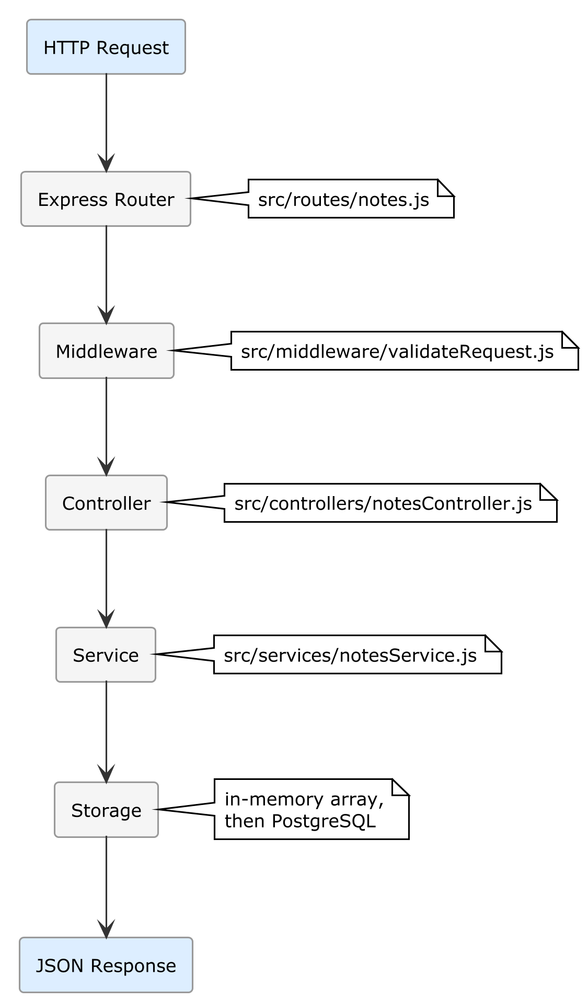

# Chapter 6 — Project 3: Your First REST API with Node.js

## What You Will Build

A **complete REST API server** with Node.js and Express that:
- Exposes CRUD endpoints for managing "notes"
- Validates all input
- Handles errors with centralized middleware
- Generates automatic Swagger documentation
- Includes integration tests

This server will become the **foundation of the full-stack project** that will grow through Chapters 7–10.

**Estimated time**: 45–60 minutes

---

> 💡 **Theory Box — What Is a REST API?** A REST API is an interface that allows different programs to communicate with each other through standard HTTP requests. It works like a waiter in a restaurant: the client (browser, mobile app) sends an *order* (request) specifying *what it wants* (URL) and *which operation* (HTTP method: GET to read, POST to create, PUT to update, DELETE to remove). The server processes the request and responds with data in JSON format. Example: `GET /api/notes` asks for the list of notes; the server responds with `[{"id": 1, "title": "First note"}]`.

> ⚙️ **Version Note** — The instructions in this chapter are verified with Node.js 20 LTS, Express.js 4.x, Zod 3.x, and Jest 29.x. JavaScript frameworks evolve constantly: if the AI flags a deprecated library or suggests a newer version (e.g., Express 5, Vitest instead of Jest), trust the correction and proceed. The architectural concepts remain identical.

> 📦 **Tooling Box — Stack chosen for this example.**
> - **Runtime:** Node.js 20 LTS
> - **Framework:** Express.js 4.x
> - **Validation:** Zod 3.x
> - **Testing:** Jest 29.x
>
> **Equivalent alternatives:** Python/FastAPI, Go/Gin, Java/Spring Boot, C#/ASP.NET. The **architectural pattern** (CRUD endpoints, input validation, middleware, tests) is identical regardless of the language. If you prefer a different stack, apply the same 0-code method: the `_CONTEXT.md` will guide the AI to generate the implementation in the framework you chose.

## 6.1 — Prerequisites

### 🔧 HANDS-ON — Installing Node.js

**Windows:**
1. Download the LTS version (20.x or higher) from [nodejs.org](https://nodejs.org)
2. Run the installer with default options

**macOS:**
```bash
brew install node
```

**Linux:**
```bash
curl -fsSL https://deb.nodesource.com/setup_20.x | sudo -E bash -
sudo apt-get install nodejs
```

**Verify:**
```bash
node --version    # v20.x.x
npm --version     # 10.x.x
```

---

## 6.2 — The Project Context (ADLC Phase 0-2)

> 📖 **Didactic Note**: In a real project, before writing the `_CONTEXT.md` you would apply Phase 3 of the professional workflow (Section 3.8): the AI proposes the technical options, you choose, and document everything in `docs/DESIGN.md` as ADRs. In this guided project, the choices have already been made for you — so you can focus on learning the ADLC method without the decision-making overhead. In the autonomous project in Appendix F you will apply the complete workflow, Design included.

### 🔧 HANDS-ON — Setup and `_CONTEXT.md`

1. Create the `notes-api` folder
2. Open it in VS Code
3. Create the `_CONTEXT.md` file:

```markdown
# Project: Notes API

## Purpose
REST API for managing personal notes. Backend that will be used as the 
foundation for a full-stack application (React frontend + Flutter mobile).

## Technologies
- Runtime: Node.js 20 LTS
- Framework: Express.js 4.x
- Language: JavaScript ES2022+ with ESModules (import/export)
- Validation: Zod
- Documentation: swagger-jsdoc + swagger-ui-express
- Testing: Jest with supertest
- Linting: ESLint

## Project Structure

notes-api/
├── _CONTEXT.md
├── package.json
├── .env.example         ← Environment variables template
├── .gitignore
├── src/
│   ├── index.js         ← Entry point: creates app and starts server
│   ├── app.js           ← Express configuration (middleware, routes)
│   ├── routes/
│   │   └── notes.js     ← Route definitions for /api/notes
│   ├── controllers/
│   │   └── notesController.js  ← Controller logic
│   ├── services/
│   │   └── notesService.js     ← Business logic (in-memory for now)
│   ├── middleware/
│   │   ├── errorHandler.js     ← Centralized error handling
│   │   └── validateRequest.js  ← Validation middleware with Zod
│   ├── schemas/
│   │   └── noteSchema.js       ← Zod schema for note validation
│   └── utils/
│       └── apiResponse.js      ← Helper for standardized responses
└── tests/
    ├── setup.js
    └── notes.test.js           ← API integration tests

## Data Model (Note)

For now we use in-memory storage (array). In Chapter 7 we will migrate to PostgreSQL.

- id: string UUID v4 (automatically generated)
- title: string (required, 1-200 characters)
- content: string (required, 1-10000 characters)
- tags: string[] (optional, default [])
- createdAt: string ISO 8601
- updatedAt: string ISO 8601

## API Endpoints

| Method | Path | Description | Status Code |
|:--|:--|:--|:--|
| GET | /api/notes | List all notes | 200 |
| GET | /api/notes/:id | Note detail | 200 / 404 |
| POST | /api/notes | Create note | 201 |
| PUT | /api/notes/:id | Update note | 200 / 404 |
| DELETE | /api/notes/:id | Delete note | 204 / 404 |
| GET | /api/health | Health check | 200 |
| GET | /api/docs | Swagger UI | 200 |

## API Response Format

All responses MUST follow this format:

Success:
{ "success": true, "data": T }

Success with list:
{ "success": true, "data": T[], "count": number }

Error:
{ "success": false, "error": { "message": string, "code": string } }

## Conventions

- ESModules: ALWAYS use import/export, NEVER require/module.exports
- Async: ALWAYS use async/await, NEVER callbacks or .then()
- Naming: camelCase for variables/functions, PascalCase for classes
- Files: kebab-case for file names
- Status codes: use the appropriate constants (201 for POST, 204 for DELETE)
- Every controller is an async function

## Constraints

- DO NOT use require(). This is an ESModules project.
- DO NOT put business logic in controllers. Use services.
- DO NOT return stack traces in errors. Only user-friendly messages.
- DO NOT use console.log for debugging in production. Use a logLevel.
- DO NOT hardcode the port. Use process.env.PORT with default 3000.
- CORS must be enabled for development (origin: '*' in dev).
- Every endpoint must have a JSDoc Swagger comment.

## Commands

- Install dependencies: npm install
- Start in dev: npm run dev (with nodemon)
- Start in prod: npm start
- Test: npm test
- Lint: npm run lint

## package.json type

REQUIRED: the package.json MUST contain "type": "module" to support
ESModules.
```

---

## 6.3 — Project Generation

### 🔧 HANDS-ON — Initialization and generation

In Copilot Agent Mode:

```text
Read the _CONTEXT.md and implement the entire Notes API project.

Start with:
1. Initialize the npm project with package.json (type: module)
2. Install the necessary dependencies
3. Implement the files in order: schemas → utils → services → middleware → 
   controllers → routes → app → index
4. Add the Swagger configuration
5. Create integration tests
6. Create .env.example and .gitignore
```

The AI should:
1. Run `npm init -y` and `npm install express zod swagger-jsdoc swagger-ui-express uuid cors`
2. Run `npm install -D jest supertest nodemon eslint`
3. Create all files following the `_CONTEXT.md` structure

---

## 6.4 — Structural Verification

### 🔧 HANDS-ON — Checking the structure

```bash
# Verify that the files were created
dir src /s       # Windows
ls -R src        # macOS/Linux
```

### Quick review checklist

**`package.json`:**
- [ ] Contains `"type": "module"`
- [ ] Scripts `dev`, `start`, `test`, `lint` present
- [ ] Correct dependencies

**`src/app.js`:**
- [ ] Uses `import`, not `require`
- [ ] CORS enabled
- [ ] Error handler as last middleware
- [ ] Route /api/notes mounted
- [ ] Route /api/docs for Swagger

**`src/schemas/noteSchema.js`:**
- [ ] Zod schema with title validation (1-200 chars), content (1-10000 chars)
- [ ] Optional tags field

**`src/utils/apiResponse.js`:**
- [ ] Response format conforms to `_CONTEXT.md`
- [ ] Functions `successResponse()` and `errorResponse()`

---

## 6.5 — Testing and First Run

### 🔧 HANDS-ON — Starting the server

```bash
npm run dev
```

Expected output:
```text
Server running on port 3000
Swagger docs available at http://localhost:3000/api/docs
```

### 🔧 HANDS-ON — Manual testing with curl or Thunder Client

**Health check:**
```bash
curl http://localhost:3000/api/health
```
```json
{ "success": true, "data": { "status": "ok", "timestamp": "2026-03-30T..." } }
```

**Create a note:**
```bash
curl -X POST http://localhost:3000/api/notes \
  -H "Content-Type: application/json" \
  -d '{"title": "My first note", "content": "Generated in 0-code!", "tags": ["test"]}'
```
```json
{ "success": true, "data": { "id": "uuid...", "title": "My first note", ... } }
```

**List notes:**
```bash
curl http://localhost:3000/api/notes
```

**Test validation (expected error):**
```bash
curl -X POST http://localhost:3000/api/notes \
  -H "Content-Type: application/json" \
  -d '{"title": ""}'
```
```json
{ "success": false, "error": { "message": "Validation failed", "code": "VALIDATION_ERROR" } }
```

### 🔧 HANDS-ON — Swagger UI

Open in your browser: `http://localhost:3000/api/docs`

You should see the interactive Swagger documentation with all the endpoints. You can test the APIs directly from there.

### 🔧 HANDS-ON — Automated tests

```bash
npm test
```

### 🎯 CHECKPOINT
- Server started ✅
- Health check responds ✅
- Note CRUD works ✅
- Validation blocks invalid input ✅
- Swagger UI accessible ✅
- Automated tests pass ✅

---

## 6.6 — Understanding the Architecture

This is a good time to understand the architecture the AI generated, because you will encounter it throughout the book:



Each layer has a specific responsibility:
- **Router**: defines URLs and HTTP methods
- **Middleware**: validation, authentication (we will add it in Ch. 8)
- **Controller**: handles the HTTP request/response
- **Service**: contains the business logic (knows nothing about HTTP)
- **Storage**: persists data (currently in an array, later a database)

> 📖 **Deep Dive**: This layer separation is a classic architectural pattern. The advantage is that when we add PostgreSQL in Chapter 7, we will only need to modify the storage layer. Everything else stays unchanged.

---

## 6.7 — Preparation for the Next Chapters

This API is the foundation of the full-stack project. In the upcoming chapters:

| Chapter | What We Add |
|:--|:--|
| **Ch. 7** | PostgreSQL + Prisma (replacing in-memory storage) |
| **Ch. 8** | OAuth 2.0 authentication + JWT |
| **Ch. 9** | React frontend with authentication |
| **Ch. 10** | Complete full-stack integration |
| **Ch. 11–12** | Flutter app connected to this API |

Save the project — we will pick it up again in the next chapter.

### 🔧 HANDS-ON — Initialize Git

```bash
git init
git add .
git commit -m "feat: complete Notes REST API with validation and Swagger"
```

---

## Project Summary

| Aspect | Detail |
|:--|:--|
| **Stack** | Node.js 20 + Express + Zod + Swagger |
| **Endpoints** | 6 REST endpoints + documentation |
| **Validation** | Zod schema on all input |
| **Testing** | Integration tests with Jest + supertest |
| **Architecture** | Router → Controller → Service → Storage |
| **Total time** | ~45–60 minutes |
| **Code written by hand** | Only the `_CONTEXT.md` |

---

**→ In the next chapter**: we connect a real database. We will replace the in-memory storage with PostgreSQL using Prisma ORM, discover the first MCP Server, and set up automatic migrations.
