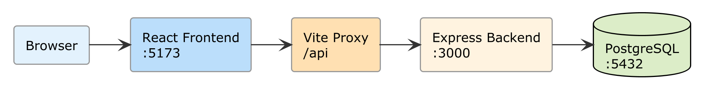
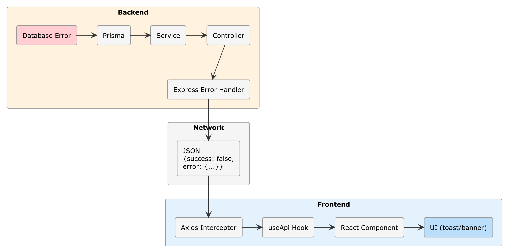

# Chapter 10 — Project 7: Full-Stack Integration

## What You Will Build

A fully integrated full-stack application:
- Backend and frontend communicating without errors
- CORS and proxy configured correctly
- Unified end-to-end error handling
- A single project `_CONTEXT.md` governing both
- The Multi-Agent pattern applied in practice
- A reproducible development system for any future project

**Estimated time**: 45–60 minutes  
**Prerequisite**: Backend (Ch. 6–8) and Frontend (Ch. 9) working

---

## 10.1 — The Monorepo Structure

### 🔧 HANDS-ON — Organize the workspace

Reorganize the directory structure:

```text
notes-fullstack/
├── _CONTEXT.md              ← Global project context
├── SKILL.md                 ← Shared skill (optional)
├── PROGRESS.md              ← Persistent memory across sessions
├── backend/
│   ├── _CONTEXT.md          ← Backend-specific context
│   ├── package.json
│   ├── prisma/
│   └── src/
└── frontend/
    ├── _CONTEXT.md          ← Frontend-specific context
    ├── SKILL.md             ← React skill
    ├── package.json
    └── src/
```

```bash
mkdir notes-fullstack
mv notes-api notes-fullstack/backend
mv notes-frontend notes-fullstack/frontend
cd notes-fullstack
git init
```

---

## 10.2 — The Global Context

The `_CONTEXT.md` in the project root is the most important document. It describes the entire system.

### 🔧 HANDS-ON — Create the root `_CONTEXT.md`

````markdown
# Project: Notes Full-Stack Application

## Overview
Full-stack web application for managing personal notes with 
OAuth 2.0 authentication. Composed of a backend REST API and a React frontend.

## Architecture

```text
[Browser] → [Frontend React :5173] → [Vite Proxy /api] → [Backend Express :3000]
                                                              ↓
                                                        [PostgreSQL :5432]
```

## Components

### Backend (./backend/)
- **Technology**: Node.js 20, Express.js, Prisma ORM
- **Database**: PostgreSQL 16
- **Auth**: OAuth 2.0 (Google + GitHub), JWT, Passport.js
- **API Base**: /api
- **Port**: 3000
- **Context**: ./backend/_CONTEXT.md

### Frontend (./frontend/)
- **Technology**: React 18, Vite, Tailwind CSS 4
- **Routing**: React Router 6
- **Auth**: httpOnly cookie via backend proxy
- **Port**: 5173 (dev), served from CDN in production
- **Context**: ./frontend/_CONTEXT.md
- **Skill**: ./frontend/SKILL.md

## API Contract

The frontend and backend communicate through this contract:

### Response format (ALWAYS respected)
```json
{
  "success": true|false,
  "data": { ... },
  "error": { "message": "...", "code": "VALIDATION_ERROR" }
}
```

### Endpoints

| Method | Endpoint | Auth | Description |
|:--|:--|:--|:--|
| GET | /api/auth/google | No | Start Google login |
| GET | /api/auth/github | No | Start GitHub login |
| GET | /api/auth/me | Yes | Current user profile |
| POST | /api/auth/refresh | Cookie | Refresh JWT |
| POST | /api/auth/logout | Yes | Logout (invalidate token) |
| GET | /api/notes | Yes | List user notes |
| POST | /api/notes | Yes | Create note |
| GET | /api/notes/:id | Yes | Note detail |
| PUT | /api/notes/:id | Yes | Edit note |
| DELETE | /api/notes/:id | Yes | Delete note |
| GET | /api/notes/search?q= | Yes | Search notes |

### Error codes
- 401: Not authenticated → frontend redirects to login
- 403: Not authorized (another user's note) → show error
- 404: Resource not found → show 404 page
- 422: Validation failed → show errors on form fields
- 500: Server error → show generic message

## Environment Variables

### Backend (.env)
DATABASE_URL, GOOGLE_CLIENT_ID, GOOGLE_CLIENT_SECRET,
GITHUB_CLIENT_ID, GITHUB_CLIENT_SECRET, JWT_SECRET, 
JWT_EXPIRES_IN, REFRESH_TOKEN_EXPIRES_IN, FRONTEND_URL

### Frontend (.env)
VITE_API_URL=/api (in dev with proxy)

## Commands

### Development
- Backend: cd backend && npm run dev
- Frontend: cd frontend && npm run dev
- Database: npx prisma studio (from backend folder)

### Production
- Backend: cd backend && npm start
- Frontend: cd frontend && npm run build (generates ./frontend/dist/)
````



> 📖 **Deep Dive**: This document is the contract between the two parts of the application. When you ask the AI to modify the backend, it knows what to expect from the frontend. When you modify the frontend, the AI knows which endpoints are available. Without this document, every change risks breaking the other part.

---

## 10.3 — CORS Management in Development and Production

### The problem

In development, the frontend (port 5173) and backend (port 3000) run on different ports. The browser blocks cross-origin requests for security.

### The dual solution

**In development**: The Vite proxy (configured in Chapter 9) forwards the requests.

**In production**: The backend directly serves the frontend's static files.

### 🔧 HANDS-ON — Configure the backend for production

```text
Modify the backend to serve the frontend's static files in production.

In app.js:
- If NODE_ENV === 'production', serve static files from ../frontend/dist
- For any non-API route, serve index.html (React Router handles routing)
- Configure CORS only for the development environment

Also modify the CORS middleware:
- In development: origin = 'http://localhost:5173', credentials = true
- In production: origin not needed (same-origin)
```

The AI should generate something similar to:

```javascript
// In app.js
import path from 'path';
import { fileURLToPath } from 'url';

const __dirname = path.dirname(fileURLToPath(import.meta.url));

if (process.env.NODE_ENV === 'production') {
  // Serve frontend build
  app.use(express.static(path.join(__dirname, '../../frontend/dist')));
  
  // Fallback for React Router
  app.get('*', (req, res) => {
    if (!req.path.startsWith('/api')) {
      res.sendFile(path.join(__dirname, '../../frontend/dist/index.html'));
    }
  });
} else {
  // CORS for development
  app.use(cors({
    origin: process.env.FRONTEND_URL || 'http://localhost:5173',
    credentials: true
  }));
}
```

---

## 10.4 — End-to-End Error Handling

An error can originate at any level. The system must handle it consistently.

### The error flow



### 🔧 HANDS-ON — Complete error handling

```text
Implement an end-to-end error handling system:

1. Backend: create a global error handling middleware in Express 
   that catches all errors and converts them to the standard format 
   { success: false, error: { message, code } }.
   Handle specifically: PrismaClientKnownRequestError (P2025 = not found),
   ValidationError, AuthenticationError, AuthorizationError.

2. Frontend: add an Axios response interceptor that:
   - For 401: clears the auth state and redirects to login
   - For 422: returns validation errors to the form
   - For 500: shows a generic error toast
   - For network errors: shows a "Connection lost" banner

3. Frontend: create a React ErrorBoundary component that catches 
   rendering errors and shows a fallback page.
```

> ⚠️ **Warning**: The backend error handler must NEVER expose internal details in production. Messages like "Cannot read property 'id' of undefined" or stack traces are security vulnerabilities (Information Disclosure, OWASP A01). In production, return only generic messages.

---

## 10.5 — Development Session with `PROGRESS.md`

When working on a complex project, the AI's persistent memory is essential.

### 🔧 HANDS-ON — Create `PROGRESS.md`

```markdown
# Notes Full-Stack — Progress

## Current Status
- [x] Backend REST API with Express.js
- [x] PostgreSQL database with Prisma
- [x] OAuth 2.0 authentication (Google + GitHub)
- [x] React frontend with notes dashboard
- [x] Complete CRUD notes (frontend ↔ backend)
- [x] End-to-end error handling
- [ ] Automated testing (Chapter 14)
- [ ] Production deployment (Chapter 15)

## Architectural Decisions
- JWT in httpOnly cookie (not localStorage) for XSS security
- Vite proxy in dev, static serving in production
- Monorepo with separate contexts for backend and frontend
- Context API for auth state (no Redux, the project is simple enough)

## Resolved Issues
- CORS: resolved with Vite proxy in dev + conditional cors middleware
- Refresh token: handled with Axios interceptor that retries the request
- OAuth redirect: callback URL points to backend, which redirects to frontend

## Notes for Next Session
- When modifying backend endpoints, also update the 
  root _CONTEXT.md (endpoint table)
- The development database is named "notes_dev" (see backend .env)
```

If you use Copilot Agent Mode, this file is not read automatically, but you can instruct Copilot to read it:

```text
Read the PROGRESS.md file to understand the project status, then...
```

---

## 10.6 — The Multi-Agent Pattern in Practice

In Chapter 3 we introduced the concept of an agent. Now let's see how to use **multiple specialized agents** in a real workflow.

### The Planner-Generator-Evaluator pattern

This is not about making agents communicate with each other (that's for advanced systems). It's about **changing the AI's role** in different phases of work:

**1. Planner**: Ask the AI to analyze and plan

```text
Analyze the root _CONTEXT.md. I want to add a "categories" 
feature to notes: each note can belong to a category, 
categories are user-defined.

DO NOT write code. List:
1. Which backend files need to be modified and why
2. Which frontend files need to be modified and why
3. The required database migrations
4. The recommended implementation order
```

**2. Generator**: Ask it to implement point by point

```text
Implement point 1 of the plan: the database migration.
Add the Category model and the relationship with Note in Prisma.
Follow the conventions from the backend _CONTEXT.md.
```

**3. Evaluator**: Ask the AI to review its own work

```text
Review the code you just generated for the categories feature.
Verify:
1. Is the migration reversible?
2. Do the endpoints follow the standard response format?
3. Does the frontend correctly handle the "no categories" case?
4. Are there security issues (can a user access another user's 
   categories)?
List any issues found.
```

### 🔧 HANDS-ON — Add categories

Follow the Planner-Generator-Evaluator pattern described above to add the "categories" feature to the application:

1. Ask the AI to plan (Planner)
2. Implement database and backend (Generator)
3. Implement frontend (Generator)
4. Ask the AI to review everything (Evaluator)
5. Fix any reported issues

---

## 10.7 — AI-Guided Refactoring

With the entire stack working, it's the right time to consolidate.

### 🔧 HANDS-ON — Backend refactoring

```text
Refactor the backend. Verify:
1. All controllers follow the same pattern (try/catch, response format)
2. There is no duplication in validation code (use Zod middleware)
3. Prisma queries specify fields with select (never return 
   all fields)
4. Route files follow the same structure
5. Error messages are consistent

DO NOT change external behavior. DO NOT break tests. 
Show me a diff before applying the changes.
```

> 💡 **Tip**: Asking "show me a diff" before applying changes is an effective defensive practice. You can review the AI's proposed changes before it applies them.

---

## 10.8 — Development Scripts

### 🔧 HANDS-ON — Root npm scripts

Create a `package.json` at the monorepo root:

```json
{
  "name": "notes-fullstack",
  "private": true,
  "scripts": {
    "dev": "concurrently \"npm run dev:backend\" \"npm run dev:frontend\"",
    "dev:backend": "cd backend && npm run dev",
    "dev:frontend": "cd frontend && npm run dev",
    "build": "cd frontend && npm run build",
    "start": "cd backend && NODE_ENV=production node src/index.js",
    "db:migrate": "cd backend && npx prisma migrate dev",
    "db:studio": "cd backend && npx prisma studio",
    "db:seed": "cd backend && npx prisma db seed"
  },
  "devDependencies": {
    "concurrently": "^8.0.0"
  }
}
```

```bash
npm install
npm run dev  # Start backend and frontend together
```

---

## 10.9 — End-to-End Testing

### Final checklist

| Test | How to verify |
|:--|:--|
| **Cold start** | `npm run dev` → everything starts without errors |
| **Google Login** | Click → OAuth → Dashboard |
| **GitHub Login** | Click → OAuth → Dashboard |
| **Complete CRUD** | Create → Read → Edit → Delete note |
| **Categories** | Create category → Assign to note → Filter |
| **Search** | Search by title → Correct results |
| **Logout + protection** | Logout → Try /dashboard → Redirect to login |
| **Expired token** | Wait for expiration → App renews automatically |
| **Backend down** | Stop the backend → Frontend shows "Connection lost" |
| **404** | Go to /nonexistent-page → 404 page |
| **Mobile** | Open on mobile emulator → Responsive layout |

### 🎯 CHECKPOINT
If all tests pass, the full-stack application is complete. You have a backend with a database and authentication, a React frontend with a dashboard, and a monorepo architecture ready for deployment.

---

## 10.10 — Final Commit

```bash
cd notes-fullstack
git add .
git commit -m "feat: complete full-stack integration with monorepo, error handling and categories"
```

---

## Summary

| Aspect | Detail |
|:--|:--|
| **Architecture** | Monorepo with separate contexts |
| **Global context** | Root `_CONTEXT.md` with API contract |
| **CORS** | Vite proxy (dev) + static serving (prod) |
| **Error handling** | End-to-end from database to UI toast |
| **Multi-Agent** | Planner-Generator-Evaluator pattern |
| **Memory** | `PROGRESS.md` for continuous sessions |
| **Scripts** | `npm run dev` starts everything with concurrently |

---

## What You Have Built So Far

Take a moment. Starting from zero, in 10 chapters you have built:

1. ✅ An **interactive program** in Python (Ch. 4)
2. ✅ A **task manager CLI** with persistence (Ch. 5)
3. ✅ A **REST API** with Express.js and Swagger (Ch. 6)
4. ✅ A **PostgreSQL database** with Prisma ORM (Ch. 7)
5. ✅ An **OAuth 2.0 authentication** system (Ch. 8)
6. ✅ A **React frontend** with dashboard and CRUD (Ch. 9)
7. ✅ A **fully integrated full-stack application** (Ch. 10)

All **without writing a single line of code manually**.

---

**→ In Part IV**: we will bring this application to mobile with Flutter. We will build a native app that connects to the backend we already have, with authentication, data synchronization, and store publishing.
