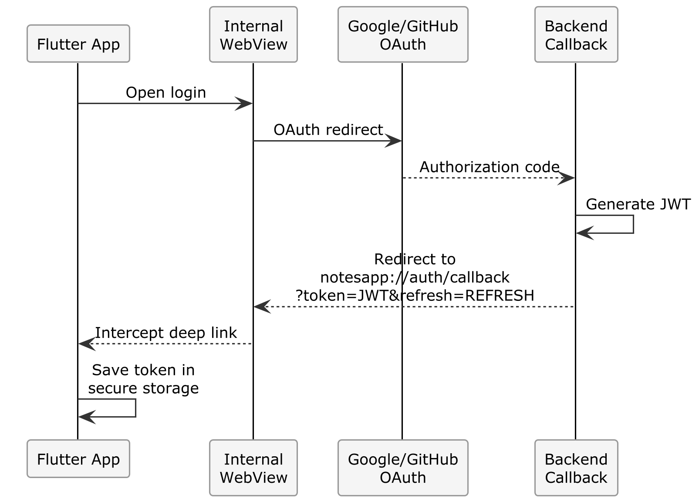

# Chapter 12 — Project 9: Flutter and Backend: Authentication and CRUD

## What You'll Build

A fully functional Flutter app that:
- Performs OAuth 2.0 login (Google/GitHub) via WebView
- Stores tokens securely (flutter_secure_storage)
- Displays the notes list from the API
- Supports creating, editing, and deleting notes
- Handles network errors and expired tokens
- Works on Android emulator, iOS, and Chrome

**Estimated time**: 60–90 minutes  
**Prerequisite**: Flutter app with static UI (Ch. 11) + Working backend

---

## 12.1 — OAuth Authentication on Mobile

### The Problem

On the web, OAuth works with browser redirects. On mobile, the flow is different:



### 🔧 HANDS-ON — Dependencies for Mobile OAuth

Update the `_CONTEXT.md`:

```markdown
## Mobile Authentication

Mobile authentication uses a WebView to display the OAuth page.
After login, the backend redirects to a special URL that the app intercepts
to extract the JWT token.

### Flow:
1. User taps "Login with Google"
2. App opens a WebView with URL: {backend}/api/auth/google?platform=mobile
3. Google shows the consent page
4. Backend receives the OAuth callback
5. Backend redirects to: notesapp://auth/callback?token={jwt}&refresh={refresh_token}
6. App intercepts the deep link, saves the tokens, closes the WebView

### Additional dependencies:
- flutter_web_auth_2: for the OAuth flow with custom scheme
- flutter_secure_storage: to securely store tokens
```

```text
Add to the Flutter project:
1. The flutter_web_auth_2 dependency in pubspec.yaml
2. Modify auth_service.dart to implement the mobile OAuth flow:
   - Open the WebView with the backend OAuth URL
   - Intercept the callback with the "notesapp://" scheme
   - Extract token and refresh_token from the URL
   - Save both with flutter_secure_storage
3. Update the backend to support the ?platform=mobile parameter:
   - If platform=mobile, after OAuth redirect to notesapp://auth/callback?token=...
   - If platform is not present, redirect to the web frontend as before
```

### Required Backend Update

The backend needs to handle the mobile redirect. Ask the AI:

```text
In the backend, modify the OAuth callback (both Google and GitHub):
- If the query string contains platform=mobile, after authentication
  redirect to: notesapp://auth/callback?token={jwt}&refresh={refreshToken}
- Otherwise, redirect to the web frontend as before.
- Tokens must be passed as query parameters in the mobile redirect.
```

> ⚠️ **Warning**: Passing tokens as query parameters is acceptable for mobile deep links (the custom scheme `notesapp://` cannot be intercepted by browsers). NEVER use this technique on `https://` URLs — tokens would end up in server logs and browser history.

---

## 12.2 — Android and iOS Configuration

### Android — Deep Link

The AI should configure the `android/app/src/main/AndroidManifest.xml` file to handle the `notesapp://` scheme:

```xml
<intent-filter>
    <action android:name="android.intent.action.VIEW" />
    <category android:name="android.intent.category.DEFAULT" />
    <category android:name="android.intent.category.BROWSABLE" />
    <data android:scheme="notesapp" android:host="auth" />
</intent-filter>
```

### iOS — URL Scheme

In `ios/Runner/Info.plist`:

```xml
<key>CFBundleURLTypes</key>
<array>
    <dict>
        <key>CFBundleURLSchemes</key>
        <array>
            <string>notesapp</string>
        </array>
    </dict>
</array>
```

### 🔧 HANDS-ON — Generate the Configuration

```text
Configure the Flutter project to handle deep links with the "notesapp://" scheme.
- Android: add the intent-filter in AndroidManifest.xml
- iOS: add the URL scheme in Info.plist
- Update api_config.dart with the callback scheme
```

---

## 12.3 — Secure Token Storage

### 🔧 HANDS-ON — Implement Token Storage

```text
Create lib/services/token_service.dart that:
1. Uses flutter_secure_storage to save/read/delete tokens
2. Saves: access_token, refresh_token
3. Exposes: saveTokens(), getAccessToken(), getRefreshToken(), clearTokens()
4. On Android uses EncryptedSharedPreferences
5. On iOS uses the Keychain

Then modify api_service.dart (Dio):
- Add an interceptor that reads the token from TokenService 
  and sets the Authorization: Bearer {token} header
- Add an interceptor for 401 responses:
  a. Try to renew the token with refresh_token
  b. If the refresh succeeds, retry the original request
  c. If the refresh fails, perform logout
```

> 📖 **Deep Dive**: `flutter_secure_storage` uses the iOS Keychain and Android's EncryptedSharedPreferences. These are the operating system's native encrypted storage mechanisms — much more secure than SharedPreferences or storing tokens in plain text files.

---

## 12.4 — Connecting Screens to the Backend

### 🔧 HANDS-ON — Working Login

```text
Update login_screen.dart:
- The "Login with Google" button calls authService.loginWithGoogle()
- The "Login with GitHub" button calls authService.loginWithGithub()
- During login show a CircularProgressIndicator
- If login succeeds, navigate to /dashboard
- If login fails, show a SnackBar with the error
```

### 🔧 HANDS-ON — Dashboard with Real Data

```text
Update dashboard_screen.dart to load notes from the backend:
1. On screen mount, call notesProvider to load notes
2. Show CircularProgressIndicator during loading
3. Show EmptyState if there are no notes
4. Show ErrorBanner if there is a network error
5. Show the list of NoteCard with real data
6. Pull-to-refresh to reload
7. FAB (Floating Action Button) to create a new note
```

### 🔧 HANDS-ON — Full CRUD

```text
Implement CRUD operations in the screens:

1. note_form_screen.dart:
   - Form with title and content fields
   - Validation: title required, minimum 3 characters
   - Save button: creates or updates the note via API
   - If editing, pre-fill the fields with existing data
   
2. note_detail_screen.dart:
   - Shows title, content, creation/modification date
   - AppBar with actions: edit (edit icon) and delete (delete icon)
   - Delete: show confirmation dialog before proceeding
   - After delete: return to dashboard

3. dashboard_screen.dart:
   - Each NoteCard, on tap, navigates to note_detail_screen
   - Swipe-to-delete on cards (with confirmation)
   - List animations (insertion/removal)
```

---

## 12.5 — State Management with Riverpod

The AI has generated the providers. Here is how you should find them structured:

```dart
// providers/auth_provider.dart

enum AuthStatus { loading, authenticated, unauthenticated }

class AuthState {
  final AuthStatus status;
  final User? user;
  final String? error;
  
  const AuthState({
    this.status = AuthStatus.loading,
    this.user,
    this.error,
  });
}

class AuthNotifier extends StateNotifier<AuthState> {
  final AuthService _authService;
  final TokenService _tokenService;

  AuthNotifier(this._authService, this._tokenService)
      : super(const AuthState()) {
    _checkAuth();  // Check if there's already a saved token
  }

  Future<void> _checkAuth() async {
    final token = await _tokenService.getAccessToken();
    if (token != null) {
      try {
        final user = await _authService.getCurrentUser();
        state = AuthState(status: AuthStatus.authenticated, user: user);
      } catch (_) {
        await _tokenService.clearTokens();
        state = const AuthState(status: AuthStatus.unauthenticated);
      }
    } else {
      state = const AuthState(status: AuthStatus.unauthenticated);
    }
  }
}
```

> 💡 **Tip**: Review the generated code to verify that `_checkAuth()` is called in the constructor. This is the "auto-login" pattern: when the app restarts, if there is a saved token, it tries to log in automatically without requiring the user to go through OAuth again.

---

## 12.6 — Testing the App

### Preparation

1. **Start the backend**: `cd notes-fullstack/backend && npm run dev`
2. **Start the app**: `flutter run` (on emulator or Chrome)

### Verification Checklist

| Feature | Test |
|:--|:--|
| **Google Login** | Tap → WebView → Consent → Dashboard |
| **GitHub Login** | Tap → WebView → Consent → Dashboard |
| **Auto-login** | Close and reopen the app → Still authenticated |
| **Notes list** | Notes from the backend appear in the dashboard |
| **Create note** | Tap FAB → Fill form → Save → Note appears |
| **Edit note** | Tap note → Edit → Modify → Save → Verified |
| **Delete note** | Swipe or icon → Confirm → Note disappears |
| **Pull refresh** | Pull down → List refreshes |
| **Network error** | Stop the backend → App shows error |
| **Expired token** | App renews the token automatically |
| **Logout** | Tap logout → Back to login → Tokens cleared |

### 🎯 CHECKPOINT
If you can log in, create/edit/delete a note from the mobile app and the data also appears in the web frontend, the integration is complete.

---

## 12.7 — Evolution: Categories and Search

### 🔧 HANDS-ON — Add Missing Features

```text
The mobile app must have the same features as the web frontend.
Add:

1. Category filter in the dashboard 
   (horizontal chips/filters at the top of the list)
2. Search bar in the dashboard AppBar
3. Category badge on NoteCard
4. Category selection in the note creation/editing form
```

---

## 12.8 — Commit

```bash
cd notes-fullstack/notes_mobile
git add .
git commit -m "feat: Flutter app with OAuth login, notes CRUD and backend integration"
```

---

## Summary

| Aspect | Detail |
|:--|:--|
| **Mobile auth** | OAuth via WebView + deep link callback |
| **Token storage** | flutter_secure_storage (Keychain/EncryptedSharedPrefs) |
| **HTTP** | Dio with interceptor for token and refresh |
| **State** | Riverpod with StateNotifier |
| **CRUD** | Complete: list, create, edit, delete |
| **Auto-login** | Saved token → automatic login on restart |

---

**→ In the next chapter**: we'll prepare the app for store publication. Production builds, icons, splash screen, APK signing, and publishing.
