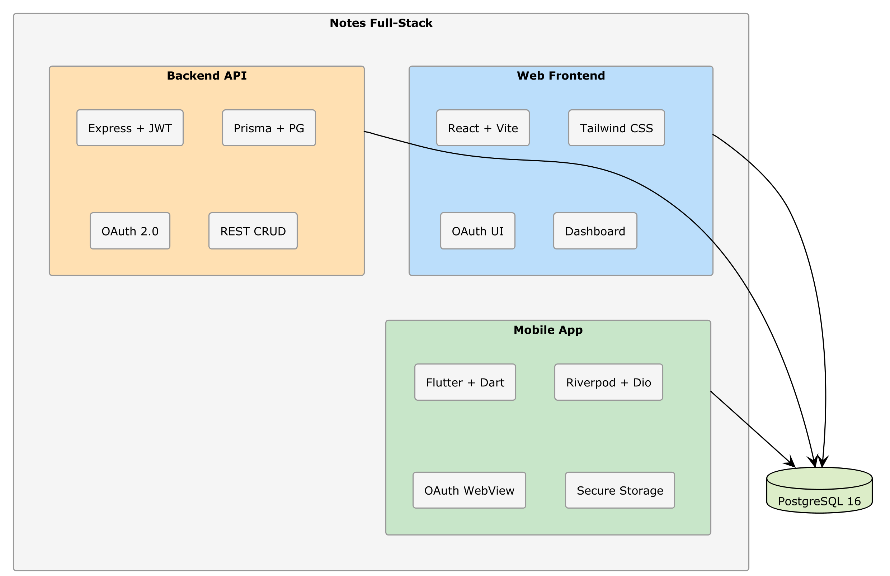

# Chapter 13 — Release: Publishing to the Stores

## What You Will Build

In this chapter, you will prepare the Flutter app for publication:
- App icon and splash screen generated by AI
- Production builds for Android (APK/AAB) and iOS (IPA)
- App digital signing
- Store listings (text, screenshots)
- Publishing process on Google Play and App Store

**Estimated time**: 90–120 minutes  
**Prerequisite**: Working Flutter app (Ch. 11–12)

---

## 13.1 — Preparing for Production

### 🔧 HANDS-ON — Update `_CONTEXT.md` for the Release

Add a section to the context:

```markdown
## Release

### App Identity
- Name: Notes App
- Android Bundle ID: com.example.notesapp (replace with your own domain)
- iOS Bundle ID: com.example.notesapp
- Version: 1.0.0+1

### Environments
- Dev: http://10.0.2.2:3000/api (emulator), http://localhost:3000/api (Chrome)
- Staging: https://staging-api.notes-app.example.com/api
- Production: https://api.notes-app.example.com/api

### Build
- Android: flutter build appbundle (for Play Store)
- iOS: flutter build ipa (for App Store)
- Android signing: keystore in android/app/keystore.jks (DO NOT commit)
```

---

## 13.2 — Icon and Splash Screen

### 🔧 HANDS-ON — Generate the Icon with AI

```text
Generate an icon for the Notes app following Material Design guidelines:
- Size: 1024x1024 pixels
- Background: indigo gradient (from #4F46E5 to #3730A3)
- Center icon: a stylized note (sheet with lines) in white
- Style: flat, minimal, rounded edges
- Format: PNG with transparency

Save as assets/icon/app_icon.png
```

> 💡 **Tip**: If the AI cannot generate images directly, ask it to generate an SVG icon with code, or use tools like DALL-E or Midjourney with a prompt that the AI helps you write.

### 🔧 HANDS-ON — Configure flutter_launcher_icons

```text
Add flutter_launcher_icons to the project:
1. Add the dev dependency in pubspec.yaml
2. Add the configuration in pubspec.yaml:
   flutter_launcher_icons:
     android: true
     ios: true
     image_path: "assets/icon/app_icon.png"
     adaptive_icon_background: "#4F46E5"
     adaptive_icon_foreground: "assets/icon/app_icon_foreground.png"
3. Generate the icons with: dart run flutter_launcher_icons
```

### 🔧 HANDS-ON — Splash Screen

```text
Add flutter_native_splash to the project:
1. Add the dev dependency in pubspec.yaml
2. Configure:
   flutter_native_splash:
     color: "#4F46E5"
     image: assets/icon/app_icon.png
     android_12:
       color: "#4F46E5"
       icon_background_color: "#4F46E5"
       image: assets/icon/app_icon.png
3. Generate with: dart run flutter_native_splash:create
```

---

## 13.3 — Production Configuration

### 🔧 HANDS-ON — Production Environment

```text
Modify api_config.dart to support production environments:
1. Use --dart-define variables to pass the environment to the build
2. In production, the API URL must point to the deployed backend
3. Disable debug logs in production
4. Configure: flutter build appbundle --dart-define=ENV=production
```

The AI should generate something like:

```dart
class ApiConfig {
  static const String environment = String.fromEnvironment(
    'ENV',
    defaultValue: 'development',
  );

  static String get baseUrl {
    switch (environment) {
      case 'production':
        return 'https://api.notes-app.example.com/api';
      case 'staging':
        return 'https://staging-api.notes-app.example.com/api';
      default:
        return 'http://10.0.2.2:3000/api';
    }
  }
}
```

---

## 13.4 — Android Build

### Generating the Keystore

The keystore is the digital certificate that signs your app. Without it, Google Play will not accept your app.

```bash
keytool -genkey -v -keystore android/app/keystore.jks \
  -keyalg RSA -keysize 2048 -validity 10000 \
  -alias notes-app
```

> ⚠️ **Warning**: The `keystore.jks` file is SECRET. DO NOT commit it to git. If you lose it, you will never be able to update your app on the store again. Make a secure backup.

### 🔧 HANDS-ON — Configure Signing

```text
Configure Android app signing:
1. Create android/key.properties with the keystore data
   (storePassword, keyPassword, keyAlias, storeFile)
2. Modify android/app/build.gradle to read key.properties
3. Add key.properties and keystore.jks to .gitignore
4. Configure the build for production: minifyEnabled true, shrinkResources true
```

### Build

```bash
# App Bundle (for Google Play — recommended)
flutter build appbundle --dart-define=ENV=production

# APK (for direct distribution)
flutter build apk --release --dart-define=ENV=production
```

The generated file is located at:
- AAB: `build/app/outputs/bundle/release/app-release.aab`
- APK: `build/app/outputs/flutter-apk/app-release.apk`

---

## 13.5 — iOS Build

> ⚠️ **Warning**: To build for iOS you need a Mac with Xcode installed and an Apple Developer account ($99/year).

### 🔧 HANDS-ON — Xcode Configuration

```text
Configure the iOS project for release:
1. Open ios/Runner.xcworkspace in Xcode
2. In Signing & Capabilities:
   - Select your Team (Apple Developer account)
   - Verify the Bundle Identifier
3. In General:
   - Set the version (1.0.0)
   - Set the build number (1)
4. In Build Settings:
   - iOS Deployment Target: 15.0 (or higher)
```

### Build

```bash
flutter build ipa --dart-define=ENV=production
```

The IPA file is located in `build/ios/ipa/`.

---

## 13.6 — Store Listings

### 🔧 HANDS-ON — Generate the Text with AI

```text
Generate the store listing text for the Notes app:

1. Title: maximum 30 characters
2. Short description: maximum 80 characters
3. Full description: 4000 characters max, including:
   - Introductory paragraph
   - Key features list
   - Security/privacy section
   - Closing call to action
4. Keywords: 7–10 relevant keywords
5. Category: Productivity
6. Content rating: Everyone / 4+

Generate both the Italian and English versions.
```

### Screenshots

For screenshots, run the app on the emulator and capture the main screens:

1. **Login screen** — with the OAuth buttons
2. **Dashboard** — with some sample notes
3. **Note detail** — showing an opened note
4. **Note creation** — the input form
5. **Search** — search results

> 💡 **Tip**: Use `flutter screenshot` to capture screenshots from the emulator directly from the terminal.

---

## 13.7 — Publishing on Google Play

### Process

1. Go to [Google Play Console](https://play.google.com/console)
2. Create a new app
3. Fill in the listing details (text, screenshots, icon)
4. Go to Release → Production → Create new release
5. Upload the `.aab` file
6. Complete the content compliance declaration
7. Set the price (free) and distribution countries
8. Submit for review

The first review typically takes 1–3 business days.

### Privacy Policy

Google Play requires a privacy policy. Ask the AI:

```text
Generate a privacy policy for the Notes app that:
- Explains that the app uses OAuth for authentication (Google/GitHub)
- Specifies that note data is stored on secure servers
- Does not share data with third parties
- The user can delete their account and all data
- Compliant with GDPR
- URL where it will be published: https://notes-app.example.com/privacy

Generate in Markdown format.
```

---

## 13.8 — Publishing on App Store

### Process

1. Go to [App Store Connect](https://appstoreconnect.apple.com)
2. Create a new app
3. Fill in the information (text, screenshots, icon)
4. In Xcode: Product → Archive → Distribute App → App Store Connect
5. Go back to App Store Connect, select the build
6. Submit for review

Apple's review typically takes 1–2 business days.

> ⚠️ **Warning**: Apple is more restrictive than Google. Make sure that:
> - The app works without crashes
> - All links (privacy policy, terms) are reachable
> - The app provides value to the user (it is not just a "demo")
> - OAuth login works correctly

---

## 13.9 — CI/CD for Mobile

### 🔧 HANDS-ON — GitHub Actions for Automated Builds

```text
Create a GitHub Actions workflow that:
1. Triggers on push to the main branch
2. Builds the Flutter app for Android
3. Runs flutter analyze and flutter test
4. Generates the release APK
5. Uploads the APK as an artifact

File: .github/workflows/flutter-build.yml
```

The AI should generate something like:

```yaml
name: Flutter Build

on:
  push:
    branches: [main]
  pull_request:
    branches: [main]

jobs:
  build:
    runs-on: ubuntu-latest
    steps:
      - uses: actions/checkout@v4
      - uses: subosito/flutter-action@v2
        with:
          flutter-version: '3.x'
          channel: 'stable'
      
      - name: Install dependencies
        working-directory: notes_mobile
        run: flutter pub get
      
      - name: Analyze
        working-directory: notes_mobile
        run: flutter analyze
      
      - name: Test
        working-directory: notes_mobile
        run: flutter test
      
      - name: Build APK
        working-directory: notes_mobile
        run: flutter build apk --release --dart-define=ENV=production
      
      - name: Upload APK
        uses: actions/upload-artifact@v4
        with:
          name: release-apk
          path: notes_mobile/build/app/outputs/flutter-apk/app-release.apk
```

> 📖 **Deep Dive**: For automatic publishing to the Play Store, you can add the Fastlane plugin to the workflow. But for the first release, manual publishing is sufficient.

---

## 13.10 — Final Commit

```bash
cd notes-fullstack
git add .
git commit -m "feat: configurazione release Android e iOS con CI/CD"
```

---

## Summary

| Aspect | Detail |
|:--|:--|
| **Icon** | flutter_launcher_icons with adaptive icon |
| **Splash** | flutter_native_splash with indigo theme |
| **Android Build** | Signed AAB with keystore |
| **iOS Build** | IPA via Xcode (requires Mac + Apple Developer) |
| **CI/CD** | GitHub Actions: analyze + test + build |
| **Store listing** | AI-generated text in IT and EN |
| **Privacy** | GDPR-compliant policy generated by AI |

---

## What You Have Built — Final Project

Let's take stock. In 13 chapters, you have built a **complete system**:



Three client applications, a shared backend, a database, secure authentication. **All generated by AI, guided by context documents.**

---

**→ In Part V**: quality and production. Automated testing, OWASP security, and deployment on cloud platforms.
