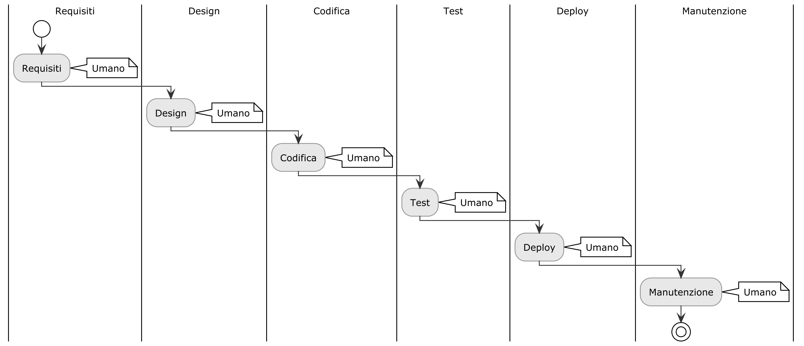
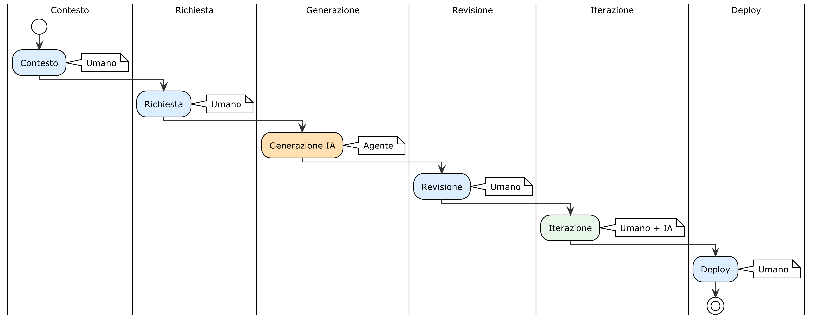

# Introduzione — Dal SDLC all'ADLC: La Trasformazione dell'Ingegneria del Software

## Perché Questo Libro

Nel 2024 è successo qualcosa che ha cambiato le regole del gioco. I modelli di intelligenza artificiale hanno smesso di essere strumenti di autocompletamento e sono diventati **collaboratori autonomi**, capaci di ragionare, pianificare, scrivere codice, eseguire test e autocorreggersi. Questo evento — che gli analisti hanno definito "Inflessione Agentica" — ha reso possibile per la prima volta nella storia dell'informatica costruire software completo senza scrivere manualmente codice sorgente.

Non è fantascienza. Non è una promessa. È il presente.

Ma questa rivoluzione ha un problema: nessuno ha spiegato **come si fa** nella pratica. Le fonti accademiche descrivono la teoria in modo brillante. I blog aziendali vendono visioni futuristiche. I tutorial su YouTube mostrano demo impressionanti che durano 5 minuti. Quello che manca è un percorso completo e strutturato che parta da zero e arrivi a un'applicazione reale in produzione, spiegando ogni passo con la chiarezza di un manuale operativo.

Questo libro colma quel vuoto.

Costruirai 9 progetti reali — da un Hello World a un'applicazione full-stack con database, autenticazione, frontend React, app mobile Flutter e deploy in produzione. Tutto senza scrivere manualmente una riga di codice. Il codice esiste, funziona e puoi leggerlo, ma è l'intelligenza artificiale a generarlo. Il tuo ruolo è diverso, ed è più importante di quanto pensi.

---

## Il Paradigma Tradizionale: Lo SDLC

Per comprendere la rivoluzione in corso, è necessario capire da cosa si sta evolvendo.

Da decenni, lo sviluppo software segue il **Software Development Life Cycle (SDLC)** — un modello di processo che, nelle sue varie incarnazioni (Waterfall, Agile, DevOps), si fonda su un presupposto fondamentale: **il software è deterministico**. Lo sviluppatore scrive istruzioni precise in un linguaggio formale. A parità di input, la macchina restituisce sempre lo stesso output. Il codice sorgente è l'unico depositario della logica di business.

In questo paradigma, l'essere umano è un **operaio della sintassi**. Traduce requisiti in istruzioni formali, riga per riga. La qualità del software dipende dalla capacità del programmatore di scrivere codice corretto, efficiente e manutenibile. I test verificano percorsi noti con risultati binari: passa o fallisce. Il successo si misura in linee di codice funzionanti, copertura dei test, cicli di calcolo ottimizzati.

Il modello ha funzionato per cinquant'anni. Ma ha un costo altissimo: la barriera d'ingresso. Per costruire software, devi prima imparare a programmare — anni di studio della sintassi, dei framework, dei pattern, delle quirk di ogni linguaggio. E anche dopo anni di esperienza, il collo di bottiglia resta la velocità con cui le dita del programmatore trasformano i concetti in codice.

---

## Il Nuovo Paradigma: L'ADLC

L'**Agent Development Life Cycle (ADLC)** non è una versione aggiornata dell'SDLC. È un cambio di paradigma. La differenza non è quantitativa (scrivere codice più velocemente), ma qualitativa (il ruolo dell'essere umano cambia natura).

Nell'ADLC, l'intelligenza artificiale non è un assistente che completa le frasi. È un **agente autonomo** che utilizza un LLM come motore di ragionamento per eseguire flussi complessi: scrive codice, lo testa, rileva errori, propone correzioni, interagisce con strumenti esterni e, quando incontra ostacoli insormontabili, trasferisce il controllo all'umano.

L'essere umano non scrive più codice. Diventa un **architetto di contesto** — un direttore d'orchestra la cui responsabilità è fornire all'agente:

- **Il progetto** (contesto): cosa costruire, con quali tecnologie, in quale struttura
- **Le regole** (vincoli): cosa non fare mai, quali standard rispettare, dove fermarsi
- **Gli strumenti** (capabilities): quali sistemi esterni l'agente può usare

### Le 5 Dimensioni del Cambiamento

La tabella seguente illustra le differenze fondamentali tra i due approcci lungo cinque dimensioni critiche:

| Dimensione | SDLC Tradizionale | ADLC |
|:--|:--|:--|
| **Ruolo del sistema** | Esegue esclusivamente task predefiniti lungo percorsi logici rigidi | Agisce come collaboratore autonomo capace di interpretare, prioritizzare e ripianificare i task |
| **Comportamento** | Deterministico e prevedibile. La logica risiede in codice e configurazioni rigide | Adattivo e probabilistico. La logica emerge dall'interazione tra contesto, prompt, modelli e strumenti |
| **Focus operativo** | Efficienza computazionale, ottimizzazione algoritmica e correttezza funzionale | Agenzia, ragionamento astratto, resilienza agli errori e adattabilità a scenari imprevisti |
| **Driver di iterazione** | Cambiamenti formali nei requisiti di business comunicati dagli stakeholder | Cambiamenti nelle performance, mutazioni ambientali o feedback umano in tempo reale |
| **Paradigma di testing** | Test predefiniti validano percorsi noti (pass/fail). Qualità = manutenibilità del codice | Valutazione continua di reasoning, allucinazioni e sicurezza. Qualità = affidabilità del comportamento |

---

## Le 7 Fasi dell'ADLC

L'ADLC struttura il processo di sviluppo in 7 fasi che mappano — e trasformano — le fasi classiche dell'SDLC:

| # | Fase ADLC | Equivalente SDLC | Cosa cambia |
|:--|:--|:--|:--|
| **0** | **Preparazione e Ipotesi** | Pianificazione | Non scrivi requisiti formali. Formuli ipotesi testabili: "Posso automatizzare questo processo con un agente?" |
| **1** | **Inquadramento (Scope Framing)** | Analisi | Non analizzi il dominio per tradurlo in codice. Mappi i confini di autonomia dell'agente: cosa può fare da solo, dove deve fermarsi, dove l'autonomia è vietata |
| **2** | **Definizione e Architettura** | Design | Non disegni diagrammi UML. Scrivi il `_CONTEXT.md` — il contratto in linguaggio naturale che governa il comportamento dell'agente |
| **3** | **Simulazione (Proof of Value)** | Prototipazione | Non costruisci un prototipo. Testi con un caso minimo se l'agente comprende il contesto e produce output coerente |
| **4** | **Implementazione** | Coding | Non scrivi codice. Orchesti l'agente: formuli richieste, revisioni l'output, iteri. L'agente genera codice, test, documentazione |
| **5** | **Rilascio** | Testing + Deploy | Non esegui solo test. Valuti la sicurezza del comportamento (allucinazioni, rischio, compliance) e deployi |
| **6** | **Apprendimento Continuo** | Manutenzione | Non patchi bug. Aggiorni il contesto con le lezioni apprese, migliorando la qualità delle sessioni future |

---

## Le Tre Competenze Fondamentali

Se lo SDLC richiedeva la padronanza dei linguaggi di programmazione, l'ADLC richiede tre competenze diverse:

### 1. Context Engineering (Ingegneria del Contesto)

I modelli linguistici sono architetture **stateless** — soffrono di amnesia totale tra una sessione e l'altra. Se non ricevono contesto strutturato, tendono a *derivare* verso comportamenti generici o a *confabulare* informazioni inesistenti.

La Context Engineering è l'arte di progettare le informazioni fornite all'agente affinché possa operare con precisione. Non è "scrivere prompt migliori". È costruire un **sistema informativo** — file di contesto, vincoli, template, regole — che permetta all'agente di lavorare autonomamente per periodi prolungati senza perdere la rotta.

**La stragrande maggioranza dei fallimenti operativi degli agenti IA non è più imputabile a deficienze cognitive dei modelli, ma a fallimenti del contesto.** La qualità del software che produci in 0-code dipende interamente dalla qualità dei tuoi documenti di contesto.

### 2. Risk Design (Progettazione del Rischio)

Un agente che opera in autonomia può prendere decisioni sbagliate. La differenza tra un sistema sicuro e uno pericoloso sta nella classificazione del rischio:

- **LOW RISK**: Azioni diagnostiche e di ricerca → l'agente procede autonomamente
- **MEDIUM RISK**: Azioni che creano nuovi artefatti → l'agente chiede conferma prima di procedere
- **HIGH RISK**: Azioni distruttive o irreversibili → **Mandatory STOP** — l'agente si ferma categoricamente

Progettare il rischio significa decidere in anticipo dove l'agente può muoversi liberamente, dove deve chiedere permesso, e dove deve fermarsi senza eccezioni.

### 3. Confidence Tagging (Etichettatura della Fiducia)

Gli LLM non esprimono incertezza spontaneamente. Possono affermare un fatto verificato e un'allucinazione pericolosa con la stessa identica sicurezza. Per questo l'ADLC impone un protocollo di trasparenza:

| Tag | Significato | Azione |
|:--|:--|:--|
| **FACT** | Informazione verificabile da codice, documentazione o output di strumenti | Nessuna revisione necessaria |
| **INFERRED** | Deduzione logica da fatti consolidati | Revisione umana consigliata |
| **ASSUMPTION** | Ipotesi non verificata, alto rischio di allucinazione | **STOP** — l'umano deve validare |

Questo protocollo trasforma l'output dell'agente da "scatola nera" a sistema trasparente dove ogni affermazione ha un grado di affidabilità dichiarato.

---

## 0-Code ≠ No-Code

Un chiarimento essenziale. Lo sviluppo **0-code** non ha nulla a che vedere con le piattaforme no-code tradizionali (Bubble, Wix, Zapier):

| | No-Code Tradizionale | 0-Code con IA |
|:--|:--|:--|
| **Codice** | Non esiste, solo blocchi visuali | L'IA lo genera (React, Node, Flutter, Python...) |
| **Personalizzazione** | Limitata ai template della piattaforma | Illimitata — qualsiasi stack, qualsiasi architettura |
| **Proprietà** | Bloccato nella piattaforma | Tuo, nel tuo repository Git |
| **Scalabilità** | Dipende dalla piattaforma | Dipende dalla tua architettura |
| **Come lavori** | Trascini blocchi | Descrivi cosa vuoi in linguaggio naturale |

Nello sviluppo 0-code, il codice sorgente esiste, funziona ed è standard. Puoi leggerlo, modificarlo, versionarlo su Git e deployarlo ovunque. L'unica differenza è chi lo scrive: non tu con le mani sulla tastiera, ma l'agente IA sulla base dei tuoi documenti di contesto.

---

## Cosa Ti Serve per Iniziare

Questo libro è progettato per due profili:

- **Chi ha basi di programmazione** (anche minime o arrugginite) e vuole imparare a costruire applicazioni complete orchestrando l'IA — diventando un "Architetto del Contesto"
- **Sviluppatori junior/mid** che vogliono decuplicare la produttività adottando il paradigma 0-code nei propri progetti

L'IA scrive il codice, ma **tu devi saperlo leggere** per verificare che funzioni e sia sicuro. Nei capitoli avanzati incontrerai token JWT, middleware Express, migrazioni Prisma, state management con Riverpod. Non devi saper scrivere queste cose da zero — devi saper riconoscere se l'IA le ha implementate correttamente. Il Crash Course qui sotto e le spiegazioni contestuali nei singoli capitoli ti aiuteranno, ma chi parte da zero assoluto dovrà investire più tempo nella comprensione del codice generato.

Serve:

- **Un computer** (Windows, macOS o Linux)
- **VS Code** (gratuito) con l'estensione GitHub Copilot
- **Curiosità** e disponibilità a sperimentare
- **Familiarità minima** con il concetto di file, cartelle e terminale

Se hai esperienza di programmazione, questo libro non ti annoierà. Ti mostrerà un modo completamente diverso di lavorare — e potresti scoprire che il tuo nuovo ruolo di architetto di contesto è più stimolante di quello di scrittore di codice.

---

## Crash Course — I Concetti Fondamentali in 5 Minuti

Nei capitoli successivi costruirai applicazioni con database, API, autenticazione e app mobile. L'IA scriverà il codice, ma per verificare che funzioni correttamente hai bisogno di comprendere alcuni concetti di base. Ecco un minimo vocabolario operativo.

> 💡 **Cos'è un'API?** — Un'**API** (Application Programming Interface) è un insieme di "porte d'ingresso" che un programma mette a disposizione per ricevere richieste e restituire risposte. Quando il tuo browser carica una pagina web, sta chiamando un'API. Quando un'app mobile mostra una lista di prodotti, sta chiamando un'API. Pensa a un ristorante: tu (il cliente) non vai in cucina — parli con il cameriere (l'API), che porta il tuo ordine in cucina (il server) e ti riporta il piatto (la risposta).

> 💡 **Cos'è un database relazionale?** — Un **database** è un archivio organizzato di dati. Un database *relazionale* (come PostgreSQL) organizza i dati in **tabelle** — simili a fogli Excel. Ogni tabella ha colonne (campi) e righe (record). Le tabelle possono essere collegate tra loro: ad esempio, la tabella "utenti" è collegata alla tabella "note" tramite un campo `user_id`. Quando chiedi "mostrami le note dell'utente 3", il database cerca tutte le righe nella tabella note dove `user_id = 3`.

> 💡 **Cos'è l'architettura client-server?** — In quasi tutte le applicazioni moderne, ci sono due parti: il **client** (ciò che l'utente vede — il browser web, l'app mobile) e il **server** (il programma che gira su un computer remoto e gestisce dati, logica e sicurezza). Il client invia richieste, il server risponde. Il **frontend** (React, Flutter) è il client; il **backend** (Express.js, Node.js) è il server. Comunicano tramite richieste **HTTP** — lo stesso protocollo che il browser usa quando visiti un sito web.

> 💡 **Cos'è l'autenticazione?** — L'**autenticazione** è il processo con cui un'applicazione verifica *chi sei*. Quando fai login con Google, Google conferma la tua identità alla tua app. L'app ti rilascia un "biglietto" digitale (un **token JWT**) che alleghi a ogni richiesta successiva, così il server sa che sei tu senza chiederti la password ogni volta.

Non devi memorizzare tutto ora. Questi concetti riappariranno con spiegazioni contestuali nei capitoli dove servono. Se un termine ti risulta oscuro durante la lettura, consulta il **Glossario** (Appendice A).

---

## Come Leggere Questo Libro

Il libro è organizzato in una progressione lineare. Ogni capitolo costruisce sul precedente:

**Parte I (Capitoli 1-3)** installa il paradigma: cos'è il 0-code, come configurare l'ambiente, come funziona l'ADLC nella pratica.

**Parte II (Capitoli 4-6)** ti mette le mani in pasta con i primi progetti: Hello World, un'applicazione CLI completa, la tua prima REST API.

**Parte III (Capitoli 7-10)** costruisce un'applicazione web full-stack: database PostgreSQL, autenticazione OAuth 2.0, frontend React, integrazione completa.

**Parte IV (Capitoli 11-13)** porta il progetto su mobile con Flutter: setup, integrazione con il backend, pubblicazione sugli store.

**Parte V (Capitoli 14-15)** affronta la qualità e la produzione: testing automatizzato, sicurezza, deploy su piattaforme cloud reali.

**Parte VI (Capitolo 16)** guarda al futuro: pattern multi-agente, microservizi, codice legacy, i limiti onesti del paradigma.

In **Appendice E** trovi l'analisi di un framework ADLC reale e professionale — un set completo di "contratti" per agenti IA usato in produzione — che mostra come i principi teorici del libro si traducono in pratica operativa matura.

In **Appendice F** ti aspetta la prova del nove: un progetto autonomo (BookShelf) dove applicherai l'intero framework ADLC senza rotelle di addestramento. È la sfida finale che consolida tutto ciò che hai appreso.

Ogni capitolo segue la stessa struttura: **"Cosa imparerai" → Spiegazione → Pratica guidata → Riepilogo"**. Puoi seguire il libro dall'inizio alla fine come un corso, oppure saltare ai capitoli che ti interessano se hai già le basi.

---

## Legenda dei Box

In tutto il libro troverai box colorati che segnalano informazioni di natura diversa. Ecco come leggerli:

| Icona | Box | Significato |
|:---:|:---|:---|
| 💡 | **Nota** (blu) | Approfondimento teorico, concetto chiave o informazione contestuale. |
| 🟢 | **Suggerimento** (verde) | Best practice, scorciatoia o consiglio operativo. |
| ⚠️ | **Attenzione** (arancione) | Errore comune o comportamento inaspettato da evitare. |
| ☠️ | **Pericolo** (rosso) | Rischio critico: sicurezza, perdita dati, lock-in irreversibile. |
| ⚙️ | **Nota di versione** (viola) | Compatibilità tra versioni di tool, librerie o framework. |
| 💰 | **Quanto costa?** (oro) | Implicazioni economiche: piani gratuiti, limiti, costi reali. |
| ✅ | **Checkpoint** (verde) | Punto di verifica: fermati e controlla che tutto funzioni. |
| 🔧 | **Pratica** (grigio) | Esercizio guidato passo-passo — mani sulla tastiera. |
| 📦 | **Box Tooling** (blu) | Stack tecnologico scelto per l'esempio e alternative equivalenti. |

---

## Una Nota sulla Responsabilità

L'IA è un collaboratore straordinariamente capace, ma non è infallibile. Il codice che genera può contenere errori, vulnerabilità di sicurezza o assunzioni sbagliate. Il tuo ruolo di architetto di contesto include una responsabilità fondamentale: **la revisione critica di ogni output**.

Questo libro ti insegnerà non solo a generare software, ma a valutarlo. A riconoscere quando l'IA sta procedendo con sicurezza e quando sta confabulando. A progettare vincoli che prevengano errori prima che si verifichino. A costruire quel rapporto di fiducia verificabile — non cieca — che è il cuore del paradigma ADLC.

Buona costruzione.
