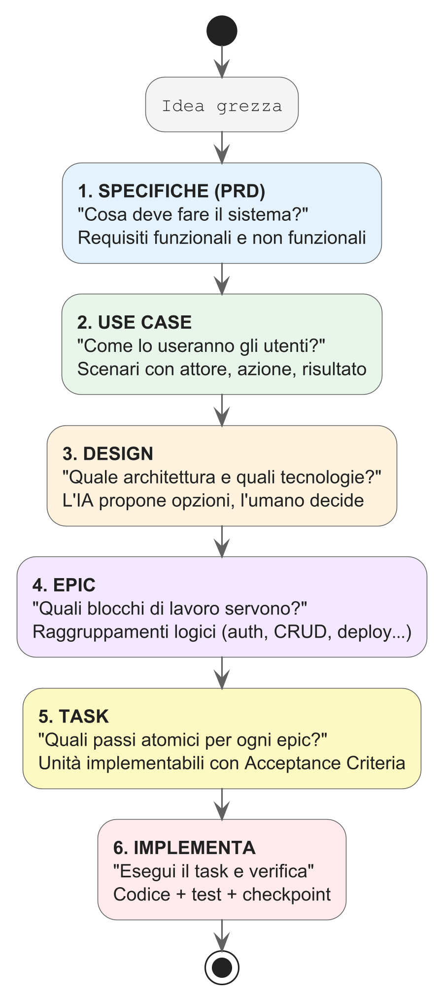

# Capitolo 3 — Il Metodo ADLC: Come si Lavora in 0-Code

## Cosa Imparerai

Alla fine di questo capitolo saprai:
- Le 7 fasi dell'Agent Development Life Cycle applicate allo sviluppo di applicazioni
- Come scrivere un file `_CONTEXT.md` efficace
- Cos'è il Context Engineering e perché è la competenza chiave del paradigma 0-code
- Come strutturare un progetto per massimizzare la qualità dell'output dell'IA

---

## 3.1 — Il Ciclo di Vita: Le 7 Fasi dell'ADLC

L'ADLC (Agent Development Life Cycle) è il metodo di lavoro strutturato per sviluppare con l'IA. Non è teoria accademica — è la sequenza di passi che seguirai in ogni progetto di questo libro.

| Fase | Nome | Cosa fai | Deliverable |
|:--|:--|:--|:--|
| **0** | Preparazione | Definisci il problema, valuti se il 0-code è adatto | Ipotesi di soluzione |
| **1** | Inquadramento | Stabilisci confini, tecnologie, vincoli | Requisiti in linguaggio naturale |
| **2** | Definizione | Scrivi il `_CONTEXT.md` e le eventuali `SKILL.md` | Documenti di contesto |
| **3** | Simulazione | Testi con un piccolo caso prima di partire | Proof of Value |
| **4** | Implementazione | L'IA genera codice sotto la tua supervisione | Codice funzionante |
| **5** | Rilascio | Test, fix, deploy | Applicazione in produzione |
| **6** | Apprendimento | Aggiorni il contesto con le lezioni apprese | Contesto migliorato |

> 💡 **Verso il framework professionale.** In questo capitolo vedremo un contesto base con un singolo `_CONTEXT.md`. Se ti stai chiedendo come questo metodo scali su team reali e architetture complesse, nell'**Appendice E** analizzeremo un framework ADLC professionale da 17 file usato in produzione — con moduli per fase, NemoClaw e governance infrastrutturale. I principi che impari qui sono gli stessi; cambiano solo scala e sofisticazione.

### Come si applica nella pratica quotidiana

Per un progetto semplice (Hello World, CLI tool), le fasi 0-3 si comprimono in 5 minuti di riflessione. Per un progetto complesso (web app full-stack), ogni fase ha un suo peso specifico.

**Esempio: costruire un'API REST per un blog**

- **Fase 0**: "Mi serve un backend per il mio blog, con post, commenti e autenticazione"
- **Fase 1**: "Userò Node.js con Express, PostgreSQL con Prisma, autenticazione JWT"
- **Fase 2**: Scrivo il `_CONTEXT.md` con architettura, struttura cartelle, vincoli
- **Fase 3**: Chiedo all'IA di generare solo l'endpoint `/health` per verificare che tutto funzioni
- **Fase 4**: Procedo con tutti gli endpoint, modello dati, middleware
- **Fase 5**: Test, fix, deploy su Railway
- **Fase 6**: Noto che l'IA ha generato password in plain text → aggiorno il contesto aggiungendo: "Usa bcrypt per l'hashing delle password"

> La Fase 6 è cruciale: il `_CONTEXT.md` è un **documento vivente** che migliora a ogni progetto.

### Quando l'IA Deraglia: Gestire i Fallimenti

Prima o poi succederà: l'IA entrerà in un **loop di errori** — corregge un bug, ne introduce un altro, tenta di risolvere il secondo e rompe il codice che funzionava. È un comportamento noto come "loop di allucinazioni" ed è importante sapere come gestirlo.

> ⚠️ **Le 5 tecniche di recupero quando l'IA si incarta:**
> 1. **Ferma e resetta la conversazione.** Chiudi la chat e aprine una nuova. Spesso l'IA accumula contesto errato nella sessione.
> 2. **Torna all'ultima versione funzionante.** Usa `git stash` o `git checkout .` per eliminare le modifiche. Tieni sempre backup prima di sessioni complesse.
> 3. **Spezza il task in parti più piccole.** Invece di "Implementa l'autenticazione completa", chiedi prima "Genera solo il middleware di verifica JWT".
> 4. **Sii più specifico nel contesto.** Se l'IA genera codice sbagliato, aggiungi un vincolo esplicito al `_CONTEXT.md`: "NON usare CommonJS. Usa SOLO import/export ESModules."
> 5. **Cambia modello o strumento.** Se Copilot non riesce, prova Claude Code (o viceversa).

> 💡 **Regola d'oro**: se l'IA ha fallito due volte sullo stesso problema con lo stesso approccio, **non insistere**. Cambia strategia: spezza il task, aggiungi contesto, o resetta la conversazione.

### Fase 6 in Pratica: Come un Vincolo Salva il Progetto

L'apprendimento continuo (Fase 6) non è un'attività teorica. È il meccanismo che trasforma errori in difese permanenti.

> 🚨 **Disastro 1: Password salvate in chiaro.** L'IA genera un endpoint di registrazione utente e salva la password nel database come testo semplice. L'output ha superato i test funzionali, ma un audit di sicurezza rivelerebbe tutte le password visibili.
>
> **Il vincolo che risolve**: `SEC-01: Le password DEVONO essere hashate con bcrypt (costo 12). Mai salvare password in chiaro.`

> 🚨 **Disastro 2: L'IA cambia stack a metà progetto.** Stai lavorando con ESModules (`import/export`) e l'IA, in una nuova sessione, genera codice CommonJS (`require/module.exports`). Il progetto smette di compilare.
>
> **Il vincolo che risolve**: `Linguaggio: JavaScript ES2022+ con ESModules. NON usare require() o module.exports. Solo import/export.`

> 🚨 **Disastro 3: Dipendenze fantasma.** L'IA installa una libreria non prevista (es. `lodash`) quando bastavano le funzioni native. Il progetto accumula dipendenze inutili.
>
> **Il vincolo che risolve**: `Dipendenze: SOLO quelle elencate nel _CONTEXT.md. Non aggiungere nuove dipendenze senza approvazione esplicita.`

> 💡 **Dopo ogni errore**, poniti la domanda: "Quale riga avrei potuto aggiungere al `_CONTEXT.md` per prevenire questo problema?" Poi aggiungila. È l'essenza della Fase 6.

---

## 3.2 — Context Engineering: L'Arte di Comunicare con l'IA

Il Context Engineering è la disciplina fondamentale dello sviluppo 0-code. È la differenza tra un'IA che genera codice mediocre e un'IA che genera software di qualità professionale.

### Il Problema dell'Amnesia

I modelli IA (LLM) hanno una proprietà fondamentale che devi comprendere: sono **stateless** — non hanno memoria tra le sessioni. Ogni volta che apri una nuova finestra di chat o riavvii Copilot, l'IA parte da zero. Non ricorda:
- Le decisioni architetturali prese ieri
- Le convenzioni di naming del tuo progetto
- I bug che avete già risolto insieme
- Lo stack tecnologico scelto

Se non le fornisci queste informazioni, l'IA **inventerà** le proprie (un fenomeno chiamato "allucinazione"). Potrebbe decidere di usare MongoDB quando il tuo database è PostgreSQL, o generare codice in CommonJS quando il tuo progetto usa ESModules.

### La Soluzione: Il file `_CONTEXT.md`

Il file `_CONTEXT.md` (o `AGENTS.md`) è il **contratto** tra te e l'IA. Viene letto automaticamente dall'agente all'inizio di ogni sessione. Contiene tutto ciò che l'IA deve sapere per lavorare correttamente nel tuo progetto.

> Pensa al `_CONTEXT.md` come al brief che daresti a un nuovo sviluppatore il suo primo giorno di lavoro: "Ecco come è strutturato il progetto, queste sono le tecnologie che usiamo, queste le convenzioni da seguire, e queste le cose da NON fare mai."

---

## 3.3 — Anatomia di un `_CONTEXT.md`

Un buon file di contesto ha 5 sezioni:

### 1. Identità e Scopo

```markdown
# Progetto: BlogAPI

Stai lavorando su un backend REST API per un blog personale.
Tecnologie: Node.js 20, Express.js, PostgreSQL 16, Prisma ORM.
Ambiente: sviluppo locale su Windows/macOS.
```

Dice all'IA **cosa** è il progetto e **con cosa** lavora.

### 2. Architettura e Struttura

```markdown
## Struttura del Progetto

src/
  routes/          → Definizioni degli endpoint (solo routing)
  controllers/     → Logica dei controller (validazione, risposta)
  services/        → Business logic (interazione con DB)
  middleware/      → Auth, error handling, logging
  utils/           → Funzioni helper
prisma/
  schema.prisma    → Schema database
tests/
  unit/
  integration/
```

Dice all'IA **dove** mettere le cose. Senza questa sezione, l'IA potrebbe creare strutture diverse ogni volta.

### 3. Convenzioni e Standard

```markdown
## Convenzioni

- Naming: camelCase per variabili e funzioni, PascalCase per classi e tipi
- Risposte API: sempre nel formato { success: boolean, data: T, error?: string }
- Validazione: usa Zod per la validazione degli input di tutti gli endpoint
- Errori: gestiti centralmente tramite middleware errorHandler
- Async: usa async/await, mai callback
- Import: usa ESModules (import/export), mai require()
```

Dice all'IA **come** scrivere il codice. Questa sezione previene le inconsistenze.

### 4. Vincoli e Divieti

```markdown
## Vincoli (OBBLIGATORI)

- NON usare mai query SQL raw. Usa SEMPRE Prisma ORM.
- NON salvare mai password in chiaro. Usa bcrypt con salt rounds >= 12.
- NON esporre mai stack trace negli errori di produzione.
- NON usare `any` in TypeScript. Definisci sempre i tipi.
- NON installare dipendenze senza motivo documentato.
```

Dice all'IA cosa **non deve mai fare**. Questa è la sezione più importante per la sicurezza e la qualità.

### 5. Comandi e Workflow

```markdown
## Comandi

- Avviare il server: `npm run dev`
- Eseguire i test: `npm test`
- Migrare il database: `npx prisma migrate dev`
- Generare il client Prisma: `npx prisma generate`
- Linting: `npm run lint`

## Workflow di Sviluppo

Quando implementi una nuova funzionalità:
1. Crea/modifica lo schema Prisma se serve
2. Genera la migrazione
3. Implementa service → controller → route (in quest'ordine)
4. Aggiungi test per il nuovo endpoint
5. Verifica che tutti i test passino
6. Aggiorna la documentazione Swagger
```

Dice all'IA **come lavorare** nel progetto. L'IA seguirà questa sequenza invece di inventare la propria.

---

## 3.4 — Il Tuo Primo `_CONTEXT.md` Completo

Ecco un esempio completo che useremo come base per i prossimi capitoli:

### 🔧 PRATICA — Crea il tuo primo file di contesto

Crea un file `_CONTEXT.md` nella root di un nuovo progetto:

```markdown
# Progetto: TaskMaster CLI

## Scopo
Un'applicazione da riga di comando per la gestione di task personali.
L'utente può aggiungere, listare, completare e eliminare task.
I dati vengono salvati in un file JSON locale.

## Tecnologie
- Linguaggio: Python 3.11+
- Librerie: solo moduli standard (argparse, json, os, datetime)
- Nessuna dipendenza esterna ammessa

## Struttura

taskmaster/
├── _CONTEXT.md
├── main.py              ← Entry point CLI
├── task_manager.py      ← Logica di gestione task
├── storage.py           ← Persistenza su file JSON
├── tests/
│   ├── test_task_manager.py
│   └── test_storage.py
└── data/
    └── tasks.json       ← Database locale (creato automaticamente)


## Convenzioni
- Naming: snake_case per tutto (file, funzioni, variabili)
- Docstring: ogni funzione pubblica deve avere una docstring
- Type hints: usa type hints su tutte le firme di funzione
- Output CLI: messaggi chiari e formattati per l'utente

## Vincoli
- NON usare librerie esterne (pip install). Solo standard library.
- NON usare variabili globali. Passa sempre i dati come parametri.
- NON ignorare gli errori. Gestisci FileNotFoundError, JSONDecodeError, etc.
- Il file tasks.json deve essere creato automaticamente se non esiste.

## Comandi CLI
- `python main.py add "Comprare il latte"` → Aggiunge un task
- `python main.py list` → Mostra tutti i task
- `python main.py list --status done` → Filtra per status
- `python main.py done 3` → Segna il task #3 come completato
- `python main.py delete 3` → Elimina il task #3

## Testing
- Framework: pytest
- Eseguire i test: `python -m pytest tests/ -v`
- Ogni modulo deve avere copertura test >= 80%
```

> 🎯 **CHECKPOINT**: Questo file è tutto ciò che serve all'IA per generare un'applicazione CLI completa, testata e funzionante. Nel Capitolo 5 lo metteremo in pratica.

---

## 3.5 — Le 7 Regole d'Oro del Context Engineering

Dalla pratica sul campo, emergono regole costanti per scrivere contesti efficaci:

### Regola 1: Sii imperativo, non descrittivo
```text
❌ "Sarebbe preferibile usare async/await"
✅ "Usa SEMPRE async/await. Mai callback o .then()."
```

### Regola 2: I divieti sono più importanti dei permessi
L'IA sa fare mille cose. Il tuo lavoro è dirle le 10 che NON deve fare. Ogni divieto nel contesto previene una classe intera di errori.

### Regola 3: Mostra la struttura, non descriverla
```text
❌ "Organizza i file in modo logico con cartelle separate per i controller,
    i modelli e i servizi"
✅ "src/
     controllers/
     models/
     services/"
```

### Regola 4: Specifica i comandi esatti
L'IA non deve inventare come avviare il progetto. Se il comando è `npm run dev`, scrivilo.

### Regola 5: Un `_CONTEXT.md` per progetto
Non riusare lo stesso contesto per progetti diversi. Ogni progetto ha il suo.

### Regola 6: Aggiorna dopo ogni errore
Quando l'IA commette un errore che poi correggi, aggiungi un vincolo al `_CONTEXT.md` per prevenirlo in futuro. Il contesto è un documento vivente.

### Regola 7: Meno è meglio, purché sia preciso
Un contesto di 50 righe iper-specifiche batte un contesto di 500 righe generiche. L'IA perde efficacia quando il contesto è troppo lungo e dispersivo.

---

## 3.6 — MCP e Agent Skills: Anteprima

Due concetti che incontrerai nei capitoli successivi meritano una breve anteprima:

### Model Context Protocol (MCP)
Quando l'IA deve interagire con servizi esterni (database, API, Slack, GitHub), utilizza il **MCP** — un protocollo standard che collega l'IA agli strumenti. Lo introdurremo nel Capitolo 7 quando collegheremo il nostro backend a PostgreSQL.

### Agent Skills (SKILL.md)
Quando un progetto diventa complesso e ha bisogno di competenze specializzate, puoi creare file `SKILL.md` nella cartella `.copilot/skills/` che conferiscono all'IA expertise su richiesta. Esistono SKILL per ogni fase dell'ADLC: analisi dei requisiti, design architetturale, implementazione (React, Flutter, API design, database, sicurezza) e operations. Li introdurremo nel Capitolo 9 per il frontend React e troverai la mappatura completa nell'Appendice E.

Per ora, il `_CONTEXT.md` è tutto ciò che ti serve.

---

## 3.7 — Gestione di Progetti Lunghi: `PROGRESS.md`

Per progetti che durano più sessioni (come l'app web full-stack dei Capitoli 7-10), avrai bisogno di un sistema di **memoria persistente**. L'IA dimentica tutto tra una sessione e l'altra, ma può leggere un file.

Il file `PROGRESS.md` funge da **diario del progetto**. Al termine di ogni sessione di lavoro, chiedi all'IA:

```text
Aggiorna PROGRESS.md con:
1. Cosa è stato implementato in questa sessione
2. Quali decisioni architetturali sono state prese
3. Quali problemi sono stati incontrati e come sono stati risolti
4. Cosa resta da fare
```

La prossima sessione, l'IA leggerà questo file e ripartirà con tutta la conoscenza accumulata.

> 💡 **Nota pratica**: Se usi Claude Code, puoi chiamare questo file `claude-progress.txt` — viene letto automaticamente all'inizio di ogni sessione. Con altri strumenti (Copilot, Cursor, Windsurf), istruisci l'agente a leggerlo: *"Leggi PROGRESS.md per capire lo stato del progetto, poi..."*

> Approfondiremo questa tecnica nel Capitolo 10 quando costruiremo l'integrazione full-stack.

---

## 3.8 — Il Workflow Professionale: Dall'Idea all'Implementazione

Finora hai imparato a scrivere il `_CONTEXT.md` manualmente e a chiedere all'IA di implementare. Ma nei progetti reali — quelli con decine di funzionalità, vincoli di sicurezza e team che si alternano — serve un passaggio intermedio: **usare l'IA stessa per decomporre l'idea in unità di lavoro implementabili**.

Il workflow professionale ADLC completo ha sei fasi di decomposizione prima di scrivere una sola riga di codice:



### Fase 1: Dall'idea alle specifiche

Parti con un prompt di alto livello. L'IA genera un documento strutturato di requisiti:

```text
Prompt:
"Devo costruire un'applicazione BookShelf per gestire una libreria personale.
 Backend Node.js + Express, frontend React, mobile Flutter, auth OAuth Google.
 Genera un documento di specifiche con requisiti funzionali e non funzionali,
 vincoli tecnici e criteri di accettazione."
```

L'IA produce un PRD (Product Requirements Document) con sezioni chiare: obiettivo, utenti target, requisiti funzionali numerati (RF-01, RF-02…), requisiti non funzionali (RNF-01…), vincoli tecnici e priorità.

> 💡 **Suggerimento**: Salva il PRD in `docs/PRD.md` nel progetto. È il documento di riferimento per tutto il resto.

### Fase 2: Dai requisiti ai casi d'uso

Prendi i requisiti e chiedi all'IA di derivare i casi d'uso:

```text
Prompt:
"A partire dal PRD in docs/PRD.md, genera i casi d'uso principali.
 Per ogni caso d'uso indica: attore, precondizione, flusso principale,
 flussi alternativi, postcondizione."
```

L'IA produce casi d'uso come:

```markdown
## UC-01: Aggiunta libro al catalogo
- **Attore**: Utente autenticato
- **Precondizione**: L'utente ha effettuato il login
- **Flusso principale**:
  1. L'utente clicca "Aggiungi libro"
  2. Compila titolo, autore, anno, genere
  3. Il sistema valida i dati
  4. Il sistema salva il libro nel database
  5. Il sistema mostra il libro nella lista aggiornata
- **Flusso alternativo**: Se il titolo è vuoto → errore di validazione
- **Postcondizione**: Il libro è visibile nella libreria dell'utente
```

> Salva in `docs/USE_CASES.md`. Questo documento colma il gap tra "cosa fa il sistema" e "come lo usa una persona reale".

### Fase 3: Progettazione e scelte tecnologiche

Questa è la fase in cui **l'IA propone, ma l'umano decide**. Prima di scomporre il lavoro in epic e task, servono decisioni architetturali che condizioneranno tutto il resto.

```text
Prompt:
"A partire dal PRD e dai casi d'uso, proponi l'architettura del sistema.
 Per ogni decisione tecnica (database, ORM, autenticazione, struttura progetto,
 pattern architetturali) presenta 2-3 opzioni con pro, contro e raccomandazione.
 Io scelgo, tu documenti in docs/DESIGN.md."
```

L'IA genera un documento di design con decisioni strutturate:

```markdown
## ADR-01: Scelta ORM

### Contesto
Il backend richiede un ORM per PostgreSQL compatibile con Node.js.

### Opzioni
| Opzione | Pro | Contro |
|---------|-----|--------|
| **Prisma** | Type-safe, migrazioni auto, ottima DX | Meno flessibile per query complesse |
| **Drizzle** | Leggero, SQL-like, performante | Community più piccola, meno tutorial |
| **TypeORM** | Maturo, pattern Active Record | API verbose, manutenzione rallentata |

### Raccomandazione
Prisma — migliore per un progetto didattico con focus su produttività.

### Decisione
→ **[L'UMANO SCEGLIE QUI]**
```

L'IA prosegue con le decisioni successive: struttura delle cartelle, strategia di autenticazione, gestione dello stato frontend, pattern API (REST vs. GraphQL), strategia di deploy.

> ⚠️ **Regola fondamentale**: L'IA non deve scegliere da sola le tecnologie. Presenta le opzioni con dati concreti (performance, maturità, curva di apprendimento, costo), ma la scelta finale è sempre dell'umano. Questo vale per:
> - Stack tecnologico (linguaggio, framework, database)
> - Pattern architetturali (monolite vs. microservizi, REST vs. GraphQL)
> - Servizi cloud (hosting, auth provider, CDN)
> - Librerie con impatto architetturale (ORM, state management, UI framework)

Il risultato è un `docs/DESIGN.md` con tutte le ADR (Architecture Decision Records) — decisioni motivate, tracciabili, che l'IA rispetterà in tutte le fasi successive.

> Salva in `docs/DESIGN.md`. Questo documento alimenta il `_CONTEXT.md` con le scelte tecnologiche definitive.

### Fase 4: Dai casi d'uso alle epic

Le epic raggruppano i casi d'uso in blocchi di lavoro gestibili:

```text
Prompt:
"A partire dai casi d'uso in docs/USE_CASES.md, organizza il lavoro in epic.
 Ogni epic deve avere: codice (E-001, E-002…), titolo, obiettivo,
 casi d'uso coperti, dipendenze tra epic, e ordine di implementazione."
```

L'IA produce un indice come:

```markdown
## Indice Epic

| Codice | Titolo                  | Priorità | Dipendenze |
|--------|-------------------------|----------|------------|
| E-001  | Setup e Infrastruttura  | 1        | —          |
| E-002  | Autenticazione OAuth    | 2        | E-001      |
| E-003  | CRUD Libri              | 3        | E-002      |
| E-004  | Ricerca e Filtri        | 4        | E-003      |
| E-005  | Statistiche             | 5        | E-003      |
| E-006  | Frontend Web            | 6        | E-003      |
| E-007  | App Mobile              | 7        | E-003      |
| E-008  | Testing e Sicurezza     | 8        | E-006      |
| E-009  | Deploy Produzione       | 9        | E-008      |
```

> Salva in `docs/epics/INDEX.md` con un file per epic: `docs/epics/E-001_Setup.md`, ecc.

### Fase 5: Dalle epic ai task

Ogni epic viene scomposta in task atomici — l'unità di lavoro che l'IA implementa in una singola sessione:

```text
Prompt:
"Scomponi l'epic E-003 (CRUD Libri) in task atomici.
 Ogni task deve avere: codice (T-003.1, T-003.2…), titolo,
 acceptance criteria verificabili, file coinvolti,
 vincoli SEC/PERF applicabili, stima in story point (1-5)."
```

L'IA genera i task con questo formato:

```markdown
# T-003.1 — Modello Prisma Book
Epic: E-003 | SP: 2 | Stato: 🔲 TODO | Rischio: LOW

## Obiettivo
Definire il modello Book nello schema Prisma con tutti i campi da PRD.

## Acceptance Criteria
- [ ] Il modello Book è definito in schema.prisma
- [ ] Include i campi: title, author, year, genre, isbn?, coverUrl?,
      status (enum), rating?, notes?
- [ ] La relazione con User è configurata (userId, foreign key)
- [ ] La migrazione è eseguita senza errori
- [ ] Un test verifica la creazione di un record Book

## File coinvolti
- backend/prisma/schema.prisma
- backend/tests/models/book.test.js

## SEC/PERF applicabili
- SEC-02: Ogni query filtra per userId
- PERF-02: Indice su Book.userId e Book.status
```

> Salva i task in `docs/epics/tasks/E-003/T-003.1_Modello_Book.md`.

### Fase 6: Implementazione guidata dai task

Con i task pronti, l'implementazione diventa sistematica:

```text
Prompt:
"Implementa il task T-003.1 (Modello Prisma Book).
 Leggi i dettagli in docs/epics/tasks/E-003/T-003.1_Modello_Book.md.
 Rispetta i vincoli SEC-02 e PERF-02 dal _CONTEXT.md."
```

L'IA legge il file del task, conosce gli acceptance criteria, implementa, testa, e segna il task come completato. Poi passi al successivo:

```text
"Implementa T-003.2."
```

Ogni sessione chiude uno o più task. Al termine:
- L'IA aggiorna lo stato del task (🔲 → ✅)
- Produce un checkpoint con il riassunto
- Aggiorna `_CONTEXT.md` e `PROGRESS.md`

### Perché questo workflow funziona

| Senza decomposizione | Con decomposizione |
|---|---|
| "Costruisci l'app BookShelf" | "Implementa T-003.1" |
| L'IA inventa l'architettura | L'architettura è nelle specifiche |
| Se deraglia, riparti da zero | Se deraglia, riprendi dal task |
| Nessuna tracciabilità | Ogni decisione è documentata |
| Impossibile stimare i tempi | Story point per task |

> 🎯 **CHECKPOINT**: Il workflow Idea → Specifiche → Use Case → Design → Epic → Task → Implementazione è la differenza tra "sperimentare con l'IA" e "fare ingegneria del software con l'IA". Lo applicherai nel progetto autonomo dell'Appendice F.

---

## Riepilogo

| Concetto | Cosa hai imparato |
|:--|:--|
| ADLC | Le 7 fasi del ciclo di vita 0-code |
| `_CONTEXT.md` | Come scrivere il contratto con l'IA |
| Context Engineering | Le 7 regole per contesti efficaci |
| Struttura progetto | Le 5 sezioni di un contesto ben scritto |
| MCP / Skills | Anteprima di strumenti avanzati |
| `PROGRESS.md` | Memoria persistente tra sessioni |
| Workflow professionale | Dall'idea ai task implementabili in 6 fasi |

---

**→ Nel prossimo capitolo**: metterai le mani sulla tastiera. Costruirai il tuo primo programma completo in 0-code — un Hello World evoluto che ti mostrerà il flusso completo dal contesto al codice funzionante.
