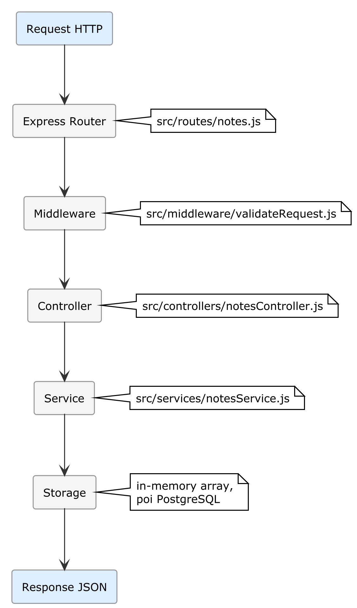

# Capitolo 6 — Progetto 3: Server REST API con Node.js

## Cosa Costruirai

Un **server REST API** completo con Node.js e Express che:
- Espone endpoint CRUD per la gestione di "note"
- Valida tutti gli input
- Gestisce errori con middleware centralizzato
- Genera documentazione Swagger automatica
- Include test di integrazione

Questo server diventerà la **base del progetto full-stack** che crescerà nei capitoli 7-10.

**Tempo stimato**: 45-60 minuti

---

> 💡 **Box Teoria — Cos'è una REST API?** Una REST API è un'interfaccia che permette a programmi diversi di comunicare tra loro tramite richieste HTTP standard. Funziona come un cameriere in un ristorante: il client (browser, app mobile) invia un *ordine* (richiesta) specificando *cosa vuole* (URL) e *che operazione* (metodo HTTP: GET per leggere, POST per creare, PUT per aggiornare, DELETE per eliminare). Il server elabora la richiesta e risponde con i dati in formato JSON. Esempio: `GET /api/notes` chiede la lista delle note; il server risponde con `[{"id": 1, "title": "Prima nota"}]`.

> ⚙️ **Nota di versione** — Le istruzioni di questo capitolo sono verificate con Node.js 20 LTS, Express.js 4.x, Zod 3.x e Jest 29.x. I framework JavaScript evolvono costantemente: se l'IA ti segnala una libreria deprecata o suggerisce una versione più recente (es. Express 5, Vitest al posto di Jest), fidati della correzione e procedi. I concetti architetturali restano identici.

> 📦 **Box Tooling — Stack scelto per questo esempio.**
> - **Runtime:** Node.js 20 LTS
> - **Framework:** Express.js 4.x
> - **Validazione:** Zod 3.x
> - **Test:** Jest 29.x
>
> **Alternative equivalenti:** Python/FastAPI, Go/Gin, Java/Spring Boot, C#/ASP.NET. Il **pattern architetturale** (endpoint CRUD, validazione input, middleware, test) è identico indipendentemente dal linguaggio. Se preferisci un altro stack, applica lo stesso metodo 0-code: il `_CONTEXT.md` guiderà l'IA a generare l'implementazione nel framework che hai scelto.

## 6.1 — Prerequisiti

### 🔧 PRATICA — Installare Node.js

**Windows:**
1. Scarica da [nodejs.org](https://nodejs.org) la versione LTS (20.x o superiore)
2. Esegui l'installer con le opzioni predefinite

**macOS:**
```bash
brew install node
```

**Linux:**
```bash
curl -fsSL https://deb.nodesource.com/setup_20.x | sudo -E bash -
sudo apt-get install nodejs
```

**Verifica:**
```bash
node --version    # v20.x.x
npm --version     # 10.x.x
```

---

## 6.2 — Il Contesto del Progetto (ADLC Fase 0-2)

> 📖 **Nota didattica**: In un progetto reale, prima di scrivere il `_CONTEXT.md` applicheresti la Fase 3 del workflow professionale (Sezione 3.8): l'IA propone le opzioni tecnologiche, tu scegli, e documenti tutto in `docs/DESIGN.md` come ADR. In questo progetto guidato, le scelte sono già state fatte per te — così puoi concentrarti sull'imparare il metodo ADLC senza il sovraccarico decisionale. Nel progetto autonomo dell'Appendice F applicherai il workflow completo, Design incluso.

### 🔧 PRATICA — Setup e `_CONTEXT.md`

1. Crea la cartella `notes-api`
2. Aprila in VS Code
3. Crea il file `_CONTEXT.md`:

```markdown
# Progetto: Notes API

## Scopo
REST API per la gestione di note personali. Backend che verrà usato come 
fondamento per un'applicazione full-stack (frontend React + mobile Flutter).

## Tecnologie
- Runtime: Node.js 20 LTS
- Framework: Express.js 4.x
- Linguaggio: JavaScript ES2022+ con ESModules (import/export)
- Validazione: Zod
- Documentazione: swagger-jsdoc + swagger-ui-express
- Testing: Jest con supertest
- Linting: ESLint

## Struttura del Progetto

notes-api/
├── _CONTEXT.md
├── package.json
├── .env.example         ← Template variabili d'ambiente
├── .gitignore
├── src/
│   ├── index.js         ← Entry point: crea app e avvia server
│   ├── app.js           ← Configurazione Express (middleware, routes)
│   ├── routes/
│   │   └── notes.js     ← Definizione route /api/notes
│   ├── controllers/
│   │   └── notesController.js  ← Logica dei controller
│   ├── services/
│   │   └── notesService.js     ← Business logic (per ora in-memory)
│   ├── middleware/
│   │   ├── errorHandler.js     ← Gestione errori centralizzata
│   │   └── validateRequest.js  ← Middleware validazione con Zod
│   ├── schemas/
│   │   └── noteSchema.js       ← Schema Zod per validazione note
│   └── utils/
│       └── apiResponse.js      ← Helper per risposte standardizzate
└── tests/
    ├── setup.js
    └── notes.test.js           ← Test di integrazione API

## Modello Dati (Nota)

Per ora usiamo storage in-memory (array). Nel Capitolo 7 migreremo a PostgreSQL.

- id: string UUID v4 (generato automaticamente)
- title: string (obbligatorio, 1-200 caratteri)
- content: string (obbligatorio, 1-10000 caratteri)
- tags: string[] (opzionale, default [])
- createdAt: string ISO 8601
- updatedAt: string ISO 8601

## Endpoint API

| Metodo | Path | Descrizione | Status Code |
|:--|:--|:--|:--|
| GET | /api/notes | Lista tutte le note | 200 |
| GET | /api/notes/:id | Dettaglio nota | 200 / 404 |
| POST | /api/notes | Crea nota | 201 |
| PUT | /api/notes/:id | Aggiorna nota | 200 / 404 |
| DELETE | /api/notes/:id | Elimina nota | 204 / 404 |
| GET | /api/health | Health check | 200 |
| GET | /api/docs | Swagger UI | 200 |

## Formato Risposte API

Tutte le risposte DEVONO seguire questo formato:

Successo:
{ "success": true, "data": T }

Successo con lista:
{ "success": true, "data": T[], "count": number }

Errore:
{ "success": false, "error": { "message": string, "code": string } }

## Convenzioni

- ESModules: usa SEMPRE import/export, MAI require/module.exports
- Async: usa SEMPRE async/await, MAI callback o .then()
- Naming: camelCase per variabili/funzioni, PascalCase per classi
- File: kebab-case per nomi file
- Status code: usa le costanti appropriate (201 per POST, 204 per DELETE)
- Ogni controller è una funzione async

## Vincoli

- NON usare require(). Questo è un progetto ESModules.
- NON mettere logica di business nei controller. Usa i service.
- NON ritornare stack trace negli errori. Solo messaggi user-friendly.
- NON usare console.log per debugging in produzione. Usa un logLevel.
- NON hardcodare la porta. Usa process.env.PORT con default 3000.
- CORS deve essere abilitato per lo sviluppo (origin: '*' in dev).
- Ogni endpoint deve avere il commento JSDoc Swagger.

## Comandi

- Installare dipendenze: npm install
- Avviare in dev: npm run dev (con nodemon)
- Avviare in prod: npm start
- Test: npm test
- Lint: npm run lint

## package.json type

OBBLIGATORIO: il package.json DEVE contenere "type": "module" per supportare
ESModules.
```

---

## 6.3 — Generazione del Progetto

### 🔧 PRATICA — Inizializzazione e generazione

In Copilot Agent Mode:

```text
Leggi il _CONTEXT.md e implementa l'intero progetto Notes API.

Inizia con:
1. Inizializza il progetto npm con package.json (type: module)
2. Installa le dipendenze necessarie
3. Implementa i file nell'ordine: schemas → utils → services → middleware → 
   controllers → routes → app → index
4. Aggiungi la configurazione Swagger
5. Crea i test di integrazione
6. Crea .env.example e .gitignore
```

L'IA dovrebbe:
1. Eseguire `npm init -y` e `npm install express zod swagger-jsdoc swagger-ui-express uuid cors`
2. Eseguire `npm install -D jest supertest nodemon eslint`
3. Creare tutti i file seguendo la struttura del `_CONTEXT.md`

---

## 6.4 — Verifica Strutturale

### 🔧 PRATICA — Controllo della struttura

```bash
# Verifica che i file siano stati creati
dir src /s       # Windows
ls -R src        # macOS/Linux
```

### Checklist di revisione veloce

**`package.json`:**
- [ ] Contiene `"type": "module"`
- [ ] Script `dev`, `start`, `test`, `lint` presenti
- [ ] Dipendenze corrette

**`src/app.js`:**
- [ ] Usa `import`, non `require`
- [ ] CORS abilitato
- [ ] Error handler come ultimo middleware
- [ ] Route /api/notes montata
- [ ] Route /api/docs per Swagger

**`src/schemas/noteSchema.js`:**
- [ ] Schema Zod con validazione title (1-200 char), content (1-10000 char)
- [ ] Campo tags opzionale

**`src/utils/apiResponse.js`:**
- [ ] Formato risposta conforme al `_CONTEXT.md`
- [ ] Funzioni `successResponse()` e `errorResponse()`

---

## 6.5 — Test e Prima Esecuzione

### 🔧 PRATICA — Avvio del server

```bash
npm run dev
```

Output atteso:
```text
Server running on port 3000
Swagger docs available at http://localhost:3000/api/docs
```

### 🔧 PRATICA — Test manuali con curl o Thunder Client

**Health check:**
```bash
curl http://localhost:3000/api/health
```
```json
{ "success": true, "data": { "status": "ok", "timestamp": "2026-03-30T..." } }
```

**Crea una nota:**
```bash
curl -X POST http://localhost:3000/api/notes \
  -H "Content-Type: application/json" \
  -d '{"title": "La mia prima nota", "content": "Generata in 0-code!", "tags": ["test"]}'
```
```json
{ "success": true, "data": { "id": "uuid...", "title": "La mia prima nota", ... } }
```

**Lista note:**
```bash
curl http://localhost:3000/api/notes
```

**Testa la validazione (errore atteso):**
```bash
curl -X POST http://localhost:3000/api/notes \
  -H "Content-Type: application/json" \
  -d '{"title": ""}'
```
```json
{ "success": false, "error": { "message": "Validation failed", "code": "VALIDATION_ERROR" } }
```

### 🔧 PRATICA — Swagger UI

Apri nel browser: `http://localhost:3000/api/docs`

Dovresti vedere la documentazione interattiva Swagger con tutti gli endpoint. Puoi testare le API direttamente da lì.

### 🔧 PRATICA — Test automatici

```bash
npm test
```

### 🎯 CHECKPOINT
- Server avviato ✅
- Health check risponde ✅
- CRUD note funziona ✅
- Validazione blocca input invalidi ✅
- Swagger UI accessibile ✅
- Test automatici passano ✅

---

## 6.6 — Comprendere l'Architettura

Questo è un buon momento per capire l'architettura che l'IA ha generato, perché la ritroverai in tutto il libro:



Ogni layer ha una responsabilità precisa:
- **Router**: definisce gli URL e i metodi HTTP
- **Middleware**: validazione, autenticazione (lo aggiungeremo nel Cap. 8)
- **Controller**: gestisce la request/response HTTP
- **Service**: contiene la logica di business (non sa nulla di HTTP)
- **Storage**: persiste i dati (per ora in array, poi database)

> 📖 **Approfondimento**: Questa separazione in layer è un pattern architetturale classico. Il vantaggio è che quando nel Capitolo 7 aggiungeremo PostgreSQL, dovremo modificare SOLO il layer di storage. Tutto il resto resta invariato.

---

## 6.7 — Preparazione per i Prossimi Capitoli

Questa API è il fondamento del progetto full-stack. Nei prossimi capitoli:

| Capitolo | Cosa aggiungiamo |
|:--|:--|
| **Cap. 7** | PostgreSQL + Prisma (sostituiamo in-memory storage) |
| **Cap. 8** | Autenticazione OAuth 2.0 + JWT |
| **Cap. 9** | Frontend React con autenticazione |
| **Cap. 10** | Integrazione Full-Stack completa |
| **Cap. 11-12** | App Flutter connessa a questa API |

Salva il progetto — lo riprenderemo nel prossimo capitolo.

### 🔧 PRATICA — Inizializza Git

```bash
git init
git add .
git commit -m "feat: Notes API REST completa con validazione e Swagger"
```

---

## Riepilogo del Progetto

| Aspetto | Dettaglio |
|:--|:--|
| **Stack** | Node.js 20 + Express + Zod + Swagger |
| **Endpoint** | 6 endpoint REST + documentazione |
| **Validazione** | Schema Zod su tutti gli input |
| **Test** | Integration test con Jest + supertest |
| **Architettura** | Router → Controller → Service → Storage |
| **Tempo totale** | ~45-60 minuti |
| **Codice scritto a mano** | Solo il `_CONTEXT.md` |

---

**→ Nel prossimo capitolo**: colleghiamo un database reale. Sostituiremo lo storage in-memory con PostgreSQL usando Prisma ORM, scopriremo il primo Server MCP e configureremo migrazioni automatiche.
