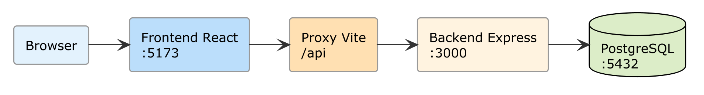
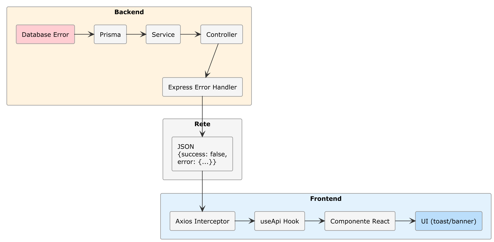

# Capitolo 10 — Progetto 7: Integrazione Full-Stack

## Cosa Costruirai

Un'applicazione full-stack completamente integrata:
- Backend e frontend che comunicano senza errori
- Gestione CORS e proxy configurati correttamente
- Error handling unificato end-to-end
- Un unico `_CONTEXT.md` di progetto che governa entrambi
- Il pattern Multi-Agente applicato in pratica
- Un sistema di sviluppo riproducibile per qualsiasi progetto futuro

**Tempo stimato**: 45-60 minuti  
**Prerequisito**: Backend (Cap. 6-8) e Frontend (Cap. 9) funzionanti

---

## 10.1 — La Struttura del Monorepo

### 🔧 PRATICA — Organizzare la workspace

Riorganizza la struttura su disco:

```text
notes-fullstack/
├── _CONTEXT.md              ← Contesto globale del progetto
├── SKILL.md                 ← Skill condiviso (opzionale)
├── PROGRESS.md              ← Memoria persistente tra sessioni
├── backend/
│   ├── _CONTEXT.md          ← Contesto specifico del backend
│   ├── package.json
│   ├── prisma/
│   └── src/
└── frontend/
    ├── _CONTEXT.md          ← Contesto specifico del frontend
    ├── SKILL.md             ← Skill React
    ├── package.json
    └── src/
```

```bash
mkdir notes-fullstack
mv notes-api notes-fullstack/backend
mv notes-frontend notes-fullstack/frontend
cd notes-fullstack
git init
```

---

## 10.2 — Il Contesto Globale

Il `_CONTEXT.md` nella root del progetto è il documento più importante. Descrive l'intero sistema.

### 🔧 PRATICA — Crea il `_CONTEXT.md` di root

````markdown
# Progetto: Notes Full-Stack Application

## Panoramica
Applicazione web full-stack per la gestione di note personali con 
autenticazione OAuth 2.0. Composta da un backend REST API e un frontend React.

## Architettura

```text
[Browser] → [Frontend React :5173] → [Proxy Vite /api] → [Backend Express :3000]
                                                              ↓
                                                        [PostgreSQL :5432]
```

## Componenti

### Backend (./backend/)
- **Tecnologia**: Node.js 20, Express.js, Prisma ORM
- **Database**: PostgreSQL 16
- **Auth**: OAuth 2.0 (Google + GitHub), JWT, Passport.js
- **API Base**: /api
- **Porta**: 3000
- **Contesto**: ./backend/_CONTEXT.md

### Frontend (./frontend/)
- **Tecnologia**: React 18, Vite, Tailwind CSS 4
- **Routing**: React Router 6
- **Auth**: Cookie httpOnly via backend proxy
- **Porta**: 5173 (dev), servito da CDN in produzione
- **Contesto**: ./frontend/_CONTEXT.md
- **Skill**: ./frontend/SKILL.md

## Contratto API

Il frontend e il backend comunicano attraverso questo contratto:

### Formato risposte (SEMPRE rispettato)
```json
{
  "success": true|false,
  "data": { ... },
  "error": { "message": "...", "code": "VALIDATION_ERROR" }
}
```

### Endpoint

| Metodo | Endpoint | Auth | Descrizione |
|:--|:--|:--|:--|
| GET | /api/auth/google | No | Avvia login Google |
| GET | /api/auth/github | No | Avvia login GitHub |
| GET | /api/auth/me | Sì | Profilo utente corrente |
| POST | /api/auth/refresh | Cookie | Rinnova JWT |
| POST | /api/auth/logout | Sì | Logout (invalida token) |
| GET | /api/notes | Sì | Lista note utente |
| POST | /api/notes | Sì | Crea nota |
| GET | /api/notes/:id | Sì | Dettaglio nota |
| PUT | /api/notes/:id | Sì | Modifica nota |
| DELETE | /api/notes/:id | Sì | Elimina nota |
| GET | /api/notes/search?q= | Sì | Cerca note |

### Codici errore
- 401: Non autenticato → frontend redirige al login
- 403: Non autorizzato (nota di un altro utente) → mostra errore
- 404: Risorsa non trovata → mostra pagina 404
- 422: Validazione fallita → mostra errori nei campi del form
- 500: Errore server → mostra messaggio generico

## Variabili d'ambiente

### Backend (.env)
DATABASE_URL, GOOGLE_CLIENT_ID, GOOGLE_CLIENT_SECRET,
GITHUB_CLIENT_ID, GITHUB_CLIENT_SECRET, JWT_SECRET, 
JWT_EXPIRES_IN, REFRESH_TOKEN_EXPIRES_IN, FRONTEND_URL

### Frontend (.env)
VITE_API_URL=/api (in dev con proxy)

## Comandi

### Sviluppo
- Backend: cd backend && npm run dev
- Frontend: cd frontend && npm run dev
- Database: npx prisma studio (dalla cartella backend)

### Produzione
- Backend: cd backend && npm start
- Frontend: cd frontend && npm run build (genera ./frontend/dist/)
````



> 📖 **Approfondimento**: Questo documento è il contratto tra le due parti dell'applicazione. Quando chiedi all'IA di modificare il backend, sa cosa aspettarsi dal frontend. Quando modifichi il frontend, l'IA sa quali endpoint sono disponibili. Senza questo documento, ogni modifica rischia di rompere l'altra parte.

---

## 10.3 — Gestione CORS in Sviluppo e Produzione

### Il problema

In sviluppo, frontend (porta 5173) e backend (porta 3000) sono su porte diverse. Il browser blocca le richieste cross-origin per sicurezza.

### La soluzione dual

**In sviluppo**: Il proxy Vite (configurato nel capitolo 9) inoltra le richieste.

**In produzione**: Il backend serve direttamente i file statici del frontend.

### 🔧 PRATICA — Configura il backend per la produzione

```text
Modifica il backend per servire i file statici del frontend in produzione.

In app.js:
- Se NODE_ENV === 'production', servi i file statici da ../frontend/dist
- Per qualsiasi route non-API, servi index.html (React Router gestisce il routing)
- Configura CORS solo per l'ambiente di sviluppo

Modifica anche il CORS middleware:
- In sviluppo: origin = 'http://localhost:5173', credentials = true
- In produzione: origin non necessario (same-origin)
```

L'IA dovrebbe generare qualcosa simile a:

```javascript
// In app.js
import path from 'path';
import { fileURLToPath } from 'url';

const __dirname = path.dirname(fileURLToPath(import.meta.url));

if (process.env.NODE_ENV === 'production') {
  // Serve frontend build
  app.use(express.static(path.join(__dirname, '../../frontend/dist')));
  
  // Fallback per React Router
  app.get('*', (req, res) => {
    if (!req.path.startsWith('/api')) {
      res.sendFile(path.join(__dirname, '../../frontend/dist/index.html'));
    }
  });
} else {
  // CORS per sviluppo
  app.use(cors({
    origin: process.env.FRONTEND_URL || 'http://localhost:5173',
    credentials: true
  }));
}
```

---

## 10.4 — Error Handling End-to-End

Un errore può nascere a qualsiasi livello. Il sistema deve gestirlo in modo coerente.

### Il flusso degli errori



### 🔧 PRATICA — Error handling completo

```text
Implementa un sistema di gestione errori end-to-end:

1. Backend: crea un middleware di error handling globale in Express 
   che cattura tutti gli errori e li converte nel formato standard 
   { success: false, error: { message, code } }.
   Gestisci specificamente: PrismaClientKnownRequestError (P2025 = not found),
   ValidationError, AuthenticationError, AuthorizationError.

2. Frontend: aggiungi un Axios response interceptor che:
   - Per 401: cancella lo stato auth e ridirige al login
   - Per 422: restituisce gli errori di validazione al form
   - Per 500: mostra un toast di errore generico
   - Per errori di rete: mostra un banner "Connessione persa"

3. Frontend: crea un componente ErrorBoundary React che cattura 
   errori di rendering e mostra una pagina di fallback.
```

> ⚠️ **Attenzione**: L'error handler del backend NON deve mai esporre dettagli interni in produzione. Messaggi come "Cannot read property 'id' of undefined" o stack trace sono vulnerabilità di sicurezza (Information Disclosure, OWASP A01). In produzione, restituisci solo messaggi generici.

---

## 10.5 — Sessione di Sviluppo con `PROGRESS.md`

Quando lavori su un progetto complesso, la memoria persistente dell'IA è fondamentale.

### 🔧 PRATICA — Crea `PROGRESS.md`

```markdown
# Notes Full-Stack — Progresso

## Stato Attuale
- [x] Backend REST API con Express.js
- [x] Database PostgreSQL con Prisma
- [x] Autenticazione OAuth 2.0 (Google + GitHub)
- [x] Frontend React con dashboard note
- [x] CRUD note completo (frontend ↔ backend)
- [x] Error handling end-to-end
- [ ] Testing automatizzato (Capitolo 14)
- [ ] Deploy in produzione (Capitolo 15)

## Decisioni Architetturali
- JWT in cookie httpOnly (non localStorage) per sicurezza XSS
- Proxy Vite in dev, static serving in produzione
- Monorepo con contesti separati per backend e frontend
- Context API per stato auth (no Redux, il progetto è abbastanza semplice)

## Problemi Risolti
- CORS: risolto con proxy Vite in dev + cors middleware condizionale
- Refresh token: gestito con interceptor Axios che riprova la richiesta
- OAuth redirect: callback URL punta al backend, che redirige al frontend

## Note per la Prossima Sessione
- Quando modifichi gli endpoint del backend, aggiorna anche il 
  _CONTEXT.md di root (tabella endpoint)
- Il database di sviluppo si chiama "notes_dev" (vedi .env del backend)
```

Se usi Copilot Agent Mode, questo file non viene letto automaticamente ma puoi istruire Copilot a leggerlo:

```text
Leggi il file PROGRESS.md per capire lo stato del progetto, poi...
```

---

## 10.6 — Il Pattern Multi-Agente in Pratica

Nel Capitolo 3 abbiamo introdotto il concetto di agente. Ora vediamo come usare **più agenti specializzati** in un flusso di lavoro reale.

### Il pattern Planner-Generator-Evaluator

Non si tratta di far comunicare agenti tra loro (quello è per sistemi avanzati). Si tratta di **cambiare il ruolo dell'IA** nelle diverse fasi del lavoro:

**1. Planner (Pianificatore)**: Chiedi all'IA di analizzare e pianificare

```text
Analizza il _CONTEXT.md di root. Voglio aggiungere la funzionalità 
"categorie" alle note: ogni nota può appartenere a una categoria, 
le categorie sono definite dall'utente.

NON scrivere codice. Elenca:
1. Quali file del backend vanno modificati e perché
2. Quali file del frontend vanno modificati e perché
3. Le migrazioni del database necessarie
4. L'ordine di implementazione consigliato
```

**2. Generator (Generatore)**: Chiedi di implementare punto per punto

```text
Implementa il punto 1 del piano: la migrazione del database.
Aggiungi il modello Category e la relazione con Note in Prisma.
Segui le convenzioni del _CONTEXT.md del backend.
```

**3. Evaluator (Valutatore)**: Chiedi all'IA di revisionare il proprio lavoro

```text
Rivedi il codice che hai appena generato per la funzionalità categorie.
Verifica:
1. La migrazione è reversibile?
2. Gli endpoint rispettano il formato standard delle risposte?
3. Il frontend gestisce correttamente il caso "nessuna categoria"?
4. Ci sono problemi di sicurezza (un utente può accedere alle categorie 
   di un altro)?
Elenca eventuali problemi trovati.
```

### 🔧 PRATICA — Aggiungi le categorie

Segui il pattern Planner-Generator-Evaluator descritto sopra per aggiungere la funzionalità "categorie" all'applicazione:

1. Chiedi all'IA di pianificare (Planner)
2. Implementa database e backend (Generator)
3. Implementa frontend (Generator)
4. Chiedi all'IA di revisionare tutto (Evaluator)
5. Correggi eventuali problemi segnalati

---

## 10.7 — Refactoring Guidato dall'IA

Con l'intero stack funzionante, è il momento giusto per consolidare.

### 🔧 PRATICA — Refactoring del backend

```text
Fai un refactoring del backend. Verifica:
1. Tutti i controller seguono lo stesso pattern (try/catch, formato risposta)
2. Non c'è duplicazione nel codice di validazione (usa middleware Zod)
3. Le query Prisma specificano i campi con select (mai restituire 
   tutti i campi)
4. I route file seguono la stessa struttura
5. I messaggi di errore sono consistenti

NON cambiare il comportamento esterno. NON rompere i test. 
Mostrami un diff prima di applicare i cambiamenti.
```

> 💡 **Suggerimento**: Chiedere "mostrami un diff" prima di applicare i cambiamenti è una pratica difensiva efficace. Puoi revisionare le modifiche proposte dall'IA prima che le applichi.

---

## 10.8 — Script di Sviluppo

### 🔧 PRATICA — Script npm nella root

Crea un `package.json` nella root del monorepo:

```json
{
  "name": "notes-fullstack",
  "private": true,
  "scripts": {
    "dev": "concurrently \"npm run dev:backend\" \"npm run dev:frontend\"",
    "dev:backend": "cd backend && npm run dev",
    "dev:frontend": "cd frontend && npm run dev",
    "build": "cd frontend && npm run build",
    "start": "cd backend && NODE_ENV=production node src/index.js",
    "db:migrate": "cd backend && npx prisma migrate dev",
    "db:studio": "cd backend && npx prisma studio",
    "db:seed": "cd backend && npx prisma db seed"
  },
  "devDependencies": {
    "concurrently": "^8.0.0"
  }
}
```

```bash
npm install
npm run dev  # Avvia backend e frontend insieme
```

---

## 10.9 — Test End-to-End

### Checklist finale

| Test | Come verificare |
|:--|:--|
| **Cold start** | `npm run dev` → tutto parte senza errori |
| **Login Google** | Click → OAuth → Dashboard |
| **Login GitHub** | Click → OAuth → Dashboard |
| **CRUD completo** | Crea → Leggi → Modifica → Elimina nota |
| **Categorie** | Crea categoria → Associa a nota → Filtra |
| **Ricerca** | Cerca nel titolo → Risultati corretti |
| **Logout + protezione** | Logout → Prova /dashboard → Redirect a login |
| **Token scaduto** | Aspetta la scadenza → L'app rinnova automaticamente |
| **Backend down** | Ferma il backend → Il frontend mostra "Connessione persa" |
| **404** | Vai a /pagina-inesistente → Pagina 404 |
| **Mobile** | Apri su emulatore mobile → Layout responsive |

### 🎯 CHECKPOINT
Se tutti i test passano, l'applicazione full-stack è completa. Hai un backend con database e autenticazione, un frontend React con dashboard, e un'architettura monorepo pronta per il deploy.

---

## 10.10 — Commit Finale

```bash
cd notes-fullstack
git add .
git commit -m "feat: integrazione full-stack completa con monorepo, error handling e categorie"
```

---

## Riepilogo

| Aspetto | Dettaglio |
|:--|:--|
| **Architettura** | Monorepo con contesti separati |
| **Contesto globale** | `_CONTEXT.md` di root con contratto API |
| **CORS** | Proxy Vite (dev) + static serving (prod) |
| **Error handling** | End-to-end dal database al toast UI |
| **Multi-Agente** | Pattern Planner-Generator-Evaluator |
| **Memoria** | `PROGRESS.md` per sessioni continuative |
| **Script** | `npm run dev` avvia tutto con concurrently |

---

## Cosa Hai Costruito Finora

Fermati un momento. Partendo da zero, in 10 capitoli hai costruito:

1. ✅ Un **programma interattivo** Python (Cap. 4)
2. ✅ Un **task manager CLI** con persistenza (Cap. 5)
3. ✅ Una **REST API** con Express.js e Swagger (Cap. 6)
4. ✅ Un **database PostgreSQL** con Prisma ORM (Cap. 7)
5. ✅ Un sistema di **autenticazione OAuth 2.0** (Cap. 8)
6. ✅ Un **frontend React** con dashboard e CRUD (Cap. 9)
7. ✅ Un'**applicazione full-stack integrata** (Cap. 10)

Tutto **senza scrivere una riga di codice manualmente**.

---

**→ Nella Parte IV**: porteremo questa applicazione su mobile con Flutter. Costruiremo un'app nativa che si connette al backend che abbiamo già, con autenticazione, sincronizzazione dati e pubblicazione sugli store.
