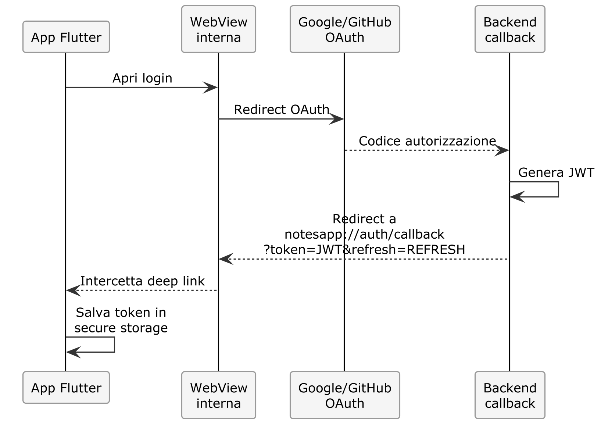

# Capitolo 12 — Progetto 9: Flutter e Backend: Autenticazione e CRUD

## Cosa Costruirai

Un'app Flutter completamente funzionante che:
- Esegue login OAuth 2.0 (Google/GitHub) tramite WebView
- Salva i token in modo sicuro (flutter_secure_storage)
- Mostra la lista note dall'API
- Supporta creazione, modifica ed eliminazione note
- Gestisce errori di rete e token scaduti
- Funziona su emulatore Android, iOS e Chrome

**Tempo stimato**: 60-90 minuti  
**Prerequisito**: App Flutter con UI statica (Cap. 11) + Backend funzionante

---

## 12.1 — Autenticazione OAuth su Mobile

### Il problema

Sul web, OAuth funziona con redirect del browser. Su mobile, il flusso è diverso:



### 🔧 PRATICA — Dipendenze per OAuth mobile

Aggiorna il `_CONTEXT.md`:

```markdown
## Autenticazione Mobile

L'autenticazione su mobile usa una WebView per mostrare la pagina OAuth.
Dopo il login, il backend redirige a un URL speciale che l'app intercetta
per estrarre il token JWT.

### Flusso:
1. Utente tocca "Login con Google"
2. App apre una WebView con URL: {backend}/api/auth/google?platform=mobile
3. Google mostra la pagina di consenso
4. Backend riceve il callback OAuth
5. Backend redirige a: notesapp://auth/callback?token={jwt}&refresh={refresh_token}
6. App intercetta il deep link, salva i token, chiude la WebView

### Dipendenze aggiuntive:
- flutter_web_auth_2: per il flusso OAuth con custom scheme
- flutter_secure_storage: per salvare i token in modo sicuro
```

```text
Aggiungi al progetto Flutter:
1. La dipendenza flutter_web_auth_2 in pubspec.yaml
2. Modifica auth_service.dart per implementare il flusso OAuth mobile:
   - Apri la WebView con l'URL del backend OAuth
   - Intercetta il callback con lo scheme "notesapp://"
   - Estrai token e refresh_token dall'URL
   - Salva entrambi con flutter_secure_storage
3. Aggiorna il backend per supportare il parametro ?platform=mobile:
   - Se platform=mobile, dopo l'OAuth redirige a notesapp://auth/callback?token=...
   - Se platform non è presente, redirige al frontend web come prima
```

### Aggiornamento backend necessario

Il backend deve gestire il redirect mobile. Chiedi all'IA:

```text
Nel backend, modifica il callback OAuth (sia Google che GitHub):
- Se la query string contiene platform=mobile, dopo l'autenticazione
  redirige a: notesapp://auth/callback?token={jwt}&refresh={refreshToken}
- Altrimenti, redirige al frontend web come prima.
- I token devono essere passati come query parameters nel redirect mobile.
```

> ⚠️ **Attenzione**: Passare token come query parameter è accettabile per deep link mobili (il custom scheme `notesapp://` non è intercettabile da browser). NON usare mai questa tecnica su URL `https://` — i token finirebbero nei log del server e nella cronologia del browser.

---

## 12.2 — Configurazione Android e iOS

### Android — Deep Link

L'IA dovrebbe configurare il file `android/app/src/main/AndroidManifest.xml` per gestire lo scheme `notesapp://`:

```xml
<intent-filter>
    <action android:name="android.intent.action.VIEW" />
    <category android:name="android.intent.category.DEFAULT" />
    <category android:name="android.intent.category.BROWSABLE" />
    <data android:scheme="notesapp" android:host="auth" />
</intent-filter>
```

### iOS — URL Scheme

In `ios/Runner/Info.plist`:

```xml
<key>CFBundleURLTypes</key>
<array>
    <dict>
        <key>CFBundleURLSchemes</key>
        <array>
            <string>notesapp</string>
        </array>
    </dict>
</array>
```

### 🔧 PRATICA — Genera la configurazione

```text
Configura il progetto Flutter per gestire il deep link con scheme "notesapp://".
- Android: aggiungi l'intent-filter in AndroidManifest.xml
- iOS: aggiungi l'URL scheme in Info.plist
- Aggiorna api_config.dart con il callback scheme
```

---

## 12.3 — Storage Sicuro dei Token

### 🔧 PRATICA — Implementa il token storage

```text
Crea lib/services/token_service.dart che:
1. Usa flutter_secure_storage per salvare/leggere/cancellare i token
2. Salva: access_token, refresh_token
3. Espone: saveTokens(), getAccessToken(), getRefreshToken(), clearTokens()
4. Su Android usa EncryptedSharedPreferences
5. Su iOS usa il Keychain

Poi modifica api_service.dart (Dio):
- Aggiungi un interceptor che legge il token da TokenService 
  e lo mette nell'header Authorization: Bearer {token}
- Aggiungi un interceptor per le risposte 401:
  a. Prova a rinnovare il token con refresh_token
  b. Se il refresh va a buon fine, riprova la richiesta originale
  c. Se il refresh fallisce, esegui il logout
```

> 📖 **Approfondimento**: `flutter_secure_storage` usa il Keychain di iOS e EncryptedSharedPreferences di Android. Questi sono gli storage crittografati nativi del sistema operativo — molto più sicuri di SharedPreferences o di salvare token in file di testo.

---

## 12.4 — Collegare le Schermate al Backend

### 🔧 PRATICA — Login funzionante

```text
Aggiorna login_screen.dart:
- Il bottone "Login con Google" chiama authService.loginWithGoogle()
- Il bottone "Login con GitHub" chiama authService.loginWithGithub()
- Durante il login mostra un CircularProgressIndicator
- Se il login riesce, naviga a /dashboard
- Se il login fallisce, mostra un SnackBar con l'errore
```

### 🔧 PRATICA — Dashboard con dati reali

```text
Aggiorna dashboard_screen.dart per caricare le note dal backend:
1. Al mount della schermata, chiama notesProvider per caricare le note
2. Mostra CircularProgressIndicator durante il caricamento
3. Mostra EmptyState se non ci sono note
4. Mostra ErrorBanner se c'è un errore di rete
5. Mostra la lista di NoteCard con i dati reali
6. Pull-to-refresh per ricaricare
7. FAB (Floating Action Button) per creare una nuova nota
```

### 🔧 PRATICA — CRUD completo

```text
Implementa le operazioni CRUD nelle schermate:

1. note_form_screen.dart:
   - Form con campi titolo e contenuto
   - Validazione: titolo obbligatorio, minimo 3 caratteri
   - Bottone Salva: crea o aggiorna la nota via API
   - Se editing, precompila i campi con i dati esistenti
   
2. note_detail_screen.dart:
   - Mostra titolo, contenuto, data creazione/modifica
   - AppBar con azioni: modifica (icona edit) ed elimina (icona delete)
   - Elimina: mostra dialog di conferma prima di procedere
   - Dopo elimina: torna alla dashboard

3. dashboard_screen.dart:
   - Ogni NoteCard, al tap, naviga a note_detail_screen
   - Swipe-to-delete sulle card (con conferma)
   - Animazioni di lista (inserimento/rimozione)
```

---

## 12.5 — Gestione Stato con Riverpod

L'IA ha generato i provider. Ecco come dovresti trovarli strutturati:

```dart
// providers/auth_provider.dart

enum AuthStatus { loading, authenticated, unauthenticated }

class AuthState {
  final AuthStatus status;
  final User? user;
  final String? error;
  
  const AuthState({
    this.status = AuthStatus.loading,
    this.user,
    this.error,
  });
}

class AuthNotifier extends StateNotifier<AuthState> {
  final AuthService _authService;
  final TokenService _tokenService;

  AuthNotifier(this._authService, this._tokenService)
      : super(const AuthState()) {
    _checkAuth();  // Verifica se c'è già un token salvato
  }

  Future<void> _checkAuth() async {
    final token = await _tokenService.getAccessToken();
    if (token != null) {
      try {
        final user = await _authService.getCurrentUser();
        state = AuthState(status: AuthStatus.authenticated, user: user);
      } catch (_) {
        await _tokenService.clearTokens();
        state = const AuthState(status: AuthStatus.unauthenticated);
      }
    } else {
      state = const AuthState(status: AuthStatus.unauthenticated);
    }
  }
}
```

> 💡 **Suggerimento**: Rivedi il codice generato per verificare che `_checkAuth()` venga chiamato nel costruttore. Questo è il pattern "auto-login": quando l'app si riavvia, se c'è un token salvato, prova a fare il login automatico senza che l'utente debba rifare OAuth.

---

## 12.6 — Test dell'App

### Preparazione

1. **Avvia il backend**: `cd notes-fullstack/backend && npm run dev`
2. **Avvia l'app**: `flutter run` (su emulatore o Chrome)

### Checklist di verifica

| Funzionalità | Test |
|:--|:--|
| **Login Google** | Tocca → WebView → Consenso → Dashboard |
| **Login GitHub** | Tocca → WebView → Consenso → Dashboard |
| **Auto-login** | Chiudi e riapri l'app → Sei ancora autenticato |
| **Lista note** | Le note dal backend appaiono nella dashboard |
| **Crea nota** | Tocca FAB → Compila form → Salva → Nota appare |
| **Modifica nota** | Tocca nota → Edit → Modifica → Salva → Verificata |
| **Elimina nota** | Swipe o icona → Conferma → Nota scompare |
| **Pull refresh** | Tira giù → La lista si aggiorna |
| **Errore rete** | Spegni il backend → L'app mostra errore |
| **Token scaduto** | L'app rinnova il token automaticamente |
| **Logout** | Tocca logout → Torna al login → Token cancellati |

### 🎯 CHECKPOINT
Se riesci a fare login, creare/modificare/eliminare una nota dall'app mobile e i dati appaiono anche nel frontend web, l'integrazione è completa.

---

## 12.7 — Evoluzione: Categorie e Ricerca

### 🔧 PRATICA — Aggiungi le funzionalità mancanti

```text
L'app mobile deve avere le stesse funzionalità del frontend web.
Aggiungi:

1. Filtro per categorie nella dashboard 
   (chip/filtri orizzontali in cima alla lista)
2. Barra di ricerca nella AppBar della dashboard
3. Badge categoria sulla NoteCard
4. Selezione categoria nel form di creazione/modifica nota
```

---

## 12.8 — Commit

```bash
cd notes-fullstack/notes_mobile
git add .
git commit -m "feat: app Flutter con login OAuth, CRUD note e integrazione backend"
```

---

## Riepilogo

| Aspetto | Dettaglio |
|:--|:--|
| **Auth mobile** | OAuth via WebView + deep link callback |
| **Token storage** | flutter_secure_storage (Keychain/EncryptedSharedPrefs) |
| **HTTP** | Dio con interceptor per token e refresh |
| **State** | Riverpod con StateNotifier |
| **CRUD** | Completo: lista, crea, modifica, elimina |
| **Auto-login** | Token salvato → login automatico al riavvio |

---

**→ Nel prossimo capitolo**: prepareremo l'app per la pubblicazione sugli store. Build di produzione, icone, splash screen, firma dell'APK e pubblicazione.
