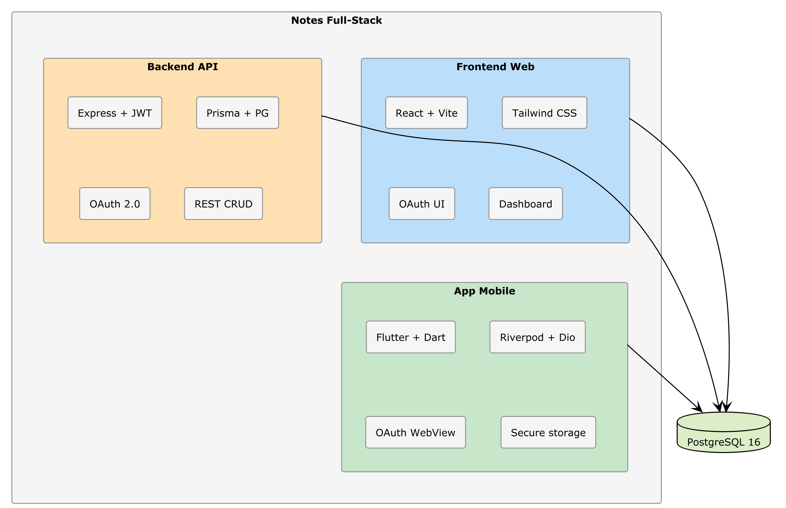

# Capitolo 13 — Release: Pubblicazione sugli Store

## Cosa Costruirai

In questo capitolo preparerai l'app Flutter per la pubblicazione:
- Icona dell'app e splash screen generati dall'IA
- Build di produzione per Android (APK/AAB) e iOS (IPA)
- Firma digitale dell'app
- Listing sugli store (testi, screenshot)
- Processo di pubblicazione su Google Play e App Store

**Tempo stimato**: 90-120 minuti  
**Prerequisito**: App Flutter funzionante (Cap. 11-12)

---

## 13.1 — Preparazione alla Produzione

### 🔧 PRATICA — Aggiorna il `_CONTEXT.md` per il rilascio

Aggiungi una sezione al contesto:

```markdown
## Release

### Identità App
- Nome: Notes App
- Bundle ID Android: com.example.notesapp (cambia con il tuo dominio)
- Bundle ID iOS: com.example.notesapp
- Versione: 1.0.0+1

### Ambienti
- Dev: http://10.0.2.2:3000/api (emulatore), http://localhost:3000/api (Chrome)
- Staging: https://staging-api.notes-app.example.com/api
- Produzione: https://api.notes-app.example.com/api

### Build
- Android: flutter build appbundle (per Play Store)
- iOS: flutter build ipa (per App Store)
- Firma Android: keystore in android/app/keystore.jks (NON committare)
```

---

## 13.2 — Icona e Splash Screen

### 🔧 PRATICA — Genera l'icona con l'IA

```text
Genera un'icona per l'app Notes seguendo le linee guida Material Design:
- Dimensione: 1024x1024 pixel
- Sfondo: gradiente indigo (da #4F46E5 a #3730A3)
- Icona centrale: una nota stilizzata (foglio con linee) in bianco
- Stile: flat, minimal, bordi arrotondati
- Formato: PNG con trasparenza

Salva come assets/icon/app_icon.png
```

> 💡 **Suggerimento**: Se l'IA non può generare immagini direttamente, chiedi di generare un'icona SVG con il codice, oppure usa strumenti come DALL-E o Midjourney con un prompt che l'IA ti aiuta a scrivere.

### 🔧 PRATICA — Configura flutter_launcher_icons

```text
Aggiungi flutter_launcher_icons al progetto:
1. Aggiungi la dipendenza dev in pubspec.yaml
2. Aggiungi la configurazione in pubspec.yaml:
   flutter_launcher_icons:
     android: true
     ios: true
     image_path: "assets/icon/app_icon.png"
     adaptive_icon_background: "#4F46E5"
     adaptive_icon_foreground: "assets/icon/app_icon_foreground.png"
3. Genera le icone con: dart run flutter_launcher_icons
```

### 🔧 PRATICA — Splash Screen

```text
Aggiungi flutter_native_splash al progetto:
1. Aggiungi la dipendenza dev in pubspec.yaml
2. Configura:
   flutter_native_splash:
     color: "#4F46E5"
     image: assets/icon/app_icon.png
     android_12:
       color: "#4F46E5"
       icon_background_color: "#4F46E5"
       image: assets/icon/app_icon.png
3. Genera con: dart run flutter_native_splash:create
```

---

## 13.3 — Configurazione di Produzione

### 🔧 PRATICA — Ambiente di produzione

```text
Modifica api_config.dart per supportare ambienti di produzione:
1. Usa le variabili --dart-define per passare l'ambiente al build
2. In produzione, l'URL API deve puntare al backend deployato
3. Disabilita i log di debug in produzione
4. Configura: flutter build appbundle --dart-define=ENV=production
```

L'IA dovrebbe generare qualcosa come:

```dart
class ApiConfig {
  static const String environment = String.fromEnvironment(
    'ENV',
    defaultValue: 'development',
  );

  static String get baseUrl {
    switch (environment) {
      case 'production':
        return 'https://api.notes-app.example.com/api';
      case 'staging':
        return 'https://staging-api.notes-app.example.com/api';
      default:
        return 'http://10.0.2.2:3000/api';
    }
  }
}
```

---

## 13.4 — Build Android

### Generare il Keystore

Il keystore è il certificato digitale che firma la tua app. Senza di esso, Google Play non accetta l'app.

```bash
keytool -genkey -v -keystore android/app/keystore.jks \
  -keyalg RSA -keysize 2048 -validity 10000 \
  -alias notes-app
```

> ⚠️ **Attenzione**: Il file `keystore.jks` è SEGRETO. NON committarlo in git. Se lo perdi, non potrai mai più aggiornare la tua app sullo store. Fai un backup sicuro.

### 🔧 PRATICA — Configura la firma

```text
Configura la firma dell'app Android:
1. Crea android/key.properties con i dati del keystore
   (storePassword, keyPassword, keyAlias, storeFile)
2. Modifica android/app/build.gradle per leggere key.properties
3. Aggiungi key.properties e keystore.jks al .gitignore
4. Configura il build per produzione: minifyEnabled true, shrinkResources true
```

### Build

```bash
# App Bundle (per Google Play — consigliato)
flutter build appbundle --dart-define=ENV=production

# APK (per distribuzione diretta)
flutter build apk --release --dart-define=ENV=production
```

Il file generato si trova in:
- AAB: `build/app/outputs/bundle/release/app-release.aab`
- APK: `build/app/outputs/flutter-apk/app-release.apk`

---

## 13.5 — Build iOS

> ⚠️ **Attenzione**: Per compilare per iOS hai bisogno di un Mac con Xcode installato e un account Apple Developer ($99/anno).

### 🔧 PRATICA — Configurazione Xcode

```text
Configura il progetto iOS per il rilascio:
1. Apri ios/Runner.xcworkspace in Xcode
2. In Signing & Capabilities:
   - Seleziona il tuo Team (Apple Developer account)
   - Verifica il Bundle Identifier
3. In General:
   - Imposta la versione (1.0.0)
   - Imposta il build number (1)
4. In Build Settings:
   - iOS Deployment Target: 15.0 (o superiore)
```

### Build

```bash
flutter build ipa --dart-define=ENV=production
```

Il file IPA si trova in `build/ios/ipa/`.

---

## 13.6 — Listing sugli Store

### 🔧 PRATICA — Genera i testi con l'IA

```text
Genera i testi per la pubblicazione sugli store dell'app Notes:

1. Titolo: massimo 30 caratteri
2. Descrizione breve: massimo 80 caratteri
3. Descrizione completa: 4000 caratteri max, con:
   - Paragrafo introduttivo
   - Lista funzionalità principali
   - Sezione sicurezza/privacy
   - Call to action finale
4. Parole chiave: 7-10 keywords rilevanti
5. Categoria: Produttività
6. Content rating: Everyone / 4+

Genera sia la versione italiana che inglese.
```

### Screenshot

Per gli screenshot, esegui l'app sull'emulatore e cattura le schermate principali:

1. **Login screen** — con i bottoni OAuth
2. **Dashboard** — con alcune note di esempio
3. **Dettaglio nota** — mostra la nota aperta
4. **Creazione nota** — il form di inserimento
5. **Ricerca** — risultati di una ricerca

> 💡 **Suggerimento**: Usa `flutter screenshot` per catturare screenshot dall'emulatore direttamente dal terminale.

---

## 13.7 — Pubblicazione su Google Play

### Processo

1. Vai su [Google Play Console](https://play.google.com/console)
2. Crea una nuova app
3. Compila la scheda del listing (testi, screenshot, icona)
4. Vai in Release → Production → Create new release
5. Carica il file `.aab`
6. Compila la dichiarazione di conformità dei contenuti
7. Imposta prezzo (gratuita) e paesi di distribuzione
8. Invia per la revisione

La prima revisione richiede generalmente 1-3 giorni lavorativi.

### Privacy Policy

Google Play richiede una privacy policy. Chiedi all'IA:

```text
Genera una privacy policy per l'app Notes che:
- Spiega che l'app usa OAuth per l'autenticazione (Google/GitHub)
- Specifica che i dati delle note sono salvati su server sicuri
- Non condivide dati con terze parti
- L'utente può eliminare il proprio account e tutti i dati
- Conforme al GDPR
- URL dove sarà pubblicata: https://notes-app.example.com/privacy

Genera in formato Markdown.
```

---

## 13.8 — Pubblicazione su App Store

### Processo

1. Vai su [App Store Connect](https://appstoreconnect.apple.com)
2. Crea una nuova app
3. Compila le informazioni (testi, screenshot, icona)
4. In Xcode: Product → Archive → Distribute App → App Store Connect
5. Torna su App Store Connect, seleziona la build
6. Invia per la revisione

La revisione Apple richiede generalmente 1-2 giorni lavorativi.

> ⚠️ **Attenzione**: Apple è più restrittiva di Google. Assicurati che:
> - L'app funzioni senza crash
> - Tutti i link (privacy policy, termini) siano raggiungibili
> - L'app abbia un valore per l'utente (non sia solo una "demo")
> - Il login OAuth funzioni correttamente

---

## 13.9 — CI/CD per Mobile

### 🔧 PRATICA — GitHub Actions per build automatiche

```text
Crea un workflow GitHub Actions che:
1. Si attiva su push al branch main
2. Fa il build Flutter per Android
3. Esegue flutter analyze e flutter test
4. Genera l'APK di release
5. Carica l'APK come artifact

File: .github/workflows/flutter-build.yml
```

L'IA dovrebbe generare qualcosa come:

```yaml
name: Flutter Build

on:
  push:
    branches: [main]
  pull_request:
    branches: [main]

jobs:
  build:
    runs-on: ubuntu-latest
    steps:
      - uses: actions/checkout@v4
      - uses: subosito/flutter-action@v2
        with:
          flutter-version: '3.x'
          channel: 'stable'
      
      - name: Install dependencies
        working-directory: notes_mobile
        run: flutter pub get
      
      - name: Analyze
        working-directory: notes_mobile
        run: flutter analyze
      
      - name: Test
        working-directory: notes_mobile
        run: flutter test
      
      - name: Build APK
        working-directory: notes_mobile
        run: flutter build apk --release --dart-define=ENV=production
      
      - name: Upload APK
        uses: actions/upload-artifact@v4
        with:
          name: release-apk
          path: notes_mobile/build/app/outputs/flutter-apk/app-release.apk
```

> 📖 **Approfondimento**: Per la pubblicazione automatica su Play Store, puoi aggiungere il plugin Fastlane al workflow. Ma per il primo rilascio, la pubblicazione manuale è sufficiente.

---

## 13.10 — Commit Finale

```bash
cd notes-fullstack
git add .
git commit -m "feat: configurazione release Android e iOS con CI/CD"
```

---

## Riepilogo

| Aspetto | Dettaglio |
|:--|:--|
| **Icona** | flutter_launcher_icons con icona adattiva |
| **Splash** | flutter_native_splash con tema indigo |
| **Build Android** | AAB firmato con keystore |
| **Build iOS** | IPA via Xcode (richiede Mac + Apple Developer) |
| **CI/CD** | GitHub Actions: analyze + test + build |
| **Store listing** | Testi generati dall'IA in IT e EN |
| **Privacy** | Policy GDPR generata dall'IA |

---

## Cosa Hai Costruito — Progetto Finale

Facciamo il punto. In 13 capitoli, hai costruito un **sistema completo**:



Tre applicazioni client, un backend condiviso, un database, autenticazione sicura. **Tutto generato dall'IA, guidato da documenti di contesto.**

---

**→ Nella Parte V**: qualità e produzione. Test automatizzati, sicurezza OWASP e deploy su piattaforme cloud.
