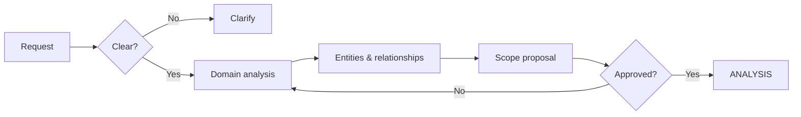
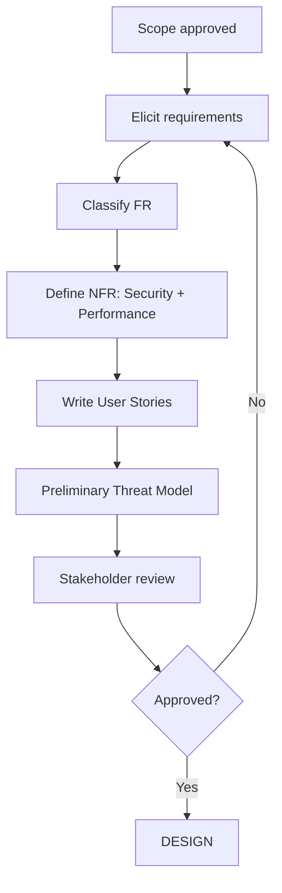

# DISCOVERY & ANALYSIS (Phase 0-1)

> Loading: When starting a new project/feature or during requirements analysis
> Prerequisite: `01_CORE_RULES.md`

---

## PART 1: DISCOVERY (Phase 0)

### Goal
Understand the domain, identify stakeholders, define scope and constraints.

### Checklist
- [ ] Domain understood (basic glossary)
- [ ] Stakeholders identified
- [ ] Business goals clear
- [ ] Technical constraints known
- [ ] Initial risks mapped
- [ ] MVP scope defined

### Workflow


### Exit Criteria
- Shared glossary drafted
- Scope defined (IN / OUT / NICE-TO-HAVE)
- Initial risks documented
- Go/No-Go decision made

---

## PART 2: ANALYSIS (Phase 1)

### Goal
Turn business needs into formal requirements, user stories, and acceptance criteria.
Technology-agnostic: do NOT select the stack yet.

### Checklist
- [ ] Functional requirements documented (FR)
- [ ] Non-functional requirements defined (NFR)
  - Security requirements (mandatory)
  - Performance requirements (mandatory)
  - Scalability, availability
- [ ] User stories with acceptance criteria
- [ ] Conceptual data model (technology-agnostic)
- [ ] Preliminary threat model
- [ ] Stakeholder review completed

### Workflow


---

## Security Requirements (always mandatory)

Select applicable constraints from `SEC_CONSTRAINTS.md`:

- **SEC-01: Input Validation** — input surfaces, validation approach, sanitization
- **SEC-02: Authentication** — auth type, token strategy, session handling
- **SEC-03: Authorization** — model (RBAC/ABAC/ACL), roles, resource ownership
- **SEC-04: Secrets & Config** — secret management, env separation, rotation
- **SEC-05: Data Protection** — PII identification, encryption at rest/in transit, retention
- **SEC-06: Dependency Hygiene** — SBOM, vulnerability scanning
- **SEC-07: Threat Modeling** — STRIDE analysis, attack surfaces
- **SEC-08: Logging & Monitoring** — audit logging, log redaction, alerting
- **SEC-09: SSRF Prevention** — outbound URL validation (if applicable)

## Performance Requirements (always mandatory)

Select applicable constraints from `PERF_CONSTRAINTS.md`:

- **PERF-01: Latency Targets** — P50/P95/P99 SLOs per API
- **PERF-02: Throughput & Concurrency** — req/s normal/peak, concurrent users
- **PERF-03: Database Efficiency** — query optimization, N+1 prevention, indexes
- **PERF-04: Resource Utilization** — memory/CPU/storage budgets, container limits
- **PERF-05: Caching & CDN** — cache strategy, TTLs, invalidation

---

## Templates

### Functional Requirements
```
| ID   | Description | Priority     | Source |
|------|-------------|--------------|--------|
| FR01 | ...         | Must/Should/Could | ... |
```

### User Story
```
[US-XXX] Title

As a [ROLE]
I want [ACTION]
So that [BENEFIT]

Acceptance Criteria:
- [ ] GIVEN [context] WHEN [action] THEN [result]

Security: [relevant aspects]
Performance: [relevant aspects]
Priority: Must/Should/Could
Story Points: [1-13]
```

### Conceptual Data Model
```
Entity: [NAME]

| Field | Logical Type | Constraints | Sensitivity | Notes |
|-------|-------------|-------------|-------------|-------|
| id    | identifier  | PK, unique  | low         |       |

Relationships:
- [Entity A] 1:N [Entity B]

Note: Physical types defined in DESIGN phase.
```

### Preliminary Threat Model
```
Assets: [what to protect]
Threat actors: [motivation, capabilities]
Attack surfaces: [surface → attack type]
Mitigations: [to detail in DESIGN]
```

---

## Expected Outputs

| Output | Destination |
|--------|-------------|
| Domain glossary | `docs/01_ANALYSIS/01_GLOSSARY.md` |
| Functional requirements | `docs/01_ANALYSIS/02_SPEC.md` |
| Non-functional requirements | `docs/01_ANALYSIS/03_NFR.md` |
| User stories | Backlog |
| Conceptual data model | `docs/01_ANALYSIS/04_DATA_MODEL.md` |
| Threat model | `docs/02_DATA_GOVERNANCE/THREAT_MODEL.md` |

---

## Exit Criteria (Analysis)
- All requirements have IDs and traceability
- Security requirements selected from SEC-01..SEC-09 (at minimum SEC-01..SEC-05)
- Performance requirements selected from PERF-01..PERF-07 (at minimum PERF-01..PERF-05)
- User stories with acceptance criteria
- Conceptual data model approved
- Stakeholder sign-off
