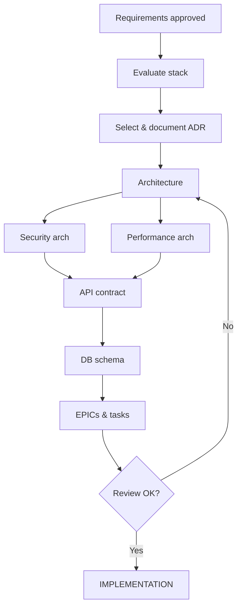

# DESIGN (Phase 2)

> Loading: During architecture design and technology choices
> Prerequisite: `01_CORE_RULES.md`, Discovery/Analysis completed

---

## Goal
Define technical architecture, choose the stack, patterns and interfaces, structure work into EPICs/tasks.

## Checklist
- [ ] Tech stack selected and documented (ADR)
- [ ] System architecture defined
- [ ] Security architecture defined
- [ ] Performance architecture defined
- [ ] API contract draft
- [ ] Database schema draft
- [ ] EPICs defined with task breakdown
- [ ] Definition of Done agreed

## Workflow


---

## 1. Stack Evaluation

```markdown
## Stack Evaluation: [PROJECT]

Requirements: [key NFRs]
Constraints: [team skills, infra, budget]

| Criterion         | Weight | Option A | Option B | Option C |
|-------------------|--------|----------|----------|----------|
| Team expertise    | 20%    | [1-5]    | [1-5]    | [1-5]    |
| Performance fit   | 20%    | [1-5]    | [1-5]    | [1-5]    |
| Security features | 20%    | [1-5]    | [1-5]    | [1-5]    |
| Scalability       | 15%    | [1-5]    | [1-5]    | [1-5]    |
| Community/Support | 10%    | [1-5]    | [1-5]    | [1-5]    |
| Cost              | 15%    | [1-5]    | [1-5]    | [1-5]    |

Decision: [Option X] — Rationale: [why]
```

## 2. ADR Format

```markdown
# ADR-NNN: [Title]
Status: Proposed | Accepted | Deprecated | Superseded
Date: YYYY-MM-DD

## Context
[Problem + relevant FR/NFR IDs]

## Decision
[What and why]

## Consequences
Positive: [benefits]
Negative: [risks → mitigations]
Actions: [skill gaps, env setup]
```

## 3. Security Architecture

| Area | Define |
|------|--------|
| Authentication | Mechanism, provider, token lifetime |
| Authorization | Model, enforcement point, role matrix |
| Data protection | Encryption at rest/in transit, secrets management |
| Network | Segmentation, WAF/DDoS, API gateway, rate limiting |
| Audit | Structured logging, SIEM, alerting |

## 4. Performance Architecture

| Area | Define |
|------|--------|
| Caching | Layers, invalidation strategy, TTLs |
| Database | Indexing criteria, read replicas, connection pooling |
| Scaling | Triggers, min/max instances, auto-scaling metrics |
| Async | Queue-based operations, background jobs |
| Observability | Metrics, distributed tracing, dashboards |

## 5. EPIC / Task Structure

### EPIC Template
```markdown
# EPIC: [E-NNN] [Title]

Description: [business value in 2-3 sentences]

In scope: [features]
Out of scope: [exclusions]

User stories: [US-001, US-002, ...]
Acceptance criteria: [EPIC-level]
Security: [considerations]
Performance: [targets]
Dependencies: [other EPICs/systems]
Estimate: [SP] / [sprints]
```

For full ADR or critical decision files, use `templates/DECISION_RECORD_TEMPLATE.md`.

For full epic files, use `templates/EPIC_TEMPLATE.md`.

### Task Breakdown
```markdown
| ID    | Task          | Type     | Estimate | Token Est. | Model Level | Risk Floor | Recommended Model | Dependencies |
|-------|---------------|----------|----------|------------|-------------|------------|-------------------|--------------|
| T-001 | [description] | dev      | [h/SP]   | [in/out/total] | [1-7] | [none/level] | [Haiku/Sonnet/Opus + effort] | - |
| T-002 | [description] | test     | [h/SP]   | [in/out/total] | [1-7] | [none/level] | [Haiku/Sonnet/Opus + effort] | T-001 |

Definition of Done:
- [ ] Code builds
- [ ] Tests written (coverage ≥ target)
- [ ] Code review approved
- [ ] SEC/PERF checklists verified
- [ ] Docs updated
```

### AI Sizing Rules

Every task created during design must include:
- input token estimate: repository/docs/context expected to be read
- output token estimate: code, tests, docs, and review text expected to be generated
- total token estimate: input + output
- model level: 1-7 using `01_CORE_RULES.md` Task Sizing Protocol
- risk floor applied: minimum level forced by risk or domain
- recommended Anthropic model class and effort
- short rationale for the level

---

## Expected Outputs

| Output | Destination |
|--------|-------------|
| Stack ADR | `docs/adr/ADR-001_Stack.md` |
| Decision records | `docs/adr/` |
| Architecture | `docs/design/ARCHITECTURE.md` |
| Security arch | `docs/design/SECURITY_ARCH.md` |
| Performance arch | `docs/design/PERFORMANCE_ARCH.md` |
| API contract | `api-specs/` |
| DB schema | `docs/design/DATABASE_SCHEMA.md` |
| EPICs | `docs/epics/` |
| Conventions | `docs/design/CONVENTIONS.md` |

## Exit Criteria
- Tech stack in ADR
- Architecture approved
- Security + Performance architecture complete
- API contract ready
- EPICs with task breakdown
- Definition of Done agreed
