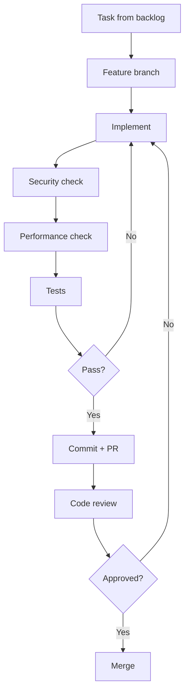

# IMPLEMENTATION (Phase 3)

> Loading: During development
> Prerequisite: `01_CORE_RULES.md`, Design completed, stack defined

---

## Goal
Turn design into working, tested, documented code. Security & Performance by design.

## Sprint Cycle
Planning → Daily work → Review → Retrospective → Next sprint

## Implementation Checklist (per task)
- [ ] Task selected from backlog
- [ ] Token estimate and recommended model level reviewed
- [ ] Feature branch created
- [ ] Constraints reread: SEC-XX and PERF-XX from `_CONTEXT.md`
- [ ] Complex logic (>50 lines): pseudocode BEFORE code
- [ ] Code implemented per design and conventions
- [ ] Security checklist verified
- [ ] Performance checklist verified
- [ ] Tests written (coverage target per DoD)
- [ ] Code review completed
- [ ] Documentation updated
- [ ] PR approved and merged

## Pseudocode Rule (mandatory for complex logic)

If the task requires algorithmic logic >50 lines, complex business rules, or external integration:
1. Write pseudocode/comments first
2. Wait for approval
3. Implement

---

## Task Workflow



---

## Security Checklist (each PR)

### Input Validation
- [ ] All inputs validated (server-side)
- [ ] Whitelist approach preferred
- [ ] Injection prevented (parameterized queries / ORM)
- [ ] XSS prevented (output encoding)
- [ ] Path traversal prevented

### Authentication & Authorization
- [ ] Endpoints protected correctly
- [ ] Permissions verified (not just authenticated)
- [ ] Tokens/sessions handled correctly

### Data Protection
- [ ] Sensitive data not logged
- [ ] Secrets not hardcoded
- [ ] Encryption applied where required
- [ ] PII handled per policy

### Error Handling
- [ ] Errors do not expose internals
- [ ] No stack traces in responses
- [ ] User-facing messages are generic

---

## Performance Checklist (each PR)

### Database
- [ ] No N+1 queries
- [ ] Indexes used correctly
- [ ] Queries optimized
- [ ] Connection pooling configured

### Caching
- [ ] Cache used where appropriate
- [ ] Cache invalidation correct
- [ ] TTL configured

### Resources
- [ ] No memory leaks
- [ ] Large objects streamed
- [ ] Async for I/O operations
- [ ] No blocking on main threads

### Network
- [ ] Payload minimized
- [ ] Compression enabled
- [ ] Timeouts configured

---

## Code Conventions

### Universal Principles (SOLID + Clean Code)
- Single Responsibility: one class = one job
- Open/Closed: extend without modifying
- Liskov Substitution: subtypes are substitutable
- Interface Segregation: small, focused interfaces
- Dependency Inversion: depend on abstractions

### Clean Code
- Self-explanatory naming
- Short functions (≤ 20 lines ideal)
- One abstraction level per function
- Comments for "why", not "what"
- No magic numbers/strings

### Generic Project Structure
```
project-root/
  src/
    api/              # Entry points (controllers, handlers)
    domain/           # Business logic, entities
    infrastructure/   # External services, persistence
    shared/           # Utilities, cross-cutting
  tests/
    unit/
    integration/
  docs/
  scripts/
  config/
```

---

## Sprint Ceremonies

### Planning
```
Sprint [N] | Date: YYYY-MM-DD | Capacity: [SP]
Goal: [one sentence]
Selected: [task list with SP, token estimates, model levels]
Risks: [risk → mitigation]
```

### Review
```
Sprint [N] | Completed: [tasks] | Not completed: [tasks + reason]
Demo feedback: [...] | Velocity: [SP] | Bugs: [N]
```

### Retrospective
```
What went well: [...] | What didn't: [...] | Actions: [...]
```

## Exit Criteria (per sprint)
- Sprint tasks completed
- Tests pass (unit + integration)
- Security + Performance checklists green
- Code reviews approved
- Documentation updated
