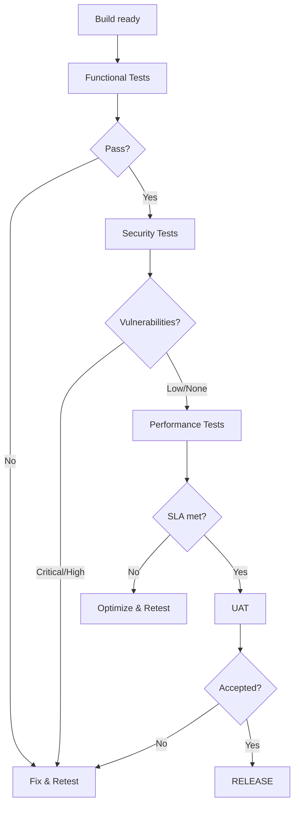

# VERIFICATION & RELEASE (Phase 4-5)

> Loading: During testing, QA, deployment, and release
> Prerequisite: `01_CORE_RULES.md`, Implementation completed

---

## PART 1: VERIFICATION (Phase 4)

### Goal
Validate correctness, security, performance, and readiness for release.

### Checklist
- [ ] Functional testing (unit, integration, E2E, UAT)
- [ ] Security testing (SAST, DAST, dependency scan)
- [ ] Performance testing (load, stress)
- [ ] Critical bugs resolved
- [ ] Documentation updated

### Workflow


---

## Security Testing

### SAST Report Template
```
Tool: [tool name] | Date: YYYY-MM-DD | Commit: [hash]

| Severity | Count | Categories |
|----------|-------|------------|
| Critical | 0     | -          |
| High     | 0     | -          |

Action: [proceed / block release]
```

### DAST Report Template
```
Tool: [tool name] | Target: [env URL] | Date: YYYY-MM-DD

OWASP Top 10 Coverage:
- [ ] A01: Broken Access Control
- [ ] A02: Cryptographic Failures
- [ ] A03: Injection
- [ ] A04: Insecure Design
- [ ] A05: Security Misconfiguration
- [ ] A06: Vulnerable Components
- [ ] A07: Auth Failures
- [ ] A08: Data Integrity Failures
- [ ] A09: Logging Failures
- [ ] A10: SSRF
```

### Dependency Scan Template
```
Tool: [tool name] | Date: YYYY-MM-DD

| Package | Version | CVE | Severity | Fix Version |
|---------|---------|-----|----------|-------------|
```

---

## Performance Testing

### Load Test Template
```
Tool: [tool name] | Date: YYYY-MM-DD | Env: [staging/perf]
Duration: [min] | Virtual Users: [N] | Ramp-up: [pattern]

| Metric            | Target | Actual | Status  |
|--------------------|--------|--------|---------|
| Response Time P50  | [ms]   | [ms]   | OK/FAIL |
| Response Time P95  | [ms]   | [ms]   | OK/FAIL |
| Response Time P99  | [ms]   | [ms]   | OK/FAIL |
| Throughput         | [r/s]  | [r/s]  | OK/FAIL |
| Error Rate         | <[%]   | [%]    | OK/FAIL |

Bottlenecks: [identified issues]
```

### Stress Test Template
```
Max sustained: [N users / r/s]
Breaking point: [N users / r/s]
Recovery time: [seconds]
Graceful degradation: yes/no
```

---

## Testing Principles

### Test Pyramid (non-negotiable)
- **Unit Tests** → solid, numerous base
- **Integration Tests** → targeted, realistic
- **E2E Tests** → few, strategic

### Unit Test Rules
- Test one unit at a time, in isolation
- No real dependencies (DB, filesystem, network)
- Use mocks/stubs/fakes
- Fast, deterministic, independent

### Integration Test Rules
- Use real or controlled environments
- Test mapping, config, transactions, API contracts
- When: DB access, service-to-service, ORM, serialization

### E2E Test Rules
- Only critical user flows
- Accept: slow, fragile, expensive
- Don't use E2E as primary quality measure

### Anti-patterns (flag immediately)
- E2E used instead of unit tests
- Tests depending on timing or shared state
- Tests validating implementation instead of behavior

---

## PART 2: RELEASE (Phase 5)

### Release Checklist
- [ ] All tests pass
- [ ] Security scan clean
- [ ] Performance targets met
- [ ] Release notes drafted
- [ ] Deployment runbook ready
- [ ] Rollback plan documented
- [ ] Stakeholder approval

### Release Notes Template
```
## Release [vX.Y.Z] — YYYY-MM-DD

### New Features
- [feature description]

### Bug Fixes
- [fix description]

### Breaking Changes
- [change + migration guide]

### Security
- [vulnerability fixed / dependency updated]

### Known Issues
- [issue + workaround]
```

### Deployment Strategy
```
1. Deploy to staging
2. Run smoke tests
3. Controlled rollout (canary / blue-green / feature flags)
4. Monitor error rate + latency (15 min window)
5. Full rollout or rollback
```

## Exit Criteria
- All tests green
- Security scan clean
- Performance SLA met
- Deployed successfully
- Rollback plan tested
