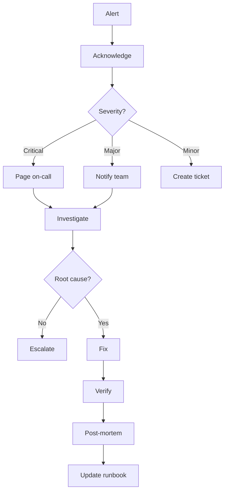

# OPS & MONITORING (Phase 6)

> Loading: During operations, monitoring, incident response
> Prerequisite: `01_CORE_RULES.md`, software in production

---

## Goal
Keep the system stable, monitor performance, respond to incidents, plan improvements.

> **Related**: For developer-driven bug fixes (non-incident), see `11_BUGFIX_PLAYBOOK.md`.
> This module covers **ops-driven** incident response with post-mortem rigor.

## Checklist
- [ ] Monitoring active
- [ ] Alerts configured
- [ ] Runbook updated
- [ ] Backups verified
- [ ] Log rotation configured
- [ ] Incident response plan ready
- [ ] Capacity planning updated

## Incident Response Workflow



---

## Key Metrics (SLA)

| Metric | Target | Alert Threshold |
|--------|--------|-----------------|
| Availability | 99.9% | <99.5% |
| Response Time P95 | <200ms | >500ms |
| Error Rate | <0.1% | >1% |
| CPU Usage | <70% | >85% |
| Memory Usage | <80% | >90% |
| Disk Usage | <70% | >85% |

---

## Templates

### Incident Report
```
Incident: INC-[NNNN]
Severity: P1/P2/P3/P4
Duration: [start] – [end]

Impact: [users, services, revenue]
Timeline: [chronological events]
Root Cause: [description]
Resolution: [what was done]
Action Items: [preventive actions]
```

### Post-Mortem
```
Post-Mortem: INC-[NNNN] | Date: YYYY-MM-DD

Summary: [1-2 sentences]
Impact: [duration, users, SLA breach?]
Root Cause: [detailed analysis]
Timeline: [chronological events]

Lessons Learned:
- What went well: [...]
- What went wrong: [...]
- Where we got lucky: [...]

Action Items:
| ID | Action | Owner | Due | Status |
```

### Runbook Entry
```
Runbook: [Procedure Name]
Last Updated: YYYY-MM-DD

Purpose: [when to use]
Prerequisites: [access, permissions]
Steps: [numbered detailed steps]
Verification: [how to confirm success]
Rollback: [how to undo]
Contacts: [primary, escalation]
```

---

## Health Check Endpoints

```
GET /health          → Basic health (200 / 503)
GET /health/ready    → Ready for traffic (LB probe)
GET /health/live     → Liveness (container probe)
```

## Monitoring Cadence

| Frequency | Activity |
|-----------|----------|
| Daily | Review dashboards, check error logs, verify backups |
| Weekly | Capacity review, security patches, cost analysis |
| Monthly | SLA report, incident trends, runbook review |

---

Continuous loop: Ops feedback → new features → Discovery/Analysis
