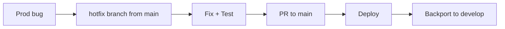

# SPECIAL LANES — Parallel and Special Workflows

> Loading: For parallel tracks, hotfixes, spikes, or large refactors
> Prerequisite: `01_CORE_RULES.md`

---

## Fullstack Parallel Lane

### When to use
Feature requires changes across multiple layers (e.g., API + UI).

### Parallel Tracks
**Backend**: API contract → endpoints → unit tests → integration tests
**Frontend**: UI design → components (mocked API) → integration

### Sync Points
1. **Contract agreement** — shared interface/spec finalized, mock server ready
2. **Integration ready** — both sides ready, switch from mocks to real
3. **E2E ready** — fully integrated, testable end-to-end

### Branching
```
feature/X           ← main feature branch
feature/X-backend   ← backend sub-branch
feature/X-frontend  ← frontend sub-branch
```

---

## Hotfix Lane

### When to use
Critical production bug requiring immediate fix.

### Workflow


---

## Spike Lane

### When to use
Technical investigation, POC, or technology evaluation.

### Template
```markdown
# Spike: [TITLE]
Time-box: [max hours/days]
Goal: [question to answer]
Experiments: [things to try]
Success criteria: [how to measure]
Output: Findings document + Go/No-Go recommendation
```

### Rules
- Strict time-box
- POC code never goes to production
- Output is knowledge, not code
- Document findings even if negative

---

## Refactoring Lane

### When to use
Cross-cutting refactor, major dependency upgrade, technology migration.

### Strangler Fig Strategy
1. **Coexistence** — new code alongside old, feature flags, zero user impact
2. **Gradual migration** — move features one by one, backward compatible
3. **Remove old** — disable legacy, monitor, cleanup

---

## Context Switch Protocol

```markdown
## CONTEXT SWITCH
From: [previous task]
To: [new task]

State saved:
- Branch: [name]
- Last commit: [hash]
- Open items: [list]

New context:
- Branch: [name]
- Focus: [what to do]
```
