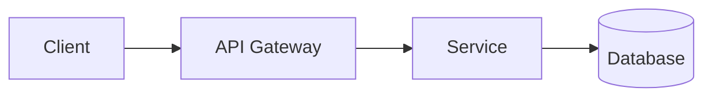

# DOCUMENTATION — Generation & Automation

> Loading: When generating or updating project documentation
> Prerequisite: `01_CORE_RULES.md`, optional `09_CODEBASE_ANALYSIS.md`

---

## Goal
Create minimal, useful documentation that stays true over time.

## Output Structure
```
docs/
  00_OVERVIEW.md
  01_ARCHITECTURE.md
  02_API.md
  03_DATA_MODEL.md
  04_SECURITY_PERF.md
  05_RUNBOOK.md
  99_GLOSSARY.md
```

## Anti-Noise Rules
- 1 page per concept (max 2)
- "How to use" > abstract description
- Each section: purpose + code location + how to verify
- If not verifiable: label ASSUMPTION + TODO
- No duplicated content across formats

---

## Templates

### `00_OVERVIEW.md`
```markdown
# Overview
- What: [1-2 sentences]
- Why: [business goal]
- Who uses it: [roles]
- Main flows: [3-5 bullets]
- How to run: [link to README/RUN]
```

### `01_ARCHITECTURE.md` (C4-lite)
```markdown
# Architecture
## Context
- Users/Actors: [...]
- External systems: [...]

## Containers / Modules
| Module | Responsibility | Entry points | Data |
|--------|---------------|--------------|------|

## Key Decisions
- ADR-001: ...
```

### `02_API.md`
```markdown
# API
## Auth
- Mechanism: [...]
- Scopes/Roles: [...]

## Endpoints
| Method | Path | Purpose | Auth | Notes |
|--------|------|---------|------|-------|
```

### `03_DATA_MODEL.md`
```markdown
# Data Model
## Entities
| Name | Purpose | Key fields | Relations | Notes |
|------|---------|------------|-----------|-------|

## Migrations
- How to apply
- Rollback strategy
```

### `04_SECURITY_PERF.md`
```markdown
# Security & Performance
## Security (SEC-xx)
- SEC-01: ...
## Performance (PERF-xx)
- PERF-01: ...
## Verification
- SAST: ... | DAST: ... | Load test: ...
```

### `05_RUNBOOK.md`
```markdown
# Runbook
## Common Operations
- Start/Stop | Logs | Health checks
## Incident Response
- Severity levels | Escalation
```

---

## Diagram Guidelines

### Mermaid (recommended — GitHub-native)

- Renders natively on GitHub, GitLab, Azure DevOps
- Supports: flowchart, sequence, ER, class, state, C4

### PlantUML (for formal publishing)
- Generate `.puml` files, compile to PNG
- Include in documents via standard image references

---

## Generation Process

1. **Analyze** — modules, entry points, data stores, public APIs
2. **Diagram** — architecture overview, data model, key sequences
3. **Generate** — Markdown files following templates above
4. **Validate** — all APIs documented, all entities documented, no broken links, gaps marked ASSUMPTION + TODO

## AI Command
```
Generate documentation for [MODULE]:
1. Analyze source code
2. Generate diagrams (Mermaid)
3. Generate docs following templates
4. Produce validation report
```
