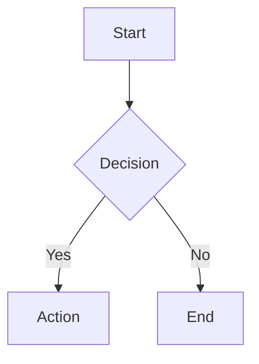

# CONTENT VALIDATION

> Loading: ALWAYS before writing generated content to files
> Purpose: Prevent syntax errors, broken diagrams, and malformed structured content

---

## Pre-Write Validation Checklist

Before writing ANY generated content to a file, validate:

- [ ] **Fenced code blocks**: every opening ` ``` ` has a matching closing ` ``` `
- [ ] **Language tags**: code blocks have correct language identifier
- [ ] **Markdown structure**: headings sequential (no jump from # to ###)
- [ ] **Links**: format `[text](url)` — no bare URLs in prose
- [ ] **Tables**: consistent column count across all rows, alignment row present
- [ ] **Lists**: consistent marker style, proper indentation for nesting

---

## Diagram Validation

### Mermaid

Before writing a Mermaid diagram:

1. **Node IDs**: alphanumeric + underscore only (no spaces, no special chars)
2. **Labels**: escape quotes (`"` → `\"`)
3. **Connections**: valid syntax (`-->`, `-.->`, `==>`)
4. **Subgraphs**: every `subgraph` has matching `end`
5. **Direction**: valid direction keyword (`TD`, `LR`, `BT`, `RL`)

```markdown
✅ Valid:


❌ Invalid:
```mermaid
graph TD
    Start Node --> Decision Node    ← spaces in IDs
    Decision -->|Yes| C[Action "quoted"]   ← unescaped quote
```
```

### PlantUML

Before writing a PlantUML diagram:

1. **Boundaries**: `@startuml` / `@enduml` present and balanced
2. **Participants**: declared before use in sequence diagrams
3. **Notes**: `note` has matching `end note` (multiline) or fits on one line
4. **Encoding**: UTF-8, no BOM

### ASCII Diagrams

1. **Character set**: only `+` `-` `|` `^` `v` `<` `>` `/` `\` and spaces
2. **Alignment**: box corners align vertically and horizontally
3. **No Unicode**: no box-drawing characters (─ │ ┌ ┐ └ ┘)
4. **Spaces only**: no tabs

---

## Structured Data Validation

### JSON embedded in Markdown

1. Valid JSON syntax (balanced braces, quoted keys)
2. No trailing commas
3. No comments (unless JSONC explicitly stated)

### YAML embedded in Markdown

1. Consistent indentation (2 spaces preferred)
2. No tabs
3. Strings with special chars quoted
4. No duplicate keys

---

## Fallback Rule

If validation fails and cannot be fixed immediately:

1. **Include text alternative** alongside the diagram/structured content
2. **Mark with TODO**: `<!-- TODO: fix diagram syntax -->`
3. **Do not write known-broken content** to files without the fallback

---

## When to Apply

| Situation | Validate? |
|-----------|-----------|
| Writing new file | ✅ Always |
| Editing existing file (adding content) | ✅ For new content |
| Quick chat-only response | ❌ Not required |
| Code generation (actual source code) | ❌ Compiler/linter handles this |
| Documentation, ADRs, design docs | ✅ Always |
| Templates | ✅ Always |

---

## Integration

This module is referenced by:
- `01_CORE_RULES.md` §3 (Code Conventions) — for generated documentation
- `10_DOCUMENTATION.md` — for all doc generation
- `08_PROMPT_LIBRARY.md` — templates must pass validation
